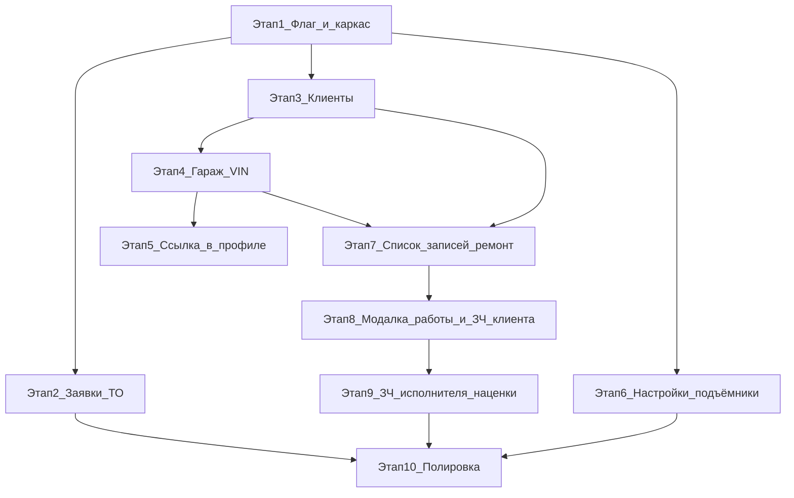

# Автосервис «Свой Гараж» — дорожная карта по этапам

> **Как пользоваться этим файлом**
>
> 1. Приложи этот файл в чат.
> 2. Включи **Plan mode**.
> 3. Напиши: `создай план для этапа N` (подставь номер).
> 4. Проверь план → нажми **Build**.
> 5. После мержа/деплоя снова приложи файл и повтори для следующего этапа.
>
> Не смешивай несколько этапов в одном Build без явной просьбы.
> Если в этапе есть «открытые решения» — агент должен зафиксировать дефолт в плане и не блокировать работу.

---

## 0. Контекст продукта (кратко)

Платформа уже продаёт запчасти. Добавляем модуль **автосервиса** для организации, у которой директор имеет `is_director=true` **и** `is_admin=true` (см. уже существующий хелпер `org_has_admin_director` в `backend/app/utils/org_access.py`).

Весь модуль (публичная страница, меню, гараж, записи) показывается **только если** в `/admin-settings` включено:

- **«Отображать автосервис на сайте»** → флаг в `site_settings` (по аналогии с `show_site_reviews` / `show_warehouse_inventory`), прокидывается в `public-site-config` и Redux `PublicInfoSlice`.

### Роли и доступ

| Кто | Что видит |
|-----|-----------|
| Гость / любой пользователь при включённом флаге | Публичная `/autoservice` (простая заявка на техосмотр) |
| Пользователь, ставший клиентом автосервиса | Гараж (свои авто), свои записи; ссылка «Гараж» в профиле рядом с заказами |
| Сотрудники организации автосервиса (`org_has_admin_director`) | Вкладка меню **Автосервис**: клиенты, записи на ТО, записи на ремонт, (для директора) настройки |
| Директор-админ этой org | + кнопка **Настройки** (пока: количество подъёмников) |
| Остальные продавцы/покупатели | Модуль скрыт (кроме публичной страницы, если флаг включён) |

Адрес автосервиса в UX-текстах (подтверждение клиента): **«Свой гараж» на Фруктовая 17** — вынести в константу/настройку сайта, чтобы потом править без кода.

### Сущности (целевая модель, кратко)

- `AutoserviceSettings` (org_id, lifts_count, …)
- `AutoserviceClient` (user_id ↔ org, статус, дата согласия)
- `GarageVehicle` (client/user, vin, марка/модель/год/…, источник: VIN API / вручную)
- `InspectionBooking` (имя, телефон, желаемая дата; источник: сайт / вручную сотрудником; статус)
- `RepairOrder` (номер заказа, клиент, авто из гаража, комментарий клиента, дата записи, кто принял, сотрудники-исполнители, статус)
- `RepairOrderWork` (порядок, название, qty, price, sum, executor_employee_id)
- `RepairOrderClientPart` (порядок, название, qty)
- `RepairOrderShopPart` (порядок, название/ссылка на склад или Rossko, qty, price, markup%, line_sum)

---

## Этап 1 — Флаг «Отображать автосервис» + каркас доступа

**Цель:** включить/выключить весь модуль одной галочкой; заложить определение org автосервиса; пустые точки входа без бизнес-логики.

### Сделать

1. `site_settings.show_autoservice` (default `false`) + schema_patch + admin API + UI в `/admin-settings` (как другие toggles).
2. Поле в `public-site-config` + `PublicInfoSlice.showAutoservice`.
3. Хелперы фронта/бэка: `isAutoserviceEnabled()`, `getAutoserviceOrganizationId()` / использование `org_has_admin_director`.
4. Роут-заглушка `/autoservice` (пустое состояние «Скоро» или минимальный layout), видна только при флаге.
5. В боковом меню для сотрудников autoservice-org — пункт **Автосервис** с подменю-заглушками (без реальных страниц или с «в разработке»), только если флаг включён.

### Не делать на этом этапе

Гараж, VIN, заявки, заказы, клиенты, настройки подъёмников.

### Критерий готовности

- Выключено → нет меню и `/autoservice` недоступна (редирект/404).
- Включено → меню у сотрудников autoservice-org есть; у чужих org нет; публичный `/autoservice` открывается.

### Промпт для Plan mode

`создай план для этапа 1`

---

## Этап 2 — Публичная заявка на техосмотр + «Записи на тех осмотр»

**Цель:** с сайта можно оставить заявку; сотрудники видят и могут добавить такую же вручную.

### Сделать

1. Публичная страница `/autoservice`: форма **имя, телефон, желаемая дата** (+ согласие/дисклеймер по стилю сайта).
2. Таблица `inspection_bookings` (+ API create public / list&create admin).
3. В меню Автосервис → **Записи на тех осмотр**:
   - список заявок с сайта;
   - кнопка «Добавить» с теми же полями;
   - базовые статусы (например: `new` / `processed` / `cancelled`) — минимум `new`.
4. Уведомление опционально отложить (не блокер).

### Критерий готовности

- Заявка с `/autoservice` появляется в списке у сотрудников.
- Ручное добавление из кабинета работает.
- Без флага этап 1 — всё скрыто.

### Промпт

`создай план для этапа 2`

---

## Этап 3 — Клиенты автосервиса + «Стать клиентом»

**Цель:** воронка согласия; список клиентов автосервиса отдельно от клиентов магазина запчастей.

### Сделать

1. Модель связи user ↔ autoservice org (`autoservice_clients`).
2. Для авторизованного пользователя (на `/autoservice` и/или в гараже): кнопка  
   **«Стать клиентом автосервиса»** → confirm:  
   «Вы точно хотите стать клиентом автосервиса Свой гараж на Фруктовая 17?»
3. Меню Автосервис → **Клиенты**: только согласившиеся / добавленные клиенты автосервиса.
4. Сотрудник может добавить клиента вручную (телефон/имя → user или «гостевой» клиент — зафиксировать дефолт в плане: предпочтительно привязка к `user_id`, если нет аккаунта — создать pending/guest запись).

### Критерий готовности

- После согласия пользователь в списке «Клиенты» автосервиса.
- Без согласия гараж (этап 4) недоступен.

### Промпт

`создай план для этапа 3`

---

## Этап 4 — Гараж пользователя (VIN + ручной ввод)

**Цель:** клиент хранит свои автомобили.

### Сделать

1. Страница **Гараж** (`/garage` или `/autoservice/garage` — выбрать в плане, один канонический URL).
2. Добавление авто: ввод **VIN** → подгрузка данных (марка, модель, год, …).  
   - Если API VIN недоступен / VIN не найден → ручной ввод полей.
   - Источник VIN: зафиксировать в плане (например DaData / внешний VIN decoder / заглушка с ручным вводом до подключения API). **На этапе 4 допустим stub**: успешный parse или fallback в ручную форму.
3. Список авто клиента, редактирование, удаление.
4. Доступ только клиентам автосервиса (этап 3) + сотрудм autoservice-org (просмотр авто клиента).

### Критерий готовности

- Клиент добавляет авто по VIN или вручную; видит список.
- Не-клиент не может пользоваться гаражом.

### Промпт

`создай план для этапа 4`

---

## Этап 5 — Ссылка «Гараж» в профиле (рядом с заказами)

**Цель:** быстрый вход клиента в гараж из привычного места.

### Сделать

1. В профиле / меню покупок (под/рядом с «Заказы») пункт **Гараж** → страница этапа 4.
2. Показывать только при `showAutoservice` **и** статусе клиента автосервиса (или показывать всем залогиненным с CTA «стать клиентом» — выбрать в плане: **рекомендуется** показывать ссылку при флаге, а на странице гаража требовать согласие).

### Критерий готовности

- Из профиля открывается гараж без поиска URL вручную.

### Промпт

`создай план для этапа 5`

---

## Этап 6 — Настройки автосервиса (подъёмники)

**Цель:** первая настройка org.

### Сделать

1. Вкладка Автосервис → **Настройки** (только директор autoservice-org / is_admin director).
2. Поле: **количество подъёмников** (integer ≥ 0).
3. Хранение в `autoservice_settings` (1 row на org).
4. Пока поле только сохраняется и отображается; слоты/календарь подъёмников — позже.

### Критерий готовности

- Директор сохраняет число подъёмников; после перезагрузки значение на месте.
- Обычный сотрудник без прав директора настроек не видит (или read-only — зафиксировать: **только директор**).

### Промпт

`создай план для этапа 6`

---

## Этап 7 — Записи на ремонт: список, номер, история, фильтр/поиск

**Цель:** рабочий журнал заказов без полной сложной модалки (её — этап 8).

### Сделать

1. Меню Автосервис → **Записи** (ремонт).
2. Список активных/текущих записей: авто (из гаража), комментарий клиента, имя клиента, дата записи, кто принял заказ, исполнители (если назначены).
3. У каждого заказа **индивидуальный номер** (человекочитаемый, уникальный).
4. Кнопка **История записей**: архив/закрытые; фильтры + поиск.
5. Для обычного клиента — упрощённый вид: только **его** записи (без чужих клиентов и без внутренних полей сотрудников, если не нужно).
6. Раскрытие строки: пока пустой/заглушка списка работ (заполнится в этапе 8).

### Критерий готовности

- Сотрудники видят заказы своей org; клиент — только свои.
- История с поиском/фильтром работает.
- Номер заказа стабилен и уникален.

### Промпт

`создай план для этапа 7`

---

## Этап 8 — Создание/редактирование записи на ремонт (модалка: работы + запчасти клиента)

**Цель:** полноценное создание заказа с работами и запчастями клиента.

### Сделать

1. Модалка создания записи:
   - выбор клиента (из клиентов автосервиса);
   - выбор авто из его гаража;
   - дата записи, комментарий (клиента / менеджера);
   - кто принял (текущий user по умолчанию);
   - назначение сотрудников на заказ (multi-select из employees org).
2. **Список работ** (нумерация по порядку):
   - название, количество, цена за 1 шт, сумма = qty × price;
   - исполнитель работы (сотрудник org);
   - добавить / удалить / переупорядочить (хотя бы add/remove).
3. **Запчасти клиента** (список): порядковый номер, название, количество.
4. Итоговая **общая сумма работ** внизу модалки.
5. Сохранение ↔ API; отображение при раскрытии в списке этапа 7.

### Пока не делать

Запчасти исполнителя / Rossko / склад / наценки — этап 9.

### Критерий готовности

- Созданный заказ виден в списке с работами и запчастями клиента; суммы считаются верно.

### Промпт

`создай план для этапа 8`

---

## Этап 9 — Запчасти исполнителя (склад / Rossko) + наценки

**Цель:** блок запчастей сервиса в заказе.

### Сделать

1. В модалке заказа секция **Запчасти исполнителя**:
   - порядковый номер, наименование, количество, цена, наценка %, сумма за шт с наценкой, сумма строки.
2. **Выбор наименования** (зафиксировать MVP-дефолт в плане этапа 9):
   - **Вариант A (рекомендуемый MVP):** сначала выбор со **склада организации** (существующие products org) + ручной ввод строки; кнопка «из Rossko» — поиск артикула и подстановка цены (без полного чекаута Rossko).
   - **Вариант B:** только ручной ввод + позже интеграции.
3. Наценка:
   - по умолчанию **5%** на позицию;
   - сверху контрол «наценка для всех»; если позиции различаются — показывать **«—»** (прочерк);
   - пересчёт сумм при изменении %.
4. Внизу **общая сумма запчастей исполнителя** (+ опционально гранд-тотал заказ = работы + запчасти исполнителя; запчасти клиента в деньгах не считаются, если нет цен).

### Открытое решение (обязательно решить в плане этапа 9)

Как именно UX выбора «склад vs Rossko» (табы / два кнопки / combobox). Не блокировать этап 8.

### Критерий готовности

- Можно добавить позиции со склада и/или Rossko-поиском (как выбран в плане), наценки считаются, общий итог виден.

### Промпт

`создай план для этапа 9`

---

## Этап 10 — Полировка UX, права, мобилка, доработки «уточняемых деталей»

**Цель:** довести до ежедневного использования; место для уточнений заказчика.

### Возможный скоуп (уточнять перед планом)

- Статусы заказа (принят / в работе / готов / выдан / отменён).
- Привязка заявки ТО (этап 2) → создание записи на ремонт.
- Назначение подъёмника (из настройки этапа 6).
- Печать / PDF заказ-наряда.
- Уведомления в Telegram/email.
- Права сотрудников (не все видят настройки/цены).
- Аудит действий.
- Доработки полей заказа «как уточнят».

### Промпт

`создай план для этапа 10` + список конкретных доработок из чата.

---

создай план для этапа 4 @.cursor/plans/autoservice-roadmap.md 

**Параллельно после этапа 1** можно вести этап 2 и этап 3 независимо.  
Этап 6 можно делать параллельно с 3–5.  
Этапы 7–9 строго последовательны.

---

## Карта UI (целевая)

### Публично

- `/autoservice` — лендинг/форма записи на ТО (+ CTA стать клиентом, если залогинен).

### Клиент

- Гараж — свои авто.
- Свои записи на ремонт (упрощённо).
- Профиль → ссылка «Гараж» рядом с заказами.

### Сотрудник autoservice-org (меню **Автосервис**)

- Записи на тех осмотр  
- Клиенты  
- Записи (ремонт) → История  
- Настройки (директор) — подъёмники  

---

## Технические ориентиры в текущем коде

| Тема | Куда смотреть |
|------|----------------|
| Флаги сайта | `site_settings`, `AdminPanelPage`, `PublicInfoSlice`, `public-site-config` |
| Org с admin-директором | `org_has_admin_director` |
| Меню боковой панели | `profileMenuConfig.js`, `ProfileMenuTabs.jsx` |
| Сотрудники org | settings employees / `User` + permissions |
| Склад org | products / my-parts, stock |
| Rossko поиск | существующие Rossko API / new parts search |
| Авто/VIN в складе запчастей | `Vehicle`, `VehicleVin` — **не путать** с гаражом клиента автосервиса (отдельные таблицы) |

---

## Чеклист перед каждым этапом (для агента)

1. Прочитать **только нужный этап** + раздел «Контекст» и зависимости.
2. Не реализовывать следующие этапы «заодно».
3. Все новые экраны/меню/роуты — за флагом `show_autoservice`.
4. Доступ staff — только org с `org_has_admin_director`.
5. После Build: миграции/schema_patches, роуты, меню, минимальный happy-path.
6. Деплой — только если пользователь явно просит.

---

## Журнал прогресса (заполнять вручную)

| Этап | Статус | Дата | Коммит / заметка |
|------|--------|------|------------------|
| 1 | не начат | | |
| 2 | не начат | | |
| 3 | не начат | | |
| 4 | не начат | | |
| 5 | не начат | | |
| 6 | не начат | | |
| 7 | не начат | | |
| 8 | не начат | | |
| 9 | не начат | | |
| 10 | не начат | | |

---

*Документ создан как ТЗ-дорожник. Детали полей заказа и UX выбора запчастей будут уточняться — закладывай расширяемую схему с первого появления моделей (этапы 7–9).*
