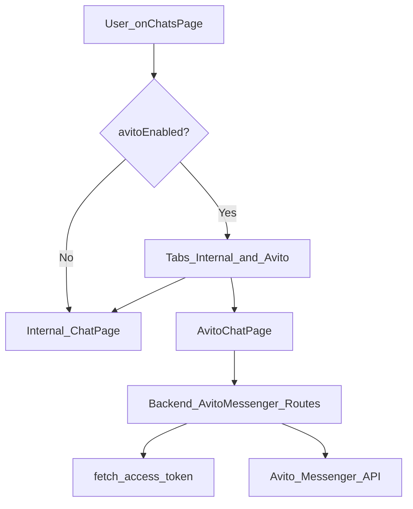

## Цель
- На маршруте `/chats` отображать **две вкладки**: **«Чат свой гараж»** (текущий внутренний чат) и **«Чат Авито»** (чаты из Avito Messenger API) в **максимально таком же интерфейсе**, как текущий чат.
- **Показывать вкладки и «Чат Авито» только если**:
  - у пользователя есть `user.organization_id`
  - пользователь **директор** (`user.is_director === true`)
  - интеграция Авито настроена (есть `client_id`, `client_secret`, `avito_user_id`). В backend это уже проверяется логикой `_has_avito_integration()` в [`backend/app/routers/avito_integration.py`](backend/app/routers/avito_integration.py).

## Что уже есть в проекте (опора)
- Внутренний чат:
  - UI: [`frontend/my-autoparts/src/pages/Chat/ChatPage.jsx`](frontend/my-autoparts/src/pages/Chat/ChatPage.jsx)
  - API: [`backend/app/routers/chats.py`](backend/app/routers/chats.py)
  - WebSocket realtime: `connectWebSocket()` в [`frontend/my-autoparts/src/redux/slices/ChatSlice.js`](frontend/my-autoparts/src/redux/slices/ChatSlice.js)
- Интеграция Авито (сейчас **autoload**, не messenger):
  - хранение ключей: [`backend/app/models/organization_avito_integration.py`](backend/app/models/organization_avito_integration.py)
  - UI настроек ключей: [`frontend/my-autoparts/src/pages/Settings/IntegrationPage.jsx`](frontend/my-autoparts/src/pages/Settings/IntegrationPage.jsx)
  - OAuth client_credentials: [`backend/app/services/avito_api.py`](backend/app/services/avito_api.py)

## Архитектура Avito Chat (как встроим)
- Backend станет **прокси-слоем** к Avito Messenger API:
  - получает токен через существующий `fetch_access_token()`
  - делает запросы к Avito Messenger API (list chats / get messages / send message)
  - возвращает данные фронту в формате, удобном для повторного использования текущего UI
- Frontend добавит табы на `/chats` и две «ветки» данных:
  - внутренняя: как сейчас (Redux `ChatSlice`, WS)
  - Avito: отдельный slice/хуки с HTTP-поллингом (WS у Авито обычно через webhook, но на фронт напрямую его не дадим)

## Backend изменения (план)
- **1) Добавить сервис Avito Messenger API**
  - Новый файл: `backend/app/services/avito_messenger_api.py`
  - Методы (названия примерные):
    - `list_chats(access_token, user_id)`
    - `get_chat_messages(access_token, user_id, chat_id, ...)`
    - `send_chat_message(access_token, user_id, chat_id, text)`
  - Внутри: `httpx.AsyncClient` по аналогии с [`backend/app/services/avito_api.py`](backend/app/services/avito_api.py) + нормальная обработка ошибок/таймаутов.

- **2) Добавить роутер для Avito чатов**
  - Новый роутер: `backend/app/routers/avito_messenger.py` (например, `prefix="/api/avito/messenger"`)
  - Эндпоинты (конкретные пути зафиксируем в реализации, но логика такая):
    - `GET /api/avito/messenger/chats` — список чатов
    - `GET /api/avito/messenger/chats/{chat_id}/messages` — сообщения
    - `POST /api/avito/messenger/chats/{chat_id}/messages` — отправка сообщения
  - Доступ:
    - `Depends(get_current_user)`
    - проверки: `user.is_director`, наличие `user.organization_id`, и `_has_avito_integration(db, org_id)`

- **3) Подключить роутер к общему API**
  - Обновить [`backend/app/routers/__init__.py`](backend/app/routers/__init__.py) чтобы добавить `include_router()`.

## Frontend изменения (план)
- **4) Ввести feature-flag "Avito chats enabled"**
  - На `/chats` при загрузке делаем запрос:
    - `GET /organizations/{orgId}/avito/credentials` (уже есть на backend)
  - `enabled = user.is_director && orgId && data.client_secret_configured && data.client_id && data.avito_user_id`
  - Если `enabled === false`:
    - показываем текущий `ChatPage` как раньше (без вкладок)

- **5) Реализовать вкладки на `/chats`**
  - Создать обёртку-страницу (или обновить существующую):
    - вариант A (наименее ломает текущее): новый компонент `frontend/my-autoparts/src/pages/Chat/ChatsHubPage.jsx`, который рендерит табы и внутри либо `ChatPage` (внутренний), либо `AvitoChatPage`
    - обновить роут в [`frontend/my-autoparts/src/App.js`](frontend/my-autoparts/src/App.js) чтобы `/chats` и `/chats/:chatId` вели на `ChatsHubPage`.

- **6) AvitoChatPage с тем же UI**
  - Новый компонент: `frontend/my-autoparts/src/pages/Chat/AvitoChatPage.jsx`
  - Цель: повторить текущую структуру (список чатов слева/сверху + окно сообщений + input).
  - Чтобы не копировать 1000 строк, вынести из `ChatPage.jsx` переиспользуемые части:
    - компоненты списка (item)
    - компоненты рендера сообщений
    - общий layout для mobile/desktop
  - AvitoChatPage будет подставлять свои данные и handlers:
    - `fetchAvitoChats()`
    - `fetchAvitoMessages(chatId)`
    - `sendAvitoMessage(chatId, text)`
  - Обновление данных: polling (например, каждые 3–5 секунд), по аналогии с fallback polling в `ChatPage.jsx`.

- **7) Redux / data layer для Avito**
  - Новый slice: `frontend/my-autoparts/src/redux/slices/AvitoChatSlice.js` (или RTK Query, но в проекте уже подход через thunks)
  - Thunks под новые backend endpoints:
    - `GET /api/avito/messenger/chats`
    - `GET /api/avito/messenger/chats/{chat_id}/messages`
    - `POST /api/avito/messenger/chats/{chat_id}/messages`

## Нюансы и ограничения (важные)
- **WebSocket**: для Avito чатов не используем текущий WS (он для внутреннего чата). Для Avito — polling; при желании позже можно добавить webhook→backend→WS, но это отдельный этап.
- **Медиа**: если Avito Messenger API поддерживает вложения и они нужны в UI, добавим во 2-й итерации. В первой итерации целимся в текстовые сообщения (чтобы “чат корректно заработал”).
- **Права**: по вашему ответу вкладка Avito доступна **только директору**, даже если интеграция включена.

