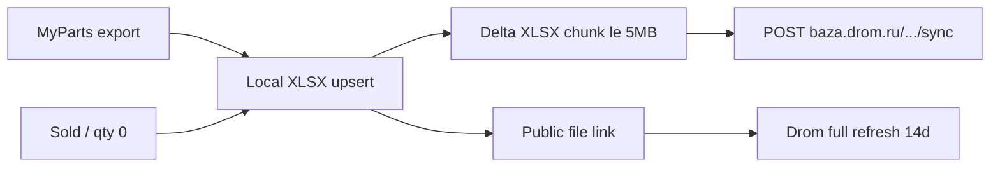

# Drom API прайс-листов

## Контекст

Сейчас [DromIntegrationPage.jsx](frontend/my-autoparts/src/pages/Settings/DromIntegrationPage.jsx) и [drom_api.py](backend/app/services/drom_api.py) — только локальный XLSX; API-клиент — заглушка с неверным base URL.

По [документации Drom](https://baza.drom.ru/help/API) API прайс-листов — **один** endpoint:

- `POST https://baza.drom.ru/good/packet/api/sync`
- `multipart/form-data`: `packetId`, `auth` (= `sha512(ключ_кабинета)`), `data` (файл ≤ 5 МБ)
- Формат `data` = формат исходного прайса (у нас XLSX из [auto-parts-GT.xlsx](backend/app/templates/drom/auto-parts-GT.xlsx))
- Удаление: количество `0`
- Успех: HTTP 200; ошибки: `ERROR_REASON_AUTH_FAILED` / `PACKET_NOT_FOUND` / `EMPTY_REQUEST`
- Полный прайс всё равно нужно обновлять раз в 14–30 дней вне API

**Выбранный подход:** API sync для инкрементальных изменений + сохранить локальный XLSX и публичную ссылку для полной автозагрузки. Триггеры sync: экспорт из «Мои запчасти» и снятие проданных позиций (qty=0).

## Backend

### 1. Credentials в БД

Расширить [organization_drom_integration.py](backend/app/models/organization_drom_integration.py):

- `packet_id` — ID прайса из URL ЛК (`.../packet/{id}/recurrent-update`)
- `api_key_encrypted` — ключ кабинета (Fernet через существующий [avito_crypto.py](backend/app/utils/avito_crypto.py))
- `auto_sync_enabled` — слать в API при экспорте/снятии
- `last_sync_at`, `last_sync_status`, `last_sync_error` — статус последней отправки

Патч колонок через [schema_patches.py](backend/app/db/schema_patches.py) (как у остальных интеграций).

### 2. Реальный клиент API

Переписать [drom_api.py](backend/app/services/drom_api.py):

- `compute_auth(api_key) -> sha512 hex`
- `sync_price_list(packet_id, api_key, file_bytes, filename) -> (status, body/text)`
- Разбор текстовых кодов ошибок из ответа
- Лимит 5 МБ: если файл больше — резать на чанки по строкам (заголовок + N строк) и слать последовательно
- Endpoint только `https://baza.drom.ru/good/packet/api/sync` (не `api.drom.ru`)

### 3. Роутер и схемы

Обновить [drom_integration.py](backend/app/routers/drom_integration.py) и [drom_integration.py schemas](backend/app/schemas/drom_integration.py):

| Endpoint | Назначение |
| --- | --- |
| `GET/PUT .../drom/credentials` | `is_enabled`, `packet_id`, `api_key` (write-only / mask), `auto_sync_enabled`, статус sync + `last_autoload` |
| `POST .../drom/sync` | Ручная отправка текущего XLSX (или delta) в API |
| `POST .../drom/sync/test` | Минимальный ping (пустой/тестовый не шлём — проверка auth через запрос с валидным маленьким файлом-заголовком или явная ошибка auth) |
| Существующие export/upload/download/file-link | Оставить; после успешного export/upload при `auto_sync_enabled` — вызвать sync |

После export: обновить listing links + вызвать sync delta (только изменённые артикулы), записать результат в cache (`drom_upload_*`) и поля `last_sync_*`.

При снятии товаров (уже есть `_remove_from_drom_xlsx` в Avito closed-order flow): после правки XLSX с qty=0 — sync того же delta в API.

### 4. Delta-файл для sync

В [drom_autoload_xlsx.py](backend/app/services/drom_autoload_xlsx.py) добавить сборку **минимального** XLSX с тем же заголовком шаблона + только затронутые строки (для удаления — qty `0`). Это и есть `data` для API; полный `export.xlsx` остаётся для ссылки/скачивания.

## Frontend

Полностью пересобрать [DromIntegrationPage.jsx](frontend/my-autoparts/src/pages/Settings/DromIntegrationPage.jsx) в стиле существующих settings (как Avito: `max-w-4xl`, white cards, `border-gray-200`, CTA `bg-blue-600`, info/error/success boxes, mobile `min-h-11`) — без нового «лендингового» визуала.

Секции страницы:

1. **Подключение** — вкл/выкл, `packetId`, ключ кабинета (password-поле, «ключ сохранён»), `auto_sync`, Save
2. **Как получить ключ** — краткая инструкция (ключ у менеджера Drom; packetId из URL прайса; формат прайса в ЛК должен совпадать с нашим XLSX)
3. **Синхронизация API** — кнопка «Отправить сейчас», статус последней sync, ошибки API
4. **Файл прайса** — номенклатура, скачать, ссылка (для полного обновления 14/30 дней), ручная загрузка XLSX
5. Обновить тексты в [IntegrationPage.jsx](frontend/my-autoparts/src/pages/Settings/IntegrationPage.jsx) (карточка Drom) и [dromExport.js](frontend/my-autoparts/src/utils/dromExport.js) под сообщения sync

[DromNomenclaturePage.jsx](frontend/my-autoparts/src/pages/Settings/DromNomenclaturePage.jsx) оставить по сути, подтянуть статус sync если нужно.

## Тесты

- Unit: `compute_auth`, chunking ≤5MB, парсинг ERROR_REASON_*
- Router/service mocks httpx: успешный 200, AUTH_FAILED, PACKET_NOT_FOUND
- Расширить [test_drom_autoload_xlsx.py](backend/tests/test_drom_autoload_xlsx.py) на delta с qty=0

## Вне scope

- Других endpoint’ов у Drom в публичной доке нет — не выдумываем CRUD объявлений/заказов
- Email-обновление прайса не подключаем (достаточно публичной ссылки + ЛК)