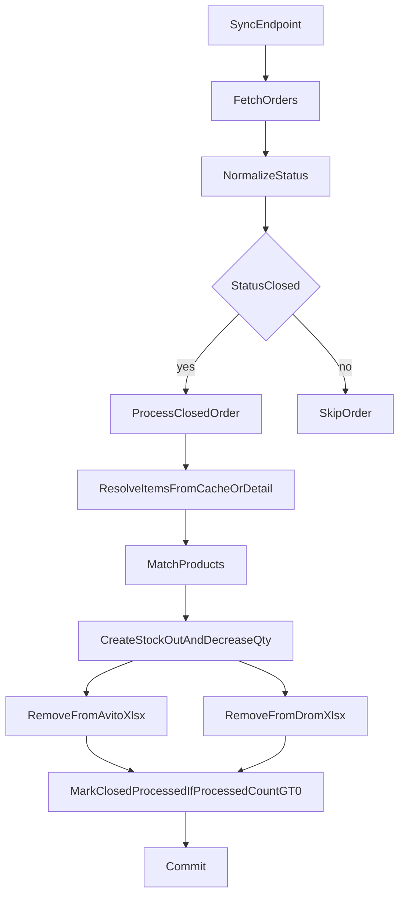

# План исправления Avito→StockOut→XLSX

## Цель
После `POST /api/sales/avito-orders/sync` для закрытых заказов:
- создается `stock-out`;
- уменьшается остаток в `my-parts`;
- удаляются позиции из номенклатур Avito и Drom.

## Что исправить
- Обновить логику в [backend/app/services/avito_orders_sync.py](backend/app/services/avito_orders_sync.py):
  - нормализовать статус заказа перед проверкой (`closed` в любом регистре);
  - не ставить `closed_processed=True` безусловно;
  - ставить `closed_processed=True` только при фактической обработке хотя бы одного товара.
- Обновить [backend/app/services/avito_closed_order_processor.py](backend/app/services/avito_closed_order_processor.py):
  - возвращать структурированный результат обработки (`processed_count`, `skipped_reasons`);
  - при пустых `items` в кэше догружать детали заказа и брать `items` из детального ответа;
  - расширить извлечение идентификаторов товара (`avitoId`, `id`, `avitoItemId`, `avito_id`, fallback по `internal_code/article/partnumber`);
  - усилить логирование причин пропуска, чтобы исключить «тихие» провалы.
- Исправить удаление из Drom XLSX:
  - в [backend/app/services/avito_closed_order_processor.py](backend/app/services/avito_closed_order_processor.py) использовать корректный путь/имя файла (`export.xlsx` или `saved_path` из кэша интеграции), а не жестко `autoload.xlsx`.
- Усилить удаление из Avito XLSX в [backend/app/services/avito_autoload_xlsx.py](backend/app/services/avito_autoload_xlsx.py):
  - добавить fallback-удаление по дополнительным колонкам идентификатора (например, `AvitoId`), если удаление по `Id=internal_code` не нашло строку.

## Проверка
- Ручной прогон `POST /api/sales/avito-orders/sync` на закрытом заказе:
  - есть новая запись в `stock_out`;
  - количество у соответствующего товара уменьшено;
  - строка удалена из Avito и Drom XLSX.
- Повторный sync не должен создавать дубль для того же закрытого заказа.
- Логи должны показывать: сколько товаров обработано, сколько пропущено и почему.

## Поток после правок

