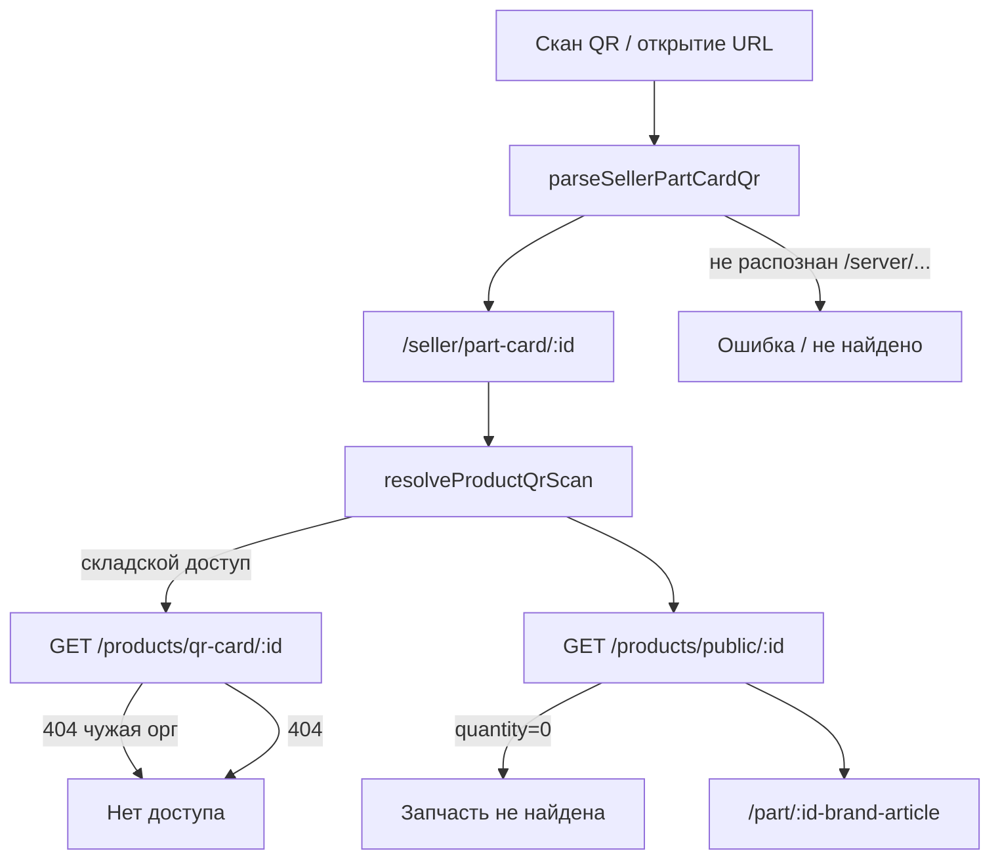

# Починка QR-кодов (старые и новые)

## Диагностика



**Главные причины «запчасть не найдена»:**

1. **Legacy URL с `/server/`** — в [`.env`](backend/.env) `PUBLIC_BASE_URL = 'https://svoygarage.ru/server'`. Старые этикетки могли печатать `https://svoygarage.ru/server/seller/part-card/123`. Парсер [`parseSellerPartCardQr.js`](frontend/my-autoparts/src/utils/parseSellerPartCardQr.js) ищет `/seller/part-card/`, но pathname `/server/seller/part-card/123` **не матчится** → QR не распознаётся.

2. **Проданные запчасти (qty=0)** — [`GET /products/public/{id}`](backend/app/routers/products.py) фильтрует `quantity > 0`. [`resolvePublicPartPath`](frontend/my-autoparts/src/utils/resolveProductQrScan.js) при 404 всё равно ведёт на `/part/{id}` без brand/article → [`PartDetail`](frontend/my-autoparts/src/pages/PartDetail/PartDetail.jsx) показывает «Запчасть не найдена», а не «Продано».

3. **Ложный «Нет доступа»** — в [`resolveProductQrScan`](frontend/my-autoparts/src/utils/resolveProductQrScan.js) при `qr-card` → 404 (чужая орг / удалён) без moderation-path возвращается `forbidden`, **без попытки публичного открытия**. Покупатель или продавец, сканирующий чужую запчасть, видит блокировку вместо публичной карточки.

4. **SEO-редирект проданных** — [`get_seller_part_card_redirect_url`](backend/app/services/static_page_seo_service.py) тоже требует `quantity > 0`, боты/прямые ссылки на проданные товары получают 404.

Новые этикетки (`/seller/part-card/{id}`) уже генерируются корректно через [`_normalize_public_base_url`](backend/app/routers/printers.py) — менять формат печати не нужно.

---

## 1. Расширить парсер legacy QR (frontend)

**Файл:** [`parseSellerPartCardQr.js`](frontend/my-autoparts/src/utils/parseSellerPartCardQr.js)

- Нормализовать path: убрать префикс `/server` (`/server/seller/part-card/123` → `/seller/part-card/123`).
- Добавить поддержку прямых публичных URL:
  - `/part/{id}` → `{ type: 'public-part', productId, path: '/part/{id}' }`
  - `/part/{id}-brand-article` → navigate напрямую
  - full URL `https://…/server/part/…` и `https://…/part/…`
- Тесты в [`parseSellerPartCardQr.test.js`](frontend/my-autoparts/src/utils/parseSellerPartCardQr.test.js): `/server/seller/part-card/42`, full URL с `/server/`, `/part/605-Jakoparts-J2883012`.

**Файл:** [`WarehouseScanPage.jsx`](frontend/my-autoparts/src/pages/Warehouse/WarehouseScanPage.jsx) — при `type: 'public-part'` навигировать сразу на `/part/…`, минуя seller route.

---

## 2. Публичный resolve без фильтра остатка (backend)

**Файл:** [`products.py`](backend/app/routers/products.py)

Новый endpoint (без auth, для QR/resolve):

```
GET /api/products/public/resolve/{product_id}
→ { id, brand, article, quantity, in_stock, path }
```

- Загружает товар по `id` **без** `quantity > 0`.
- `in_stock = quantity > 0`
- `path` = SEO-путь через существующий [`build_product_page_url`](backend/app/utils/product_urls.py) / `buildPartDetailPath` логику
- 404 только если запись удалена

Переиспользовать `_load_product(..., require_stock=False)` из [`product_seo_service.py`](backend/app/services/product_seo_service.py) — не дублировать запрос.

---

## 3. Исправить цепочку резолва QR (frontend)

**Файл:** [`resolveProductQrScan.js`](frontend/my-autoparts/src/utils/resolveProductQrScan.js)

- `resolvePublicPartPath` → вызывать `/products/public/resolve/{id}` вместо `/products/public/{id}`.
- При `qr-card` → `not_found`: после проверки moderation **пробовать public resolve**, не возвращать `forbidden`.
- `forbidden` оставить только если public resolve тоже 404 (товар реально удалён).
- Если `in_stock=false` — всё равно вернуть `mode: 'public'` с SEO-path (brand+article) для страницы «Продано».

**Файл:** [`SellerPartCardPage.jsx`](frontend/my-autoparts/src/pages/SellerPartCard/SellerPartCardPage.jsx) — логика `forbidden` станет реже; `not_found` — только при полном отсутствии товара.

---

## 4. PartDetail: sold-out вместо «не найдена»

**Файл:** [`PartDetail.jsx`](frontend/my-autoparts/src/pages/PartDetail/PartDetail.jsx)

При `fetchPublicProduct` → 404:
- Вызвать `/products/public/resolve/{id}`
- Если товар существует, но `in_stock=false` — показать существующий sold-out UI («Продано» + альтернативы), подставив brand/article из resolve
- «Запчасть не найдена» — только если resolve тоже 404

Опционально: добавить thunk `resolvePublicProduct` в [`ProductSlice.js`](frontend/my-autoparts/src/redux/slices/ProductSlice.js).

---

## 5. SEO-редирект seller → part для проданных

**Файл:** [`static_page_seo_service.py`](backend/app/services/static_page_seo_service.py) — `get_seller_part_card_redirect_url`

- Убрать фильтр `quantity > 0` при редиректе `/seller/part-card/{id}` → `/part/{id}-brand-article`
- Проданный товар всё равно открывается на публичной карточке (sold-out), а не 404

---

## 6. Тесты

| Файл | Что проверить |
|------|----------------|
| [`parseSellerPartCardQr.test.js`](frontend/my-autoparts/src/utils/parseSellerPartCardQr.test.js) | `/server/` prefix, `/part/` URLs |
| Новый `test_public_product_resolve.py` или расширить [`test_qr_part_card_access.py`](backend/tests/test_qr_part_card_access.py) | resolve возвращает sold-out товар; 404 для удалённого |
| [`test_static_page_seo_service.py`](backend/tests/test_static_page_seo_service.py) | redirect seller→part для qty=0 |

---

## Чеклист ручной проверки

- Старый QR `https://svoygarage.ru/server/seller/part-card/{id}` → открывается (склад или публичная карточка)
- Новый QR `https://svoygarage.ru/seller/part-card/{id}` → без регрессий
- Товар в наличии, публичный скан → `/part/{id}-brand-article`
- Товар продан (qty=0) → «Продано», не «Запчасть не найдена»
- QR чужой организации у продавца → публичная карточка, не «Нет доступа»
- Сканер `/warehouse/scan` с bare id `605` → работает
- Этикетка moderation (`edit-pending`, `resubmit`) → без регрессий

**Не в scope:** QR с `edit-pending/{id}` после одобрения (новый `product_id`) — для этого нужна отдельная связь pending→product в БД; пользователю потребуется перепечатать этикетку после модерации.
