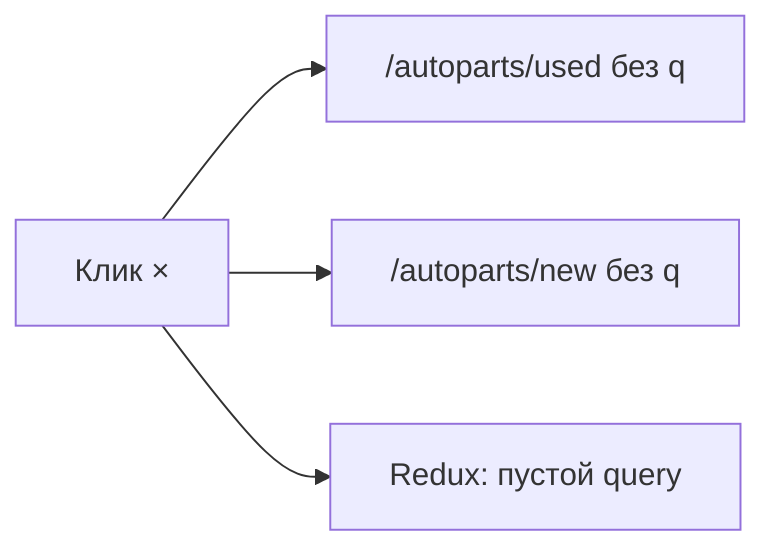

# Крестик очистки в поиске шапки

## Текущее состояние

Поиск в шапке — компонент [`Search.jsx`](frontend/my-autoparts/src/pages/Navigation/Search/Search.jsx), подключён в [`Navigation.jsx`](frontend/my-autoparts/src/pages/Navigation/Navigation.jsx) (строка ~216).

Сейчас в поле только кнопка «лупа» справа; очистить запрос можно только вручную стерев текст. При пустом `q` каталог уже умеет показывать всё:

- **Б/У** — [`AutoParts.jsx`](frontend/my-autoparts/src/pages/AutoParts/AutoParts.jsx): без `q` → `fetchCatalogProducts` (полный каталог)
- **Новые** — без `q` → [`NewPartsLanding`](frontend/my-autoparts/src/pages/AutoParts/NewParts/NewPartsLanding.jsx)

На мобиле на страницах каталога дополнительно есть [`MobileCompactSearch`](frontend/my-autoparts/src/components/MobileCompactSearch/MobileCompactSearch.jsx) — у него тоже нет крестика.

---

## Целевое поведение

Когда в поле есть текст — показать кнопку **×** слева от лупы. По клику:

| Страница | Действие |
|----------|----------|
| `/autoparts/used` | Убрать `?q=`, сбросить Redux (`setSearchQuery('')`), показать полный каталог б/у |
| `/autoparts/new` | Убрать `?q=`, `dispatch(clearSearch())`, показать лендинг новых запчастей |
| Другая страница | Очистить поле; если был активный поиск — перейти на каталог без `q` |

---

## Изменения

### 1. `Search.jsx` — крестик и `handleClear`

**Файл:** [`Search.jsx`](frontend/my-autoparts/src/pages/Navigation/Search/Search.jsx)

- Импортировать `clearSearch` из [`RosskoSlice.js`](frontend/my-autoparts/src/redux/slices/RosskoSlice.js).
- Добавить `isOnNewAutoparts = location.pathname.startsWith('/autoparts/new')`.
- Функция `handleClear()`:
  - `setSearchTerm('')`
  - `dispatch(setGlobalSearchQuery(''))`
  - На **used**: вызвать существующий `applyUsedQueryToUrl('')` (уже удаляет `q` и `page`)
  - На **new**: удалить `q` из URL, `navigate('/autoparts/new' + остальные params)`, `dispatch(clearSearch())`
  - Вне каталога: `navigate` на `/autoparts/new` или `/autoparts/used` (по `showNewAutoparts`)
- UI: кнопка × видна при `searchTerm.trim()`, между текстом и лупой
  - `aria-label="Очистить поиск"`
  - Увеличить правый padding инпута: `pr-20` при наличии крестика
  - Позиционирование: крестик `right-10`, лупа `right-0` (как сейчас)

### 2. `MobileCompactSearch.jsx` — тот же крестик (мобильный каталог)

**Файл:** [`MobileCompactSearch.jsx`](frontend/my-autoparts/src/components/MobileCompactSearch/MobileCompactSearch.jsx)

- Проп `onClear` опционально; по умолчанию — очистка через `onQueryChange('')` / `onSearch('')`
- Крестик при непустом `searchTerm`, вызывает очистку без debounce
- Согласованность с шапкой на `/autoparts/used` и `/autoparts/new` на мобиле

### 3. Тесты (минимально)

**Файл:** новый `Search.test.jsx` или расширить существующие:
- При `searchTerm = 'filter'` крестик рендерится
- `handleClear` на used-path вызывает navigate без `q`

---

## Чеклист проверки

- `/autoparts/used?q=bmw` → крестик → полный каталог, поле пустое, URL без `q`
- `/autoparts/new?q=mann` → крестик → лендинг новых, Rossko-результаты сброшены
- Десктоп: крестик в шапке не перекрывает лупу
- Мобиль: крестик в `MobileCompactSearch` на вкладках Б/У и Новые
- Пустое поле → крестик скрыт
- Фильтры (`sort`, `brand` и т.д.) при очистке **поиска** не сбрасываются — только `q`
