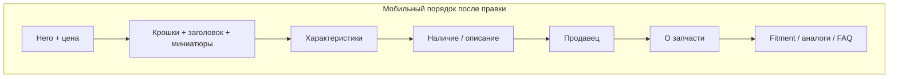

# Полировка /part/ и оптимизация /autoparts/used

## 1. Мобильная карточка `/part/`

**Файл:** [`PartDetail.jsx`](frontend/my-autoparts/src/pages/PartDetail/PartDetail.jsx)

### 1.1 Кнопка «В избранное» — только иконка, как «Поделиться»

Сейчас в hero-оверлее `FavoriteButton` рендерится с текстом «В избранное» и своими `border/padding`, из‑за чего кнопка шире share.

**Сделать:**
- В hero-оверлее (строки ~1201–1213) передать `showLabel={false}` и компактные классы: `h-10 w-10 min-h-0 rounded-full border-0 bg-transparent p-0 shadow-none`
- Для `ShareButton` — аналогичные классы, чтобы обе кнопки были круглыми `h-10 w-10` внутри общих обёрток (или убрать лишние вложенные `div`, оставив сами кнопки с `rounded-full bg-white/80`)
- Альтернатива: заменить `FavoriteButton` на [`FavoriteHeartOverlay`](frontend/my-autoparts/src/components/FavoriteButton/FavoriteHeartOverlay.jsx) со `className` под hero (без `absolute`, т.к. позиционирование уже в оверлее)

### 1.2 Убрать бейдж «Осталась N шт»

- Удалить блок `showLowStockBadge` в fold под фото (строки ~1219–1226)
- Удалить неиспользуемые переменные `showLowStockBadge` / `stockQuantity` (если больше нигде не нужны)

### 1.3 Убрать кнопку «Назад к списку» на мобиле

По вашему выбору: **убрать только мобильный блок** (строки ~1248–1260), оставить:
- стрелку «Назад» на hero-фото
- десктопную кнопку «Назад к списку» (`hidden md:flex`)

### 1.4 Блок «О запчасти» — под блок «Продавец»

Сейчас порядок в левой колонке: `PartDetailAboutBlock` → `PartDetailSpecsBlock`, продавец — в правой колонке. На мобиле левая колонка идёт раньше, поэтому «О запчасти» показывается до продавца.

**Сделать:**
- Убрать `PartDetailAboutBlock` из левой колонки (после миниатюр)
- Вставить его **сразу после** блока «Продавец» (после закрывающего `</div>` seller-card, ~строка 1495)
- На мобиле и десктопе порядок станет: галерея/заголовок → характеристики → наличие/описание → продавец → **О запчасти**



---

## 2. `/autoparts/used` — пустой поиск = полный каталог

**Файлы:** [`AutoParts.jsx`](frontend/my-autoparts/src/pages/AutoParts/AutoParts.jsx), [`autopartsPublic.js`](frontend/my-autoparts/src/utils/autopartsPublic.js)

### Проблема

При первом заходе на `/autoparts/used` без `?q=` каталог может не загрузиться, если `catalogFilterKey === usedCatalogFilterKey` (ключ совпал с прошлой сессией), но `catalogItems` пустой.

```javascript
// AutoParts.jsx ~257-261 — сейчас
const catalogAlreadyLoaded = catalogFilterKey === usedCatalogFilterKey
  && catalogFilterKey !== null;
if (!catalogAlreadyLoaded) { fetch... }
```

### Исправление

- Усилить условие: считать каталог загруженным только если **ключ совпал и `catalogItems.length > 0`**
- При заходе на used-вкладку без `q` и с пустым списком — всегда `fetchCatalogProducts(page 1)`
- Нормализовать URL: если `q` пустой или только пробелы — удалять параметр из URL (`replace: true`), синхронно чистить Redux `searchQuery`
- В `getUsedPartsUrlQuery` уже есть `.trim()` — дополнительно в `Search.jsx` / `AutoParts` при mount убрать `?q=` из адресной строки

**Не менять:** логику live-search при вводе текста — только гарантировать browse-режим при пустом поле.

---

## 3. `/autoparts/used` — зависание при длинном скролле

**Файл:** [`UsedPartsList.jsx`](frontend/my-autoparts/src/pages/AutoParts/UsedParts/UsedPartsList.jsx)

Без искусственных лимитов на API. Оптимизация рендера и надёжности подгрузки.

### 3.1 Стабильный infinite scroll

**Проблема:** `IntersectionObserver` пересоздаётся при каждом `catalogLoadingMore` (effect выходит рано на строке ~183), из‑за чего при быстром скролле sentinel теряется и подгрузка «застревает».

**Сделать:**
- Не отключать observer во время `catalogLoadingMore`; проверять флаги внутри callback через `useRef` (`loadingMoreRef`, `hasMoreRef`)
- Увеличить `rootMargin` до `300–400px` для более ранней подгрузки
- Добавить второй триггер для virtualized-режима: в `useEffect` на `gridRowVirtualizer.getVirtualItems()` / `listRowVirtualizer` — если последний видимый индекс ≥ `length - 2`, вызывать `loadMoreCatalog()` (дублирует sentinel, но надёжнее при быстром скролле)

### 3.2 Оптимизация виртуализации (главная причина фризов)

Сейчас при `> 48` товаров включается `@tanstack/react-virtual` с `measureElement` на каждой строке — при сотнях карточек это даёт layout thrashing.

**Сделать:**
- Убрать `ref={gridRowVirtualizer.measureElement}` / `listRowVirtualizer.measureElement` — использовать **фиксированный** `estimateSize` (`GRID_ROW_ESTIMATE_PX`, `LIST_ROW_ESTIMATE_PX`)
- Понизить порог `VIRTUALIZE_THRESHOLD` с 48 до **24** (раньше включать virtual scroll)
- Увеличить `overscan` до 4–5 для плавности
- Обернуть `ProductCard` в `React.memo` или мемоизировать `buildProductCardPart(part)` по `part.id` (`useMemo` map)

### 3.3 Защита от дублирующих dispatch (не лимит API)

- `loadMoreCatalog`: `useRef` `loadMoreInFlightRef` — если уже идёт запрос, не диспатчить повторно (снимается в `finally` после fulfilled/rejected)
- Это сериализация, а не throttle/дебаунс запросов

### 3.4 Мелкие улучшения

- Вынести `MediaDisplay` из тела компонента в отдельный `React.memo`-компонент (сейчас пересоздаётся на каждый render списка)
- Sentinel оставить для режима без виртуализации (`!shouldVirtualize`)

---

## Чеклист проверки

**`/part/` mobile (375px):**
- Избранное и Поделиться — две одинаковые круглые иконки без текста
- Нет бейджа «Осталась N шт»
- Нет кнопки «Назад к списку» (стрелка на фото работает)
- «О запчасти» идёт после «Продавец»

**`/autoparts/used`:**
- Первый заход без `?q=` — полный каталог, «Найдено: N» > 0
- Очистка поиска возвращает полный каталог
- Быстрый скролл вниз на 200+ карточках — подгрузка продолжается, UI не зависает
- Десктоп `/part/` — без регрессий
