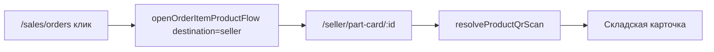

# Ссылки на товар в заказах покупателей → карточка продавца

## Текущее поведение

На странице [`SalesOrdersPage.jsx`](frontend/my-autoparts/src/pages/Sales/SalesOrdersPage.jsx) клик по товару вызывает [`openOrderItemProductFlow`](frontend/my-autoparts/src/utils/avitoProductFlow.js), который через `navigateUsedProduct` ведёт на **публичную** карточку:

```67:78:frontend/my-autoparts/src/utils/avitoProductFlow.js
function navigateUsedProduct(navigate, item, productId) {
  // ...
  navigate(`/part/${productId}-...`);  // или /part/{id}
}
```

Используется в:
- [`SalesGarageOrderCard.jsx`](frontend/my-autoparts/src/components/SalesOrders/SalesGarageOrderCard.jsx) — б/у и новые заказы Свой Гараж
- [`AvitoOrderCard.jsx`](frontend/my-autoparts/src/components/AvitoOrderCard.jsx) — заказы Avito

**Не трогаем:** [`PurchasesOrdersPage.jsx`](frontend/my-autoparts/src/pages/Sales/PurchasesOrdersPage.jsx) («Мои заказы» покупателя) — там публичная `/part/…` остаётся корректной.

## Целевое поведение

При клике на товар в **заказах покупателей** (вид продавца):

```
/sales/orders → клик по позиции → /seller/part-card/{product_id}
```

Страница [`SellerPartCardPage.jsx`](frontend/my-autoparts/src/pages/SellerPartCard/SellerPartCardPage.jsx) уже показывает складскую карточку: фото, остаток, адресное хранение, быстрые действия (списание, поступление, печать). Для авторизованного продавца/сотрудника своей организации `resolveProductQrScan` вернёт `mode: 'seller'` и отобразит полную карточку.



---

## Изменения

### 1. Параметр назначения в `openOrderItemProductFlow`

**Файл:** [`avitoProductFlow.js`](frontend/my-autoparts/src/utils/avitoProductFlow.js)

- Добавить опцию `destination: 'public' | 'seller'` (по умолчанию `'public'` — обратная совместимость).
- Новая функция `navigateSellerPartCard(navigate, productId)` → `navigate('/seller/part-card/${productId}')`.
- Когда есть `product_id` и `destination === 'seller'` — вызывать `navigateSellerPartCard` вместо `navigateUsedProduct`.
- То же для Avito-ветки после `resolveSiteProductFromAvito` (когда найден `linkedProductId`).
- Для **новых запчастей** без `product_id` (Rossko / `seo_card_id`) — оставить текущую логику `navigateGarageOrderItem` / поиск в каталоге.

### 2. Подключить в карточках заказов продавца

**Файлы:**
- [`SalesGarageOrderCard.jsx`](frontend/my-autoparts/src/components/SalesOrders/SalesGarageOrderCard.jsx) — передать `destination: 'seller'` в `openOrderItemProductFlow`.
- [`AvitoOrderCard.jsx`](frontend/my-autoparts/src/components/AvitoOrderCard.jsx) — то же.

### 3. Тест (опционально, минимальный)

**Файл:** новый `avitoProductFlow.test.js` или расширить существующие тесты:
- `openOrderItemProductFlow` с `destination: 'seller'` и `product_id: 42` → navigate вызван с `/seller/part-card/42`.
- Без `destination` → по-прежнему `/part/42`.

---

## Чеклист проверки

- `/sales/orders` → б/у заказ → клик по названию товара → `/seller/part-card/{id}` с остатком и ячейками хранения
- Avito-заказ с привязанным `product_id` → та же карточка продавца
- Новый заказ Rossko без `product_id` → без регрессии (каталог / SEO-карточка)
- `/purchases/orders` (покупатель) → по-прежнему публичная `/part/…`
- Сотрудник без прав склада → `SellerPartCardPage` отработает через существующий fallback (публичная карточка или «не найдено»)

**Зависимость от QR-плана:** не блокирует; `/seller/part-card/{id}` уже работает. Улучшения QR (legacy URL, sold-out) дополнительно повысят надёжность открытия той же страницы.
