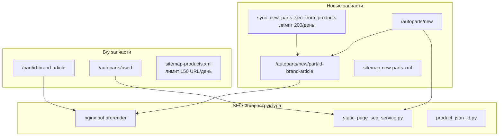
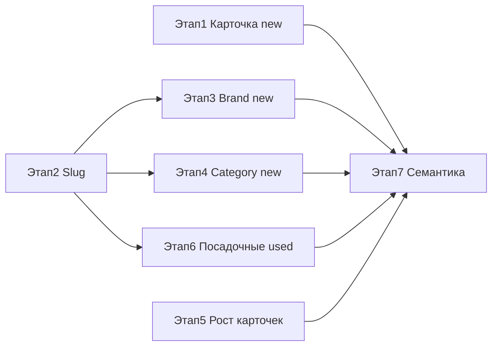

# Мастер-план SEO: новые и б/у автозапчасти «Свой Гараж»

## Текущая база (от чего отталкиваемся)



**Уже работает:** prerender для ботов, JSON-LD Product, sitemap, `noindex` на фильтрованных листингах, блок б/у на new-карточке, аналоги из Rossko (карточками, не таблицей).

**Главные пробелы:** нет цены в title, H1 не `бренд+артикул+название`, нет отдельного блока поставки, аналоги без таблицы/стабильных ссылок, нет посадочных `/brand/` и `/category/`, нет транслитерации slug, лимиты роста карточек, нет посадочных для б/у, нет системной семантики.

**Важно про категории новых запчастей:** таблица [`part_types`](backend/app/models/part_type.py) привязана к `products` (б/у-каталог). У [`NewPartsSeoCard`](backend/app/models/new_parts_seo_card.py) поля категории нет — страницы `/autoparts/new/category/*` потребуют **отдельного справочника посадочных** (slug → поисковый запрос / фильтр), а не только `part_types`.

---

## Карта этапов и зависимостей

| Этап | Название | Пункты задачи | Зависит от |
|------|----------|---------------|------------|
| **1** | Карточка новых запчастей | п.1–6 | — |
| **2** | Slug и транслит | п.8 | — |
| **3** | Посадочные брендов (new) | п.7, п.10 | Этап 2 |
| **4** | Посадочные категорий (new) | п.9, п.10 | Этап 2 |
| **5** | Рост SEO-карточек | п.11 | — (параллельно с 3–4) |
| **6** | Посадочные б/у | п.12 | Этап 2 |
| **7** | Семантика и шаблоны | п.13 | Этапы 1, 3, 4, 6 |



**Рекомендуемый порядок запуска:** 1 → 2 → 3 → 4 → 5 → 6 → 7 (этап 5 можно параллельно с 3–4).

---

## Этап 1. Улучшение карточки `/autoparts/new/part/` (п.1–6)

**Цель:** максимизировать CTR и глубину индексации каждой SEO-карточки Rossko.

### 1.1 Цена в title и description (п.1)

**Файлы (backend — источник истины для ботов):**
- [`backend/app/utils/product_search_seo.py`](backend/app/utils/product_search_seo.py) — `build_new_part_search_title()`
- [`backend/app/services/new_parts_seo_card_service.py`](backend/app/services/new_parts_seo_card_service.py) — `build_new_part_seo_meta()`

**Файлы (frontend — SPA):**
- [`frontend/my-autoparts/src/utils/productSearchSeo.js`](frontend/my-autoparts/src/utils/productSearchSeo.js)
- [`frontend/my-autoparts/src/pages/AutoParts/NewParts/NewPartDetailPage.jsx`](frontend/my-autoparts/src/pages/AutoParts/NewParts/NewPartDetailPage.jsx) — fallback SEO

**Шаблон title (≤70 символов до суффикса):**
```
{BOSCH 0986424815 Фильтр} от {1 250 ₽} — новая №{id} | Свой Гараж
```
- Цена = минимальная из `stocks[]` с наценкой (на UI) / supplier price (в meta для ботов — **согласовать одно значение**)
- Если нет цены — не добавлять блок цены

**Шаблон description:** расширить существующий backend-шаблон (уже есть цена и город) — унифицировать frontend fallback с backend.

**Также обновить:** [`frontend/my-autoparts/public/seo-head-bootstrap.js`](frontend/my-autoparts/public/seo-head-bootstrap.js) — синхронная подстановка до React.

### 1.2 H1 = бренд + артикул + название (п.2)

**Сейчас:** H1 = только `card.name` ([`NewPartDetailPage.jsx` L358](frontend/my-autoparts/src/pages/AutoParts/NewParts/NewPartDetailPage.jsx)).

**Целевой формат:**
```
H1: BOSCH 0986424815 — Масляный фильтр
```
Использовать `formatProductDisplayTitle(brand, article, name)` из [`productDisplayName.js`](frontend/my-autoparts/src/utils/productDisplayName.js).

Синхронизировать `h1` в:
- `build_new_part_seo_meta()` (backend)
- `render_new_part_prerender_html()` (prerender для ботов)
- React-страницу

### 1.3 Блок «Срок поставки / наличие на складах» (п.3)

**Сейчас:** данные есть в `NewPartProductCard` (inline), но нет отдельной секции на detail page.

**Создать компонент** `NewPartDeliveryStockBlock.jsx`:
- Таблица складов из `liveStocks` / `card.stocks[]`
- Колонки: склад, наличие (шт.), цена (с наценкой), срок доставки (`formatDeliveryTimeText` из [`rosskoHelpers.js`](frontend/my-autoparts/src/pages/AutoParts/NewParts/rosskoHelpers.js))
- Сводка сверху: «В наличии на N складах, от X ₽, доставка от …»
- Разместить между H1 и основной карточкой товара

**SEO-текст:** 1–2 предложения plain text под таблицей (попадает в prerender body).

### 1.4 Таблица аналогов со ссылками (п.4)

**Сейчас:** `analogParts` из Rossko `crosses.Part` — рендер карточками, ссылка через `POST create-or-get` (нестабильный URL).

**Целевое поведение:**
- Таблица: Бренд | Артикул | Название | Цена от | Срок | Ссылка
- Ссылка: если есть активная `NewPartsSeoCard` по brand+article → прямой URL `/autoparts/new/part/{id}-{brand}-{article}`; иначе → `create-or-get` + redirect (как сейчас)
- **Новый API:** `GET /public/new-parts/cards/resolve?brand=&article=` → `{ card_id, canonical_url } | 404`

**Файлы:**
- Новый endpoint в [`public_new_parts_cards.py`](backend/app/routers/public_new_parts_cards.py) (использовать `find_active_card_for_lookup` из sync service)
- Компонент `NewPartAnalogsTable.jsx` в detail page

### 1.5 Блок «Такая же б/у» (п.5)

**Сейчас:** горизонтальный скролл `ProductCard`, данные из 3 API — блок есть, но слабый.

**Улучшения:**
- Вынести в секцию `NewPartUsedMatchesBlock` с заголовком «Б/у {brand} {article} — дешевле?»
- Таблица/карточки: фото, цена, продавец, город, ссылка на `/part/{id}-{brand}-{article}`
- Обогатить `find-used-match` ответ: добавить `photo_url`, `organization_name`, `city` (backend)
- Показывать блок выше аналогов (выше fold)
- Если 0 совпадений — компактный CTA «Разместить б/у объявление» (опционально)

### 1.6 sku/mpn и расширение JSON-LD (п.6)

**Сейчас:** `sku` и `mpn` = `article` уже есть в [`build_new_part_card_json_ld`](backend/app/utils/product_json_ld.py) (L292–293). Задача — **доработать**, не создавать с нуля.

**Добавить в new-part JSON-LD (паритет с used):**
- `alternateName`: `[article, "{brand} {article}"]` — функция уже есть: `build_product_alternate_names`
- Rich `offers`: `shippingDetails`, `areaServed: RU`, `availableAtOrFrom` (город)
- `gtin` — только если появится в данных Rossko (не выдумывать)

**Синхронизировать FE/BE:** [`productJsonLd.js`](frontend/my-autoparts/src/utils/productJsonLd.js) + `product_json_ld.py`.

**Дополнительно (не п.6, но важно):**
- `PageSeoHelmet`: `og:type=product`, `og:image=card.image_url` (сейчас default favicon)
- Цена в JSON-LD = та же, что в title/description

### Критерии приёмки этапа 1
- [ ] Title/description с ценой совпадают в SPA, prerender и `/public/new-part-meta`
- [ ] H1 = `{brand} {article} — {name}` на странице и в prerender
- [ ] Таблица складов видна без раскрытия карточки
- [ ] Аналоги в таблице с кликабельными URL
- [ ] Блок б/у с фото и ценой
- [ ] JSON-LD валидируется в [Яндекс.Микротест](https://webmaster.yandex.ru/tools/microtest/)

---

## Этап 2. Генератор slug: кириллица → латиница (п.8)

**Цель:** единая утилита для URL вида `tormoznye-kolodki`, `bosch`, `mann-filter`.

### 2.1 Утилита транслитерации

**Создать:**
- `backend/app/utils/slug_utils.py`
- `frontend/my-autoparts/src/utils/slugUtils.js`

**Правила:**
```
"Тормозные колодки" → "tormoznye-kolodki"
"BOSCH" → "bosch"
"MANN-FILTER" → "mann-filter"
```
- ГОСТ/ISO-подобная транслитерация кириллицы
- lowercase, пробелы/подчёркивания → `-`, удаление спецсимволов
- Двусторонний lookup: `slug → display_name` и `display_name → slug`

**Тесты:** `backend/tests/test_slug_utils.py` — кейсы с ё, дефисами, латиницей, брендами.

### 2.2 Справочник посадочных страниц

**Новая таблица `seo_landing_pages`:**
```sql
id, kind (brand_new|category_new|brand_used|category_used|geo),
slug, title_ru, search_query, brand_name, part_type_id, city,
meta_title, meta_description, intro_html, is_active, priority
```

**Зачем:** brand/category/geo — разные источники данных; единая таблица для meta, sitemap и резолва slug.

**Файлы:**
- Модель `backend/app/models/seo_landing_page.py`
- Миграция/patch в [`schema_patches.py`](backend/app/db/schema_patches.py)
- CRUD API: `GET /public/seo/landings/{kind}/{slug}`
- Админка (опционально в [`SeoTab.jsx`](frontend/my-autoparts/src/pages/Admin/analytics/SeoTab.jsx))

### Критерии приёмки этапа 2
- [ ] `slugify("Тормозные колодки") === "tormoznye-kolodki"`
- [ ] Таблица `seo_landing_pages` с seed-данными (10 брендов, 10 категорий)
- [ ] API резолва slug → meta + фильтры

---

## Этап 3. Посадочные брендов — новые `/autoparts/new/brand/{slug}` (п.7, п.10)

**Цель:** индексируемые hub-страницы по брендам с уникальным title и списком карточек.

### 3.1 Маршруты и страница

**Добавить в [`App.js`](frontend/my-autoparts/src/App.js):**
```
/autoparts/new/brand/:brandSlug  →  NewPartsBrandLandingPage
```

**Компонент `NewPartsBrandLandingPage.jsx`:**
- Резолв slug → `brand_name` (из `seo_landing_pages` или авто из `DISTINCT brand` в `new_parts_seo_cards`)
- H1: `Новые автозапчасти {Brand}`
- Intro-текст 200–400 слов (из `intro_html` справочника)
- Список карточек: `GET /public/new-parts/cards?brand={}&limit=48&offset=`
- Пагинация
- Чипы популярных артикулов бренда

### 3.2 Backend: API списка карточек по бренду

**Расширить** [`public_new_parts_cards.py`](backend/app/routers/public_new_parts_cards.py):
- `GET /public/new-parts/cards?brand=MANN&page=1&page_size=48`
- Фильтр: `is_active`, `source=rossko`, `is_rossko_new_part_sitemap_eligible`
- Ответ: items + total count (для meta description: «Каталог 142 запчасти MANN…»)

### 3.3 SEO-интеграция

**Meta-шаблон (п.10):**
```
title: Новые запчасти {Brand} — каталог с доставкой | Свой Гараж
description: Купить новые автозапчасти {Brand}: {N} позиций в каталоге, артикулы, цены, доставка по России.
canonical: https://svoygarage.ru/autoparts/new/brand/{slug}
robots: index, follow
```

**Подключить в:**
- [`static_page_seo_service.py`](backend/app/services/static_page_seo_service.py) — regex `^/autoparts/new/brand/(?P<slug>[^/]+)$`
- [`spa_page_check_service.py`](backend/app/services/spa_page_check_service.py) — валидный SPA-route
- [`pageSeo.js`](frontend/my-autoparts/src/utils/pageSeo.js) — `buildNewPartsBrandSeo()`
- [`docs/nginx/svoygarage.conf`](docs/nginx/svoygarage.conf) — bot prerender для `^/autoparts/new/brand/`
- JSON-LD: `CollectionPage` + `ItemList` (как в [`organizationSeo.js`](frontend/my-autoparts/src/pages/Organizations/organizationSeo.js))

### 3.4 Sitemap

- Динамический эндпоинт `GET /api/feeds/sitemap-new-brands.xml` или секция в sitemap-index
- Генерация из `seo_landing_pages WHERE kind=brand_new AND is_active`

### 3.5 Seed: первые 15 брендов

MANN-FILTER, BOSCH, VAG, TOYOTA, HYUNDAI/KIA, NGK, KYB, SACHS, LEMFÖRDER, FEBI, CTR, GATES, DAYCO, MAHLE, VALEO — slug через этап 2.

### Критерии приёмки этапа 3
- [ ] `/autoparts/new/brand/bosch` открывается, показывает карточки BOSCH
- [ ] Уникальный title/description, `index, follow`
- [ ] Prerender для YandexBot с H1 и списком ссылок
- [ ] URL в sitemap

---

## Этап 4. Посадочные категорий — новые `/autoparts/new/category/{slug}` (п.9, п.10)

**Цель:** long-tail страницы типа «новые тормозные колодки купить».

### 4.1 Особенность данных

Категории **не привязаны** к `NewPartsSeoCard`. Стратегия:
- `seo_landing_pages.kind=category_new`
- Поле `search_query`: «тормозные колодки», «масляный фильтр» и т.д.
- Список карточек: поиск по `name ILIKE` + опционально Rossko live search для актуальных цен

### 4.2 Маршрут и страница

```
/autoparts/new/category/:categorySlug  →  NewPartsCategoryLandingPage
```

**Компонент:**
- H1: `Новые {категория} — каталог с доставкой`
- Intro 300–500 слов (уникальный текст в справочнике — **обязательно**, иначе thin content)
- Карточки: `GET /public/new-parts/cards?category_slug=tormoznye-kolodki`
- Блок «Популярные бренды в категории» → ссылки на этап 3

### 4.3 Backend

- `GET /public/new-parts/cards?category_slug=` — резолв slug → `search_query` → фильтр `name ILIKE %query%` по `new_parts_seo_cards`
- Fallback: если мало карточек (<5) — подгрузка через Rossko search и `create-or-get` (фоново)

### 4.4 SEO (аналогично этапу 3)

```
title: Новые {тормозные колодки} — купить с доставкой | Свой Гараж
description: Каталог новых {тормозных колодок}: {N} позиций, цены, артикулы, аналоги. Доставка по России.
```

Prerender + nginx + sitemap + `CollectionPage` JSON-LD.

### 4.5 Seed: первые 20 категорий

| slug | title_ru | search_query |
|------|----------|--------------|
| tormoznye-kolodki | Тормозные колодки | тормозные колодки |
| tormoznye-diski | Тормозные диски | тормозные диски |
| maslyanyy-filtr | Масляный фильтр | масляный фильтр |
| vozdushnyy-filtr | Воздушный фильтр | воздушный фильтр |
| svechi-zazhiganiya | Свечи зажигания | свечи зажигания |
| amortizatory | Амортизаторы | амортизатор |
| strela-stabilizatora | Стойки стабилизатора | стойка стабилизатора |
| remen-grm | Ремень ГРМ | ремень грм |
| komplekt-grm | Комплект ГРМ | комплект грм |
| filtr-salona | Салонный фильтр | салонный фильтр |
| pompa-vody | Помпа водяная | помпа |
| termostat | Термостат | термостат |
| generatory | Генератор | генератор |
| startery | Стартер | стартер |
| filtr-toplivnyy | Топливный фильтр | топливный фильтр |
| sharovye-opory | Шаровые опоры | шаровая опора |
| ryčag | Рычаг подвески | рычаг |
| podshipnik-stupicy | Подшипник ступицы | подшипник ступицы |
| dyski-scepleniya | Диск сцепления | диск сцепления |
| filtr-akpp | Фильтр АКПП | фильтр акпп |

### Критерии приёмки этапа 4
- [ ] `/autoparts/new/category/tormoznye-kolodki` — indexable, уникальный текст, ≥5 карточек
- [ ] Sitemap + prerender
- [ ] Перелинковка category ↔ brand

---

## Этап 5. Увеличение прироста SEO-карточек новых запчастей (п.11)

**Цель:** быстрее наращивать число URL в `sitemap-new-parts.xml`.

### 5.1 Текущие лимиты

| Параметр | Значение | Файл |
|----------|----------|------|
| Новых карточек/день (Rossko sync) | 200 | [`config.py`](backend/app/core/config.py) `NEW_PARTS_SEO_SYNC_DAILY_LIMIT` |
| Sitemap export batch | 75 new + 75 used / день | [`sitemap_service.py`](backend/app/services/sitemap_service.py) `DEFAULT_PRODUCT_URLS_LIMIT=150` |
| Задержка Rossko | 1.0 сек | `NEW_PARTS_SEO_SYNC_ROSSKO_DELAY_SEC` |

### 5.2 Действия по росту

**A. Поднять лимиты (конфигурируемо через `.env`):**
```
NEW_PARTS_SEO_SYNC_DAILY_LIMIT=500
NEW_PARTS_SEO_SYNC_ROSSKO_DELAY_SEC=0.5
SEO_SITEMAP_DAILY_URL_LIMIT=300
```

**B. Расширить источники кандидатов** в [`new_parts_seo_sync_service.py`](backend/app/services/new_parts_seo_sync_service.py):
- Сейчас: distinct brand+article из `products` (б/у каталог)
- Добавить: distinct brand+article из `NewPartsSeoCard` crosses (аналоги Rossko)
- Добавить: популярные запросы из [`popular-queries`](backend/app/routers/public_pages.py)
- Добавить: brand+article из заказов `garage_new_orders`

**C. Eager card creation:**
- При `create-or-get` из поиска/аналогов — сразу в sitemap ([`append_new_part_card_to_sitemap_cache`](backend/app/services/sitemap_service.py) уже есть)
- При открытии brand/category landing — фоновое создание карточек для топ-позиций

**D. Мониторинг в админке** [`SeoTab.jsx`](frontend/my-autoparts/src/pages/Admin/analytics/SeoTab.jsx):
- График: создано карточек/день, размер sitemap, % eligible
- Кнопка «форс-синк» (уже есть rebuild; добавить sync trigger)

**E. Автообновление карточек:**
- Периодический refresh цен/наличия в `NewPartsSeoCard` из Rossko (отдельная задача scheduler)

### Критерии приёмки этапа 5
- [ ] Лимиты вынесены в `.env` и документированы
- [ ] Создание карточек ≥350/день (при доступном Rossko)
- [ ] Sitemap new-parts растёт на ≥200 URL/неделю
- [ ] Дашборд в админке показывает динамику

---

## Этап 6. Посадочные б/у: brand, category, geo (п.12)

**Цель:** зеркальная структура для `/autoparts/used/`.

### 6.1 Маршруты

```
/autoparts/used/brand/:brandSlug      → UsedPartsBrandLandingPage
/autoparts/used/category/:categorySlug → UsedPartsCategoryLandingPage
/autoparts/used/city/:citySlug        → UsedPartsGeoLandingPage (опционально)
```

### 6.2 Источники данных (готовы)

- Бренды: `GET /catalog/facets` → `brands[]` с count
- Категории: `GET /part-types/public` + count через `GET /catalog/products?part_type_id=&is_new=false`
- Товары: `GET /catalog/products?brand=&part_type_id=&is_new=false&has_photos=1`

**Исправить:** [`buildUsedCatalogParams`](frontend/my-autoparts/src/utils/autopartsPublic.js) — явно передавать `is_new=false`.

### 6.3 SEO-шаблоны

**Brand used:**
```
title: Б/у запчасти {Brand} — каталог продавцов | Свой Гараж
description: {N} б/у автозапчастей {Brand} от продавцов на «Свой Гараж»: фото, цены, чат с продавцом. Екатеринбург и доставка по России.
```

**Category used:**
```
title: Б/у {тормозные колодки} — купить от продавцов | Свой Гараж
```

**Geo (Екатеринбург):**
```
title: Б/у автозапчасти в {Екатеринбурге} — каталог | Свой Гараж
```
- Фильтр: по `organization.address ILIKE %город%` (новый параметр `city` в catalog API) **или** curated list org IDs для города

### 6.4 Переиспользовать паттерн

- Тот же `seo_landing_pages` (kind: `brand_used`, `category_used`, `geo`)
- Тот же prerender/nginx/sitemap pipeline что в этапах 3–4
- UI: переиспользовать [`UsedPartsList`](frontend/my-autoparts/src/pages/AutoParts/UsedParts/) + hero как [`OrganizationPublicPage`](frontend/my-autoparts/src/pages/Organizations/OrganizationPublicPage.jsx)

### 6.5 Обратные ссылки с карточек б/у

В [`PartDetail.jsx`](frontend/my-autoparts/src/pages/PartDetail/PartDetail.jsx) добавить (сейчас cross-links отсутствуют):
- «Все б/у {brand}» → `/autoparts/used/brand/{slug}`
- «Новая аналогичная» → resolve new SEO card → `/autoparts/new/part/...`

### Критерии приёмки этапа 6
- [ ] 10 brand + 10 category + 1 geo посадочных для б/у
- [ ] `is_new=false` в API-запросах листинга
- [ ] Cross-links с `/part/` на посадочные
- [ ] Sitemap + prerender

---

## Этап 7. Семантика: гео, посадочные, карточки (п.13)

**Цель:** привязать кластеры запросов к конкретным URL и шаблонам meta.

### 7.1 Документ семантики

**Создать** `docs/seo/semantic-map.md` (не код — справочник для команды):

**Кластер A — Карточки (высокий intent):**
| Запрос | Целевой URL | Шаблон title |
|--------|-------------|--------------|
| `{brand} {article} купить` | `/autoparts/new/part/...` или `/part/...` | `{brand} {article} от {price} — {new/б/у} \| Свой Гараж` |
| `{brand} {article} цена` | то же | то же |
| `{article} оригинал` | new card | то же |

**Кластер B — Бренды (средний intent):**
| Запрос | URL |
|--------|-----|
| `новые запчасти {brand}` | `/autoparts/new/brand/{slug}` |
| `б/у запчасти {brand}` | `/autoparts/used/brand/{slug}` |
| `{brand} автозапчасти` | оба |

**Кластер C — Категории:**
| Запрос | URL |
|--------|-----|
| `новые {категория} купить` | `/autoparts/new/category/{slug}` |
| `б/у {категория}` | `/autoparts/used/category/{slug}` |
| `{категория} {марка авто}` | category + фильтр `?vb=` (noindex) или будущие combo-landing |

**Кластер D — Гео:**
| Запрос | URL |
|--------|-----|
| `автозапчасти екатеринбург` | `/` + `/about` + `/organizations` |
| `б/у запчасти екатеринбург` | `/autoparts/used/city/ekaterinburg` |
| `новые автозапчасти екатеринбург` | `/autoparts/new` (уже есть город в description карточек) |

### 7.2 Связка с Вебмастером

- Загрузить sitemap-index
- Регион: Свердловская область
- «Важные страницы»: топ-100 карточек + все brand/category landing
- Мониторинг: «Товарные сниппеты», ошибки микроразметки

### 7.3 Правила индексации (зафиксировать)

| URL-паттерн | robots |
|-------------|--------|
| `/autoparts/new` (без params) | index |
| `/autoparts/new?q=...` | noindex |
| `/autoparts/new/brand/{slug}` | index |
| `/autoparts/new/category/{slug}` | index |
| `/autoparts/new/part/{id}-...` | index |
| `/autoparts/used/brand/{slug}` | index |
| `/autoparts/used?brand=...` | noindex (canonical → brand landing) |
| `/part/{id}-...` | index |

### 7.4 Перелинковочная матрица

```
Главная → brand landings (new + used)
Brand landing → top cards + category landings
Category landing → brand landings + top cards
New card → used matches + analogs + brand landing
Used card → new analog + brand landing + seller org
```

### 7.5 KPI-дашборд (еженедельно)

- Показы/клики/CTR/позиция по кластерам A–D в GSC и Вебмастере
- Индекс: URL в sitemap vs проиндексировано
- Органика на `/autoparts/new/part/*` и `/part/*`
- Конверсия: корзина (new), чат (used)

### Критерии приёмки этапа 7
- [ ] `docs/seo/semantic-map.md` с ≥50 запросами и URL
- [ ] Таблица индексации согласована с `pageSeo.js` и `static_page_seo_service.py`
- [ ] Перелинковка по матрице реализована
- [ ] Первый отчёт GSC/Вебмастер через 2 недели после этапов 1–6

---

## Сводка: что уже есть vs что строим

| Пункт | Статус | Этап |
|-------|--------|------|
| п.1 Цена в title/description | Частично (только description BE) | 1 |
| п.2 H1 бренд+артикул+название | Нет | 1 |
| п.3 Блок поставки/складов | Частично (inline в карточке) | 1 |
| п.4 Таблица аналогов | Частично (карточки, без таблицы) | 1 |
| п.5 Блок б/у | Есть, нужно усилить | 1 |
| п.6 sku/mpn JSON-LD | Есть, нужно расширить | 1 |
| п.7 Brand landing new | Нет | 3 |
| п.8 Slug транслит | Нет | 2 |
| п.9 Category landing new | Нет | 4 |
| п.10 Уникальный title + список | Нет | 3, 4 |
| п.11 Рост карточек | Лимит 200/день | 5 |
| п.12 Посадочные б/у | Нет | 6 |
| п.13 Семантика | Нет | 7 |

---

## Как использовать этот план

1. Выберите этап (1–7)
2. Запустите в режиме **Plan** с формулировкой: «Реализуй Этап N из SEO Master Plan»
3. После этапа — проверьте критерии приёмки и переходите к следующему

**Оценка трудозатрат (ориентир):**
- Этап 1: 3–5 дней
- Этап 2: 2–3 дня
- Этап 3: 3–4 дня
- Этап 4: 3–4 дня
- Этап 5: 1–2 дня
- Этап 6: 4–5 дней
- Этап 7: 2–3 дня (документация + перелинковка)
