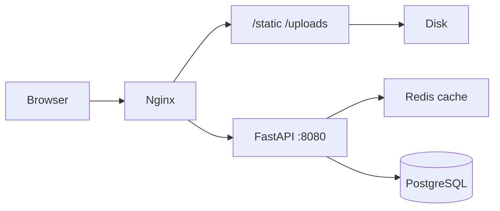

# План ускорения публичной части сайта

Фокус: **главная**, **`/autoparts/new`**, **`/autoparts/used`**, **карточки товаров**, **SEO/prerender**. Без CDN — только текущий сервер (nginx + uvicorn + PostgreSQL + Redis).

Уже есть хорошая база ([`docs/ops/performance.md`](docs/ops/performance.md)):
- пагинация публичного каталога (`GET /api/catalog/products`);
- Redis-кэш каталога и публичных товаров (TTL 45–300 с);
- lazy routes и виртуализация б/у списка (>48 позиций) в [`UsedPartsList.jsx`](frontend/my-autoparts/src/pages/AutoParts/UsedParts/UsedPartsList.jsx);
- gzip в nginx, `immutable` для hashed `/static/*`;
- CWV → Яндекс.Метрика ([`reportWebVitals.js`](frontend/my-autoparts/src/reportWebVitals.js)).



---

## Этап 0 — Baseline (1 день)

Зафиксировать «до» по публичным URL, чтобы не оптимизировать вслепую.

**Инструменты:** PageSpeed Insights / WebPageTest для:
- `/`
- `/autoparts/used`
- `/autoparts/new`
- 1–2 карточки `/part/...` и `/autoparts/new/part/...`

**Метрики:** LCP, INP, CLS (уже уходят в Метрику как `web_vitals_*`).

**Сервер:** один раз снять TTFB и размер ответа:
```bash
curl -sI -H 'Accept-Encoding: gzip' https://svoygarage.ru/static/js/main.*.js
curl -sI https://svoygarage.ru/server/api/catalog/products?page=1&page_size=20
```

**Критерий готовности:** таблица «URL → LCP/TTFB/размер JS» сохранена в [`docs/ops/performance.md`](docs/ops/performance.md).

---

## Этап 1 — Nginx и статика (быстрые победы, 1–2 дня)

Правки только в [`docs/nginx/svoygarage.conf`](docs/nginx/svoygarage.conf) на сервере.

| Задача | Зачем | Детали |
|--------|-------|--------|
| **Brotli** | −15–25% JS/CSS vs gzip | Установить `libnginx-mod-http-brotli-*`, раскомментировать блок (сейчас отключён — см. performance.md) |
| **`index.html` без long-cache** | Свежий SPA после деплоя | Отдельный `location = /index.html` с `Cache-Control: no-cache` (сейчас попадает под общий `@spa` без явной политики) |
| **Uploads: убрать `immutable`** | Корректное обновление фото | В блоках `/uploads/` — `max-age=30d` без `immutable`, если URL не content-addressed |
| **nginx microcache для публичного API** | Меньше нагрузки на uvicorn/БД | `proxy_cache` только для безопасных GET: `/api/catalog/products`, `/api/products/public/`, `/api/public/part-meta`, `/api/public/new-part-meta`, `/api/feeds/sitemap*.xml` — TTL 30–60 с, ключ `$request_uri` |
| **Кэш `page-check`** | Меньше лишних DB-hit на deep links | Короткий Redis или nginx cache для [`/_internal/page-check`](docs/nginx/svoygarage.conf) (сейчас `auth_request` на каждый `@spa` fallback) |

**Не трогаем:** rate limit на auth (уже снят на prod для входа).

---

## Этап 2 — Backend: публичный API и БД (3–5 дней)

### 2.1 Кэш Redis — инвалидация

Сейчас TTL-only ([`catalog.py`](backend/app/routers/catalog.py), [`products.py`](backend/app/routers/products.py)): после изменения товара каталог может быть устаревшим до 60 с.

- При create/update/stock change/delete товара — удалять ключи `catalog:*`, `products:public:*`, `search:combined:*` для затронутой организации.
- Точки входа: approve модерации, stock in/out, edit product.

### 2.2 Индексы PostgreSQL под публичный каталог

Добавить миграцию/patch (как в [`schema_patches.py`](backend/app/db/schema_patches.py)):

```sql
-- примеры, уточнить по EXPLAIN ANALYZE на prod
CREATE INDEX CONCURRENTLY IF NOT EXISTS ix_products_public_catalog
  ON products (quantity, is_new, id DESC)
  WHERE quantity > 0;

CREATE INDEX CONCURRENTLY IF NOT EXISTS ix_products_org_qty
  ON products (organization_id, quantity);

CREATE INDEX CONCURRENTLY IF NOT EXISTS ix_products_part_type_qty
  ON products (part_type_id, quantity);
```

Перед применением — `EXPLAIN ANALYZE` для типичного запроса из [`catalog.py`](backend/app/routers/catalog.py) (фильтр `quantity > 0`, сортировка, join с vehicles).

### 2.3 Тяжёлые публичные эндпоинты

| Эндпоинт | Проблема | Действие |
|----------|----------|----------|
| `GET /search-products/search` | до 500 строк, без Redis | Redis-кэш 60–120 с или жёсткий `limit` + пагинация для UI |
| `GET /search-products/resolve` | несколько round-trip в БД | кэш по `(brand, article)` |
| Публичный count в catalog | `count()` на каждый cache miss | кэш total отдельно или approximate для filtered browse |

### 2.4 Фоновые задачи не в web-процессе

В [`main.py`](backend/app/main.py) scheduler (SEO sync, sitemap rebuild) конкурирует с API.

- Включить `NEW_PARTS_SEO_SYNC_USE_CELERY=true` в prod `.env`.
- Sitemap rebuild — только Celery/cron, не блокировать event loop uvicorn.

---

## Этап 3 — Изображения (2–3 дня, высокий эффект на LCP)

Сейчас карточки каталога грузят **полное фото первым**:

```124:138:frontend/my-autoparts/src/utils/apiClient.js
export const buildImageUrlFallbackChain = (photo) => {
    const raw = [
        pickFullImageUrl(photo),  // full первым
        photo.thumb_url,
        ...
    ];
```

[`ProductCard.jsx`](frontend/my-autoparts/src/pages/AutoParts/ProductCard.jsx) использует эту цепочку → лишний трафик на списках.

**План:**
1. Для **списков/каталога** — отдельная цепочка `buildListImageUrlFallbackChain`: `thumb_url` → `list_photo_url` → full (fallback).
2. Для **карточки товара** — full остаётся.
3. Проверить, что API отдаёт `thumb_url` в публичных serializers ([`catalog.py`](backend/app/routers/catalog.py), public product).
4. `width`/`height` + `fetchPriority="high"` только для первых 2 карточек above-the-fold (уже частично в ProductCard).
5. Preload LCP-изображения на карточке товара (1 `<link rel="preload" as="image">` из meta/prerender).

**UsedPartsList** — в [`MediaDisplay`](frontend/my-autoparts/src/pages/AutoParts/UsedParts/UsedPartsList.jsx) ограничить превью 1 фото (уже есть) + thumb-first.

---

## Этап 4 — Frontend: меньше JS на первом экране (3–4 дня)

### 4.1 Разгрузить initial bundle

Сейчас [`AutoParts.jsx`](frontend/my-autoparts/src/pages/AutoParts/AutoParts.jsx) eager и тянет `UsedPartsList` + `@tanstack/react-virtual` даже на `/autoparts/new`.

- Lazy-load `UsedPartsList` и `NewPartsResults` внутри `AutoParts` по активной вкладке/route.
- Вынести Rossko-логику new parts в отдельный chunk (dynamic import при первом заходе на «Новые»).

### 4.2 Мемоизация горячих компонентов

- `React.memo` для [`ProductCard.jsx`](frontend/my-autoparts/src/pages/AutoParts/ProductCard.jsx), [`NewPartProductCard.jsx`](frontend/my-autoparts/src/pages/AutoParts/NewParts/NewPartProductCard.jsx).
- Вынести `MediaDisplay` из тела `UsedPartsList` наружу (сейчас пересоздаётся каждый render).

### 4.3 Шрифты

В [`public/index.html`](frontend/my-autoparts/public/index.html) Onest грузится с Google Fonts (render-blocking).

- `font-display: swap` (уже `display=swap` в URL).
- Опционально: self-host woff2 в `/static/fonts/` + preload — убирает DNS/TLS к fonts.googleapis.com.

### 4.4 Bundle audit

- Добавить `source-map-explorer` или `webpack-bundle-analyzer` в devDependencies.
- Удалить неиспользуемый `swiper` из [`package.json`](frontend/my-autoparts/package.json) (0 импортов в src).

---

## Этап 5 — Поиск и SEO-страницы (5–7 дней, средний приоритет)

Публичный поиск (`/find`, `?q=`) упирается в `ILIKE '%…%'` ([`local_product_search.py`](backend/app/services/local_product_search.py)).

**Поэтапно:**
1. **Краткосрочно:** Redis-кэш результатов по нормализованному `q` + filters (120 с).
2. **Среднесрочно:** PostgreSQL FTS (`tsvector` + GIN) по `brand`, `article`, `name` для used catalog.
3. **Prerender/meta:** убедиться, что nginx microcache покрывает [`public_product_seo.py`](backend/app/routers/public_product_seo.py) / [`public_pages_seo.py`](backend/app/routers/public_pages_seo.py) (уже `Cache-Control: max-age=300`).

---

## Этап 6 — Наблюдаемость (параллельно)

- PostgreSQL: `log_min_duration_statement = 500ms` на prod (временно для аудита).
- FastAPI: лёгкий middleware «endpoint > 1s → log» (path, duration, без PII).
- Redis: мониторинг hit rate для `catalog:*` / `products:public:*`.
- Алерт при 503/502 на `/server/api/catalog/*`.

---

## Приоритеты и ожидаемый эффект

| Приоритет | Задачи | Эффект |
|-----------|--------|--------|
| **P0** | Thumb в списках, microcache nginx, index.html no-cache, инвалидация Redis | LCP −20–40%, TTFB каталога −30–50% |
| **P1** | Brotli, lazy AutoParts chunks, memo ProductCard, DB indexes | FCP/TTI −15–25%, меньше CPU на scroll |
| **P2** | FTS для поиска, Celery для SEO jobs, font self-host | Масштабирование каталога, стабильность под нагрузкой |

---

## Порядок внедрения (рекомендуемый)

1. Baseline метрик (этап 0)
2. Nginx: Brotli + index.html + microcache (этап 1) — **можно на сервере без деплоя кода**
3. Thumb-first в ProductCard/UsedPartsList (этап 3) — **самый заметный для пользователя**
4. Redis invalidation + indexes (этап 2)
5. Lazy chunks AutoParts (этап 4)
6. Поиск FTS (этап 5)

После каждого этапа — повторный PageSpeed + сравнение CWV в Метрике (7 дней окно).

---

## Что сознательно не включаем

- CDN / edge cache (по вашему выбору)
- Оптимизация кабинета продавца (`GET /api/products/` без пагинации) — вне фокуса публичного каталога
- Service Worker для кэша assets — низкий ROI при уже настроенном nginx `immutable` для `/static/*`
