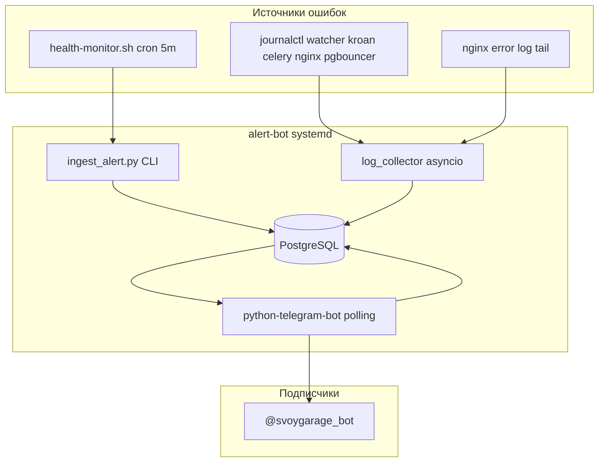

# Telegram-бот уведомлений об ошибках сервера

## Архитектура



Бот — **отдельный Python-сервис** в [`alert-bot/`](alert-bot/), не часть FastAPI. Использует **ту же PostgreSQL** (`DATABASE_URL` из [`backend/.env`](backend/.env)), но **свои таблицы** (не трогаем модели backend).

---

## Структура папки `alert-bot/`

```
alert-bot/
  requirements.txt          # python-telegram-bot, sqlalchemy, psycopg2, argon2-cffi, python-dotenv
  .env.example              # BOT_TOKEN, DATABASE_URL, ALERT_COOLDOWN_SEC
  README.md                 # локальный запуск и prod-настройка
  alert_bot/
    main.py                 # точка входа: bot + log collector
    config.py
    db/
      session.py
      models.py
    auth.py                 # проверка email+пароль через users.hashed_password (Argon2)
    handlers/
      start.py              # /start, FSM email → password
      menu.py               # клавиатура после входа
      history.py            # кнопка «История ошибок», пагинация
    services/
      alerts.py             # insert + notify subscribers
      log_collector.py      # journalctl + nginx error tail
    keyboards.py
  scripts/
    ingest_alert.py         # CLI для health-monitor.sh
  docs/ops/
    alert-bot.service       # systemd unit
    alert-bot.env.example   # шаблон /etc/autoparts/alert-bot.env
```

---

## База данных (новые таблицы)

| Таблица | Поля | Назначение |
|---------|------|------------|
| `alert_bot_subscribers` | `id`, `telegram_chat_id` (unique), `user_id` FK→users, `subscribed_at`, `is_active` | Авторизованные подписчики |
| `alert_bot_auth_sessions` | `telegram_chat_id`, `state` (awaiting_email/password), `email_temp`, `updated_at` | FSM авторизации |
| `server_error_events` | `id`, `source` (nginx/kroan/celery/health-monitor/…), `severity`, `title`, `message`, `meta` JSON, `dedupe_key`, `created_at` | История + dedupe |

- Таблицы создаются при старте бота через `Base.metadata.create_all()` (как в [`backend/app/main.py`](backend/app/main.py)).
- Индекс на `(dedupe_key, created_at)` и `(created_at DESC)` для истории.

---

## Авторизация (email → пароль)

Поток в боте:

1. `/start` — если chat_id не в `alert_bot_subscribers` → «Введите email»
2. Email → проверка `users.email ILIKE` + **`is_admin = true`**
3. «Введите пароль» → Argon2 verify (как [`backend/app/core/security.py`](backend/app/core/security.py))
4. При успехе — запись в `alert_bot_subscribers`, показ меню
5. **Удалять сообщение с паролем** через `delete_message` (Telegram API)
6. При 3 неудачных попытках — блокировка chat_id на 15 мин (in-memory или в `auth_sessions`)

После входа — постоянная клавиатура:
- **История ошибок** — последние 20 записей, кнопки «◀️ / ▶️» (по 5 на страницу), формат: `2026-07-05 20:12 | nginx | 502 x7 за 5 мин`
- **Статус** — краткая сводка (активные сервисы, последний алерт)
- **Выйти** — деактивировать подписку

---

## Сбор ошибок

### 1. Интеграция с существующим [`scripts/ops/health-monitor.sh`](scripts/ops/health-monitor.sh)

В функцию `send_alert()` добавить вызов (после записи в alert log):

```bash
INGEST="$ROOT/alert-bot/venv/bin/python"
[[ -x "$INGEST" ]] && "$INGEST" "$ROOT/alert-bot/scripts/ingest_alert.py" \
  --source health-monitor --key "$key" --severity warning \
  --title "$key" --message "$message" 2>/dev/null || true
```

Покрывает: down сервисов, 502/504, рестарты kroan, load/RAM/disk.

### 2. Real-time log collector (фоновая задача в `main.py`)

| Источник | Метод | Фильтр |
|----------|-------|--------|
| kroan, celery, pgbouncer | `journalctl -u UNIT -f -n 0 -p err..alert` | ERROR и выше |
| nginx | `tail -F /var/log/nginx/svoygarage_ssl_error.log` | новые строки |
| postgresql | `journalctl -u postgresql -f -p err..alert` | критические |

- **Dedupe/cooldown**: `dedupe_key = hash(source + normalized_message)`, не слать повторно чаще `ALERT_COOLDOWN_SEC` (default 300, как в health-monitor).
- При новом событии: INSERT в `server_error_events` → push всем `is_active` подписчикам.

### 3. Уведомление подписчикам

```python
async def notify_subscribers(event):
    for sub in active_subscribers:
        await bot.send_message(sub.chat_id, format_alert(event))
```

Формат сообщения: emoji по severity + source + время MSK + текст (обрезка до 4000 символов).

---

## Безопасность секретов

**Критично:** токен бота и SSH-пароль из запроса **не коммитить** в репозиторий.

- Токен → только `/etc/autoparts/alert-bot.env` на сервере (chmod 600)
- Добавить `alert-bot/.env` в [`.gitignore`](.gitignore) если ещё нет
- Рекомендовать пользователю **отозвать и перевыпустить токен** через @BotFather (он был опубликован в чате)
- SSH-пароль root — использовать только при деплое, не хранить в файлах проекта

---

## Systemd и деплой

### Unit [`alert-bot/docs/ops/alert-bot.service`](alert-bot/docs/ops/alert-bot.service)

```ini
[Unit]
Description=SvoyGarage Telegram Alert Bot
After=network.target postgresql.service

[Service]
Type=simple
User=fast
Group=fast
WorkingDirectory=/home/fast/autoparts/alert-bot
EnvironmentFile=/etc/autoparts/alert-bot.env
ExecStart=/home/fast/autoparts/alert-bot/venv/bin/python -m alert_bot.main
Restart=on-failure
RestartSec=10

[Install]
WantedBy=multi-user.target
```

### Env `/etc/autoparts/alert-bot.env`

```
BOT_TOKEN=<из BotFather, не в git>
DATABASE_URL=<из backend/.env, PgBouncer :6432>
ALERT_COOLDOWN_SEC=300
TZ=Europe/Moscow
```

### Изменения в [`scripts/deploy/update.sh`](scripts/deploy/update.sh)

Новая функция `ensure_alert_bot()` (по аналогии с `install_kroan_unit` + `ensure_monitoring`):

1. `python3 -m venv alert-bot/venv` + `pip install -r alert-bot/requirements.txt` (если hash изменился)
2. Копировать unit → `/etc/systemd/system/alert-bot.service`, `daemon-reload`
3. Создать `/etc/autoparts/alert-bot.env` из example (если нет)
4. `systemctl enable --now alert-bot`
5. Перезапуск при обновлении deps

### Документация

Краткая секция в [`docs/ops/monitoring.md`](docs/ops/monitoring.md): бот заменяет простой `TELEGRAM_CHAT_ID` в monitor.env (старый curl-алерт можно оставить как fallback или убрать после проверки).

---

## Деплой на Ubuntu (195.24.65.251)

Последовательность после коммита и push:

```bash
# 1. SSH на prod
ssh root@195.24.65.251

# 2. Обновить код
update

# 3. Настроить env (один раз)
nano /etc/autoparts/alert-bot.env   # BOT_TOKEN, DATABASE_URL
chmod 600 /etc/autoparts/alert-bot.env

# 4. Запустить
systemctl enable --now alert-bot
systemctl status alert-bot
journalctl -u alert-bot -f

# 5. Проверка: /start в @svoygarage_bot → email admin → пароль → тестовый алерт
python /home/fast/autoparts/alert-bot/scripts/ingest_alert.py \
  --source test --key manual --severity info --title test --message "Deploy OK"
```

---

## Зависимости от существующего кода

| Что переиспользуем | Как |
|--------------------|-----|
| PostgreSQL + users | READ-only запрос к `users` для auth |
| Argon2 | `argon2-cffi`, та же логика verify |
| health-monitor | расширение `send_alert()` |
| update.sh | `ensure_alert_bot()` |
| monitoring docs | секция про бота |

**Application code backend не меняется** — только ops-скрипты и новая папка `alert-bot/`.

---

## Риски и mitigations

| Риск | Mitigation |
|------|------------|
| Спам алертов | dedupe_key + cooldown 5 мин |
| Пароль в Telegram | удаление msg + только is_admin |
| Утечка токена | env на сервере, rotate через BotFather |
| journalctl permissions | сервис под `fast`, добавить `fast` в группу `systemd-journal` или `adm` |
| Длинные сообщения | truncate 4000 chars, полный текст в БД / истории |
