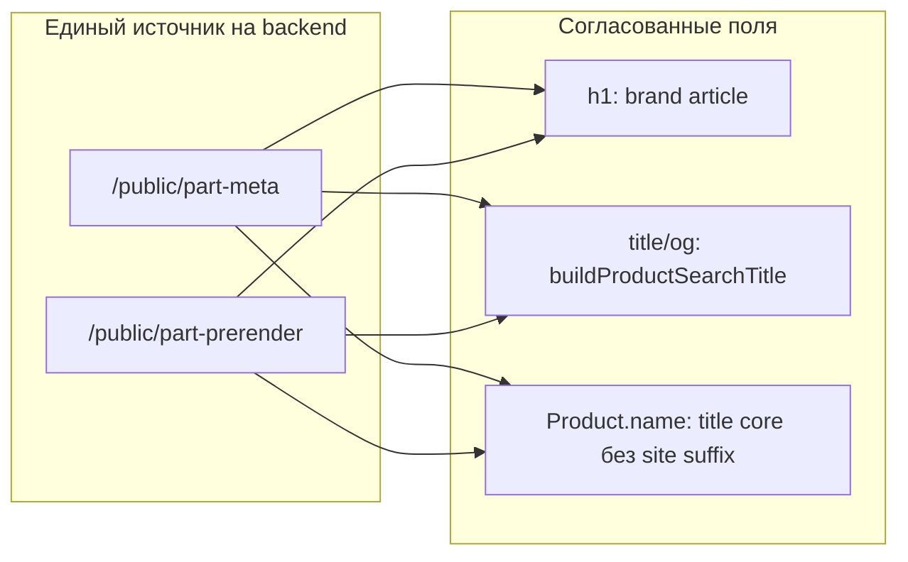

# Этап 10. SEO и микроразметка

## Контекст

Инфраструктура уже есть (этапы 6–7): prerender, 8 sitemap, JSON-LD, FAQ, тесты [`backend/tests/test_product_json_ld.py`](backend/tests/test_product_json_ld.py). Этап 10 — **стабилизация**, не новая архитектура.

**Принятые решения:**
- **Разметка:** минимальный риск — **не удалять** microdata на prerender; выровнять значения полей между microdata и JSON-LD (одинаковые `name`, `description`, `offers`).
- **Именование:** `h1` = «бренд артикул» (+ подзаголовок с типом); `title` / `og:title` / `Product.name` = расширенный SEO-формат из `buildProductSearchTitle` (бренд + артикул + тип + город; для schema — без суффикса `| Свой Гараж`).

---

## 1. Канон имён: backend (used `/part/`)

**Файлы:** [`backend/app/services/product_seo_service.py`](backend/app/services/product_seo_service.py), [`backend/app/utils/product_json_ld.py`](backend/app/utils/product_json_ld.py), [`backend/app/utils/product_search_seo.py`](backend/app/utils/product_search_seo.py) (если есть Python-аналог title)

**Сейчас:** `h1` и `Product.name` = `format_product_display_title` (полное имя); `title` = `build_product_search_title` — расхождение с SPA и с выбранным правилом.

**Изменения:**
- В `build_product_seo_meta`:
  - `h1` → `"brand article"` (fallback: display title)
  - `Product.name` в `build_catalog_product_json_ld` → core из `build_product_search_title` **без** `| Свой Гараж`
  - `microdata itemprop="name"` → то же значение, что `Product.name` (не короткий h1)
- В `build_product_json_ld_graph` / breadcrumb leaf: leaf = короткий h1 (`brand article`), не полное имя
- Breadcrumb root: унифицировать с SPA — **«Главная»** вместо «Свой Гараж» (или наоборot, но одинаково в backend graph и [`breadcrumbs.js`](frontend/my-autoparts/src/utils/breadcrumbs.js))
- Ветка `is_new=true` на `/part/`: крошки и graph → «Новые запчасти», не «Б/у запчасти»

**Prerender** [`render_product_prerender_html`](backend/app/services/product_seo_service.py): `<h1>` = короткий h1; microdata prefix получает `name=schema_name`, не `meta.h1`.

---

## 2. Канон имён: frontend used card

**Файлы:** [`frontend/my-autoparts/src/pages/PartDetail/PartDetail.jsx`](frontend/my-autoparts/src/pages/PartDetail/PartDetail.jsx), [`frontend/my-autoparts/src/utils/productSeo.js`](frontend/my-autoparts/src/utils/productSeo.js), [`frontend/my-autoparts/src/utils/productJsonLd.js`](frontend/my-autoparts/src/utils/productJsonLd.js)

**Сейчас:** SPA h1 уже `brand article`; JSON-LD собирается локально через `buildProductStructuredDataBlocks` и может расходиться с API meta.

**Изменения:**
- `seoFromPartMetaResponse` / `buildProductSeo`: брать `title`, `h1`, `json_ld` из `/public/part-meta` как primary source; локальная сборка — только fallback при отсутствии API
- `Product.name` в клиентском JSON-LD (fallback) — тот же core, что backend
- Убедиться: `og:title` = `seo.title`, `Product.name` ≠ короткий h1 (это ожидаемо по правилу)
- Breadcrumbs: передать `isNew` / `product.is_new` в `buildBreadcrumbsForPath('/part/…')` для ветки «Новые запчасти»

---

## 3. New-part card parity

**Файлы:** [`frontend/my-autoparts/src/pages/AutoParts/NewParts/NewPartDetailPage.jsx`](frontend/my-autoparts/src/pages/AutoParts/NewParts/NewPartDetailPage.jsx), [`backend/app/services/new_parts_seo_card_service.py`](backend/app/services/new_parts_seo_card_service.py)

**Сейчас:** JSON-LD Product + BreadcrumbList есть; нет видимых крошек, FAQ, `og:type=product`, `product:price/availability`.

**Изменения:**
- Добавить `<Breadcrumbs includeJsonLd={false}>` (как в used card)
- Перейти на product helmet: расширить [`PageSeoHelmet`](frontend/my-autoparts/src/utils/pageSeo.js) или переиспользовать `PartProductSeoHelmet`-логику — `og:type=product`, `product:price:*`, `product:availability`
- FAQ: UI-блок [`PartDetailFaqBlock`](frontend/my-autoparts/src/components/...) + `FAQPage` JSON-LD (адаптировать `buildProductFaqItems` для new: «новая запчасть», без «б/у состояния»)
- Backend new-part meta/prerender: те же правила h1/title/schema; FAQ в prerender graph (если ещё нет)
- `build_new_part_card_json_ld`: `name` = SEO core, `h1` на странице = `buildNewPartH1` (уже близко к правилу)

---

## 4. FAQ — один источник правды

**Файлы:** [`frontend/my-autoparts/src/utils/partDetailFaq.js`](frontend/my-autoparts/src/utils/partDetailFaq.js), [`backend/app/utils/product_part_faq.py`](backend/app/utils/product_part_faq.py)

**Проблема:** дублирующие шаблоны; правка в одном месте ломает parity prerender vs SPA.

**Минимальный fix:**
- Backend FAQ → отдавать в `/public/part-meta` и `/public/new-part-meta` как `faq_items` + готовый `faq_json_ld`
- SPA рендерит FAQ из API; `partDetailFaq.js` оставить как fallback для offline/dev
- Prerender использует тот же Python-модуль

---

## 5. Microdata + JSON-LD без конфликта

**Файлы:** [`backend/app/utils/product_json_ld.py`](backend/app/utils/product_json_ld.py) (`build_product_article_microdata_prefix`), prerender renderers

**Стратегия (conservative):**
- Оставить оба формата
- Гарантировать идентичность: `name`, `sku`/`mpn`, `price`, `availability`, `url`/`@id`
- Если Rich Results Test покажет «duplicate Product» **после выравнивания** — точечно убрать microdata только из prerender (отдельный commit, обновить тесты в `test_product_json_ld.py`)

---

## 6. Sitemap / prerender / docs

**Файлы:**
- [`backend/app/tasks/seo_tasks.py`](backend/app/tasks/seo_tasks.py) — `rebuild_sitemaps_cache_task`: добавить counts для `used-brands/categories/geo` в return value
- [`docs/seo/verification-checklist.md`](docs/seo/verification-checklist.md) — новый § «Этап 10»: Rich Results Test, правило h1 vs schema.name, проверка no duplicate conflicting Product
- [`docs/seo/implementation-summary.md`](docs/seo/implementation-summary.md) — раздел «Этап 10» с критериями приёмки

**Smoke после деплоя (ручной):**
1. Rich Results / validator.schema.org на 2 URL: used `/part/{id}-…`, new `/autoparts/new/part/{id}-…` (prerender + SPA)
2. Сравнить h1, title, Product.name в DevTools
3. Breadcrumb visible + JSON-LD для обоих типов
4. `sitemap.xml` → все 8 child sitemaps 200

---

## 7. Тесты

**Расширить** [`backend/tests/test_product_json_ld.py`](backend/tests/test_product_json_ld.py):
- `h1` = brand+article при наличии обоих
- `Product.name` совпадает с title core (не с h1)
- `is_new` breadcrumb graph → «Новые запчасти»
- microdata `itemprop="name"` == JSON-LD `Product.name`
- prerender HTML содержит FAQ `
` для used (после §4)

Опционально: unit-тест `buildBreadcrumbsForPath` для `/part/` + `is_new` (frontend, если есть test runner).

---

## Приоритет работ

| P | Задача |
|---|--------|
| P0 | Backend meta: h1 / Product.name / title alignment + is_new breadcrumbs |
| P0 | Used SPA: meta-first JSON-LD, breadcrumb is_new |
| P1 | New-part SPA: breadcrumbs UI, product OG, FAQ |
| P1 | FAQ single source через meta API |
| P2 | seo_tasks counts, docs checklist stage 10 |
| P2 | Rich Results smoke → решение по microdata (keep/remove) |

---

## Критерии готовности (из roadmap)

- Rich Results Test без **критичных** ошибок на эталонных карточках
- Breadcrumb корректен для новых и б/у (включая `is_new` на `/part/`)
- microdata и JSON-LD не противоречат друг другу по `name`/price/availability
- [`docs/seo/verification-checklist.md`](docs/seo/verification-checklist.md) обновлён под этап 10

## Вне scope

- Landings/category/geo SEO (уже в этапах 6–7; только smoke в чеклисте)
- Контентная переработка FAQ вручную (шаблоны + is_new вариант)
- Автоматический cron Rich Results monitoring
