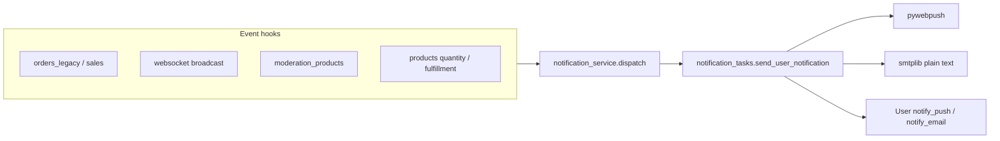

# Этап 4. PWA/email-уведомления

## Решения (согласовано)

| Вопрос | Решение |
|--------|---------|
| События MVP | **Все 6** из roadmap |
| Настройки пользователя | **Простые**: вкл/выкл push и email (без истории уведомлений) |
| Каналы | Только PWA push + email (без SMS/Telegram/WhatsApp) |
| Шаблоны писем | **Plain text** (расширить [`email.py`](backend/app/utils/email.py)) |
| Получатель нового заказа | Как сейчас: admin/seller/employee с `sales.orders` в организации |
| Асинхронность | Celery через [`enqueue_celery_task`](backend/app/utils/celery_enqueue.py) — не блокировать HTTP |
| История в БД | **Не входит** в этап 4 |

## Что уже есть (не переписываем с нуля)

- PWA: [`manifest.json`](frontend/my-autoparts/public/manifest.json), [`service-worker.js`](frontend/my-autoparts/public/service-worker.js), подписка в [`ChatSlice.js`](frontend/my-autoparts/src/redux/slices/ChatSlice.js)
- API: [`notifications.py`](backend/app/routers/notifications.py) — subscribe/unsubscribe/VAPID, `send_push_notification()`
- Модель: [`PushSubscription`](backend/app/models/notification.py)
- Push продавцу о заказе: [`push_notifications.py`](backend/app/services/push_notifications.py) — 3 call site
- Push чата offline: [`websocket.py`](backend/app/routers/websocket.py) `broadcast_to_chat`
- SMTP: [`email.py`](backend/app/utils/email.py) + env в `backend/.env`



## 1. Backend — фундамент

### User preferences

**Модель** [`user.py`](backend/app/models/user.py):
- `notify_push_enabled` — `Boolean`, default `True`
- `notify_email_enabled` — `Boolean`, default `True`

**Schema patch** [`schema_patches.py`](backend/app/db/schema_patches.py) + [`main.py`](backend/app/main.py): `ensure_user_notification_preference_columns()`

**API** в [`notifications.py`](backend/app/routers/notifications.py):
- `GET /api/notifications/preferences` → `{ notify_push_enabled, notify_email_enabled, has_push_subscription }`
- `PATCH /api/notifications/preferences` → обновление флагов

Экспорт prefs в profile response (если есть `GET /auth/me`) — чтобы фронт не делал лишний запрос.

### Единый сервис

**Новый** [`backend/app/services/notification_service.py`](backend/app/services/notification_service.py):

```python
# Типы событий (константы)
EVENT_NEW_ORDER_SELLER = "new_order_seller"
EVENT_ORDER_STATUS_BUYER = "order_status_buyer"
EVENT_CHAT_MESSAGE = "chat_message"
EVENT_MODERATION_APPROVED = "moderation_approved"
EVENT_MODERATION_REJECTED = "moderation_rejected"
EVENT_STOCK_LOW = "stock_low"

def dispatch_user_notification(user_id, *, event_type, push_data, email_subject, email_body) -> None:
    """Ставит Celery-задачу; при недоступности Celery — sync fallback с try/except + logger."""

def dispatch_org_sales_notification(db, organization_id, *, ...) -> None:
    """Обёртка над get_sales_order_recipient_user_ids."""

def maybe_notify_stock_level(db, product, previous_quantity) -> None:
    """Порог: qty==0 → «закончился»; 0 < qty <= 2 → «низкий остаток». Только при пересечении границы."""
```

**Новый** [`backend/app/tasks/notification_tasks.py`](backend/app/tasks/notification_tasks.py):
- `@celery_app.task` `send_user_notification(user_id, event_type, push_data, email_subject, email_body)`
- Свой `SessionLocal`, читает user prefs
- Push: если `notify_push_enabled` и есть active `PushSubscription` → `send_push_notification`
- Email: если `notify_email_enabled` и `user.email` → `send_notification_email`
- Логирование через `logging` (успех/ошибка), не `print`

**Расширить** [`email.py`](backend/app/utils/email.py):
- `send_notification_email(to, subject, body) -> bool` — plain text, общий SMTP-код
- Заменить `print` на `logger` в новых путях (старые auth-письма — минимально)

**Регистрация** в [`celery_app.py`](backend/app/celery_app.py): `app.tasks.notification_tasks`

### Рефакторинг существующего push

[`push_notifications.py`](backend/app/services/push_notifications.py) `notify_sellers_new_order` → вызывает `dispatch_org_sales_notification` с push payload + email (тема/тело с номером заказа, покупателем, суммой).

Убрать прямой синхронный `send_push_notification` из HTTP-пути заказа.

## 2. Backend — 6 событий MVP

| Событие | Hook | Получатель | Push | Email |
|---------|------|------------|------|-------|
| Новый заказ | [`orders_legacy.py`](backend/app/routers/orders_legacy.py), [`orders_new_parts.py`](backend/app/routers/orders_new_parts.py), [`new_parts_payment_service.py`](backend/app/services/new_parts_payment_service.py) | Продавцы org | есть | **добавить** |
| Статус заказа | [`sales.py`](backend/app/routers/sales.py) `update_used_parts_order_status`, `update_used_parts_order_item_status`, `update_new_parts_order_status` | `order.user_id` (б/у из этапа 3) / `garage_new_orders.user_id` | **добавить** | **добавить** |
| Новое сообщение | [`websocket.py`](backend/app/routers/websocket.py) offline branch | `recipient_id` | есть | **добавить** (fallback) |
| Модерация OK | [`moderation_products.py`](backend/app/routers/moderation_products.py) `approve_product` | `pending_product.created_by` | **добавить** | **добавить** |
| Модерация отклонена | `reject_product` | `pending_product.created_by` | **добавить** | **добавить** |
| Низкий остаток / нет в наличии | [`products.py`](backend/app/routers/products.py) `update_product_quantity`; [`stock_sale_fulfillment.py`](backend/app/services/stock_sale_fulfillment.py) после списания | `product.created_by` или sales org | **добавить** | **добавить** |

**Статусы в письмах покупателю** — словарь в `notification_service.py` (зеркало `GARAGE_STATUS_NAMES` из [`garageOrderUi.js`](frontend/my-autoparts/src/utils/garageOrderUi.js)).

**Чат email fallback**: при offline — `dispatch_user_notification` (push + email параллельно по prefs; если push выкл/нет подписки — только email).

**Stock dedup**: передавать `previous_quantity` в `maybe_notify_stock_level`; алерт только при переходе через порог (не на каждое обновление).

## 3. Frontend — настройки и UX

### Страница настроек

**Новый** [`frontend/my-autoparts/src/pages/Profile/NotificationSettingsPage.jsx`](frontend/my-autoparts/src/pages/Profile/NotificationSettingsPage.jsx):
- Маршрут `/profile/notifications` в [`App.js`](frontend/my-autoparts/src/App.js)
- Пункт «Уведомления» в submenu «Настройки» для всех ролей — [`profileMenuConfig.js`](frontend/my-autoparts/src/pages/Profile/menu/profileMenuConfig.js)
- Два toggle: Push / Email → `PATCH /api/notifications/preferences`
- Кнопка «Включить push-уведомления» → `subscribeToPushNotifications({ prompt: true })` из [`ChatSlice.js`](frontend/my-autoparts/src/redux/slices/ChatSlice.js)
- Toast/inline success при подписке
- Подсказка: «Если push отключён — важные уведомления придут на email»

### Баннер (опционально, минимально)

В [`App.js`](frontend/my-autoparts/src/App.js) или [`ProfilePage.jsx`](frontend/my-autoparts/src/pages/Profile/ProfilePage.jsx): одноразовый dismissible баннер «Включите уведомления» → link на `/profile/notifications` (localStorage flag `notifications_banner_dismissed`).

Не дублировать агрессивные prompt на chats/sales — оставить как есть, центр настроек в профиле.

## 4. Тесты

**Новый** [`backend/tests/test_notification_service.py`](backend/tests/test_notification_service.py):
- `maybe_notify_stock_level` — границы 0 и 2
- `order_visible` не нужен — тест dispatch respects `notify_email_enabled=False`
- Mock `send_notification_email` / Celery delay

Обновить существующие тесты заказов при необходимости (mock dispatch).

## 5. Что не входит

- SMS, Telegram, WhatsApp, мобильные SDK
- HTML-шаблоны, notification history table
- Расширенные события (Avito sync, printer, и т.д.)
- Per-event toggles (только глобальные push/email)
- 512×512 PWA icon / offline cache SW
- Изменение ролей/permissions

## Проверка

1. `/profile/notifications` — toggles сохраняются
2. Push subscribe/unsubscribe работает (уже было + toast)
3. Новый заказ б/у → push + email продавцу (при включённых prefs и SMTP)
4. Смена статуса → push/email покупателю с `user_id`
5. Offline чат → email при выкл. push или отсутствии подписки
6. Approve/reject модерации → уведомление автору товара
7. Количество 3→1 или 1→0 → алерт продавцу
8. HTTP-запросы не ждут SMTP/webpush (Celery или быстрый enqueue)
9. Ошибки в логах worker, не в ответе API
10. `read_lints` + коммит: `feat: add PWA and email notifications with user preferences`

## Критерии готовности (roadmap)

- Подписка PWA создаётся и удаляется
- Email уходит на тестовый адрес
- Минимум одно событие end-to-end (новый заказ + статус)
- Fallback email при отключённом push
- Ошибки логируются, запросы не блокируются
- Нет секретов в Git

## Следующий этап

**Этап 5** — дашборд задач продавца
