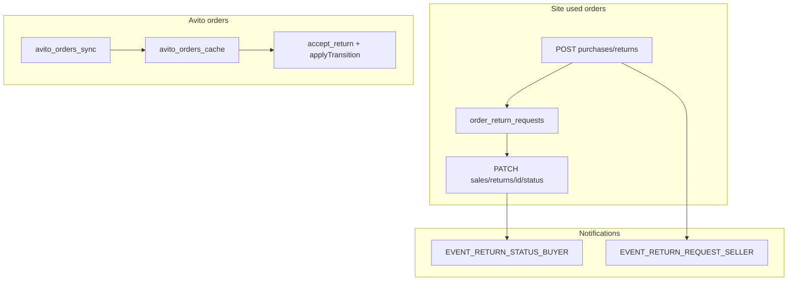

# Этап 7. Возвраты: MVP

## Решения (согласовано)

| Вопрос | Решение |
|--------|---------|
| Типы заказов | **Б/у с сайта** (`garage_used_orders` + `products`); **Rossko/новые** — нет |
| Avito | **По API Avito**: sync статусов + seller actions (`accept_return`, return transitions) |
| Кто решает | **Продавец** (admin/seller/`sales.returns`); admin — override |
| Фото | **Да** — до 5 фото в заявке (site returns) |
| Уведомления | **Push + email** (этап 4): продавцу о новой заявке, покупателю о смене статуса |
| Окно возврата | **14 дней** после `delivered` или `closed` заказа |

## Текущее состояние

- UI-заглушки: [`SalesReturnsPage.jsx`](frontend/my-autoparts/src/pages/Sales/SalesReturnsPage.jsx), [`PurchasesReturnsPage.jsx`](frontend/my-autoparts/src/pages/Sales/PurchasesReturnsPage.jsx)
- Маршруты в [`App.js`](frontend/my-autoparts/src/App.js) редиректят на orders; пункты меню скрыты
- Backend: **нет** order-return domain; есть только складской [`POST /stock-outs/returns`](backend/app/routers/stock_outs.py) (не путать)
- Avito: [`AvitoOrderCache`](backend/app/models/avito_orders_cache.py), sync + transitions в [`sales.py`](backend/app/routers/sales.py); статус `on_return` отображается, но return-actions не реализованы
- Permission `sales.returns` — только во фронте, **не seedится** в [`employees.py`](backend/app/routers/employees.py)

## 1. Backend — модель и миграция

### Таблицы (schema patch в [`schema_patches.py`](backend/app/db/schema_patches.py) + вызов из [`main.py`](backend/app/main.py))

**`order_return_requests`**
- `id`, `organization_id`, `order_id` (FK → `garage_used_orders.id`)
- `buyer_user_id` (nullable), `reason` (string enum), `comment` (text)
- `status_code`: `requested` | `reviewing` | `approved` | `rejected` | `received` | `refunded` | `closed`
- `seller_note` (nullable) — комментарий при отклонении
- `created_at`, `updated_at`, `status_changed_at`
- Unique partial: один **активный** return на заказ (`status NOT IN rejected, closed`)

**`order_return_attachments`**
- `id`, `return_request_id`, `file_url`, `created_at`

Модели: [`backend/app/models/order_return.py`](backend/app/models/order_return.py)  
Схемы: [`backend/app/schemas/order_returns.py`](backend/app/schemas/order_returns.py)

### Бизнес-правила (сервис [`order_return_service.py`](backend/app/services/order_return_service.py))

**Eligibility для создания заявки:**
- Заказ `garage_used_orders` принадлежит покупателю (`order_visible_to_buyer` из [`client_buyers.py`](backend/app/utils/client_buyers.py))
- `status_code IN (delivered, closed)`
- Прошло ≤ 14 дней с `updated_at` заказа (или даты перехода в delivered — использовать `updated_at` как proxy)
- Нет активной заявки на этот заказ
- Хотя бы один item с `product_id` (товар с сайта)

**Переходы статусов (seller):**
- `requested` → `reviewing` | `approved` | `rejected`
- `reviewing` → `approved` | `rejected`
- `approved` → `received` → `refunded` → `closed`
- `rejected` / `closed` — terminal

**Причины возврата (enum):** `defect`, `wrong_item`, `not_as_described`, `changed_mind`, `other`

## 2. Backend — API ([`sales.py`](backend/app/routers/sales.py) или отдельный [`order_returns.py`](backend/app/routers/order_returns.py))

| Method | Path | Кто | Назначение |
|--------|------|-----|------------|
| POST | `/sales/purchases/returns` | buyer | Создать заявку (+ optional photo URLs) |
| GET | `/sales/purchases/returns` | buyer | Список своих заявок |
| GET | `/sales/purchases/returns/{id}` | buyer | Детали |
| POST | `/sales/purchases/returns/{id}/attachments` | buyer | Добавить фото (multipart, reuse [`upload.py`](backend/app/routers/upload.py) pattern → `uploads/returns/`) |
| GET | `/sales/returns` | seller | Список заявок org (фильтр по status) |
| GET | `/sales/returns/{id}` | seller | Детали + order snapshot |
| PATCH | `/sales/returns/{id}/status` | seller | Смена статуса + optional `seller_note` |

**Access control:**
- Buyer: authenticated + ownership check
- Seller: `is_admin` | `is_seller` | `sales.returns` (новый helper `_has_sales_returns_access`, зеркало `_has_sales_orders_access`)
- Seed permission в [`employees.py`](backend/app/routers/employees.py): `{"code": "sales.returns", "name": "Возвраты"}`

## 3. Backend — Avito returns

Расширить [`avito_orders_api.py`](backend/app/services/avito_orders_api.py):

- `accept_return_order(access_token, order_id, terminal_number, recipient?)` — POST accept return (Почта России)
- Обновить `get_available_transitions` для return-статусов: `on_return`, `in_transit_return`, `on_delivery_return` → допустимые transitions по [Avito Order Management graph](https://developers.avito.ru/api-catalog/order-management/documentation)

Новые endpoints в [`sales.py`](backend/app/routers/sales.py):
- `POST /sales/avito-orders/{id}/accept-return` — body: `terminal_number`, optional recipient
- `GET /sales/avito-orders/returns` — список из `AvitoOrderCache` где `avito_status_code IN (on_return, in_dispute, ...)` + enrich из `avito_data`

**UX:** Avito-покупатель инициирует возврат на стороне Avito; на нашем сайте seller видит и обрабатывает. Покупательская страница `/purchases/returns` — **только site used orders**; для Avito — подсказка «возвраты Avito — в приложении Avito».

## 4. Backend — уведомления

Расширить [`notification_service.py`](backend/app/services/notification_service.py):

- `EVENT_RETURN_REQUEST_SELLER` → `dispatch_org_sales_notification` при создании заявки
- `EVENT_RETURN_STATUS_BUYER` → `dispatch_user_notification` при PATCH статуса (аналог `notify_order_status_buyer`, url → `/purchases/returns`)

Push payload: `{ type: "return_status", returnId, orderId, statusCode, url }`

## 5. Frontend

### Маршруты и меню
- [`App.js`](frontend/my-autoparts/src/App.js): заменить `Navigate` на реальные страницы
- [`profileMenuConfig.js`](frontend/my-autoparts/src/pages/Profile/menu/profileMenuConfig.js):
  - Покупки → «Возвраты» (`purchases-returns`) для всех auth users
  - Продажи → «Возвраты» (`sales-returns`) при `sales.returns` / seller / admin
- [`TAB_PATH_MAP`](frontend/my-autoparts/src/pages/Profile/menu/profileMenuConfig.js): добавить paths

### [`PurchasesReturnsPage.jsx`](frontend/my-autoparts/src/pages/Sales/PurchasesReturnsPage.jsx)
- Список заявок с badge статуса
- Модалка «Создать заявку»: выбор eligible заказа, reason, comment, до 5 фото
- Детальный просмотр статуса + timeline

### [`SalesReturnsPage.jsx`](frontend/my-autoparts/src/pages/Sales/SalesReturnsPage.jsx)
- Две секции: **Заявки с сайта** (API `/sales/returns`) + **Avito** (API `/sales/avito-orders/returns`)
- Карточка: заказ, покупатель, причина, фото-превью, текущий статус
- Dropdown смены статуса + seller note при reject
- Avito-карточка: кнопки «Принять возврат» (terminal number) + доступные transitions

### Entry point
- [`PurchasesOrdersPage.jsx`](frontend/my-autoparts/src/pages/Sales/PurchasesOrdersPage.jsx): кнопка «Запросить возврат» на completed used orders (не new, не Avito)

### Shared UI
- [`returnStatusUi.js`](frontend/my-autoparts/src/utils/returnStatusUi.js) — labels/colors для 7 статусов
- Удалить/не использовать legacy [`ReturnsTab.jsx`](frontend/my-autoparts/src/pages/Sales/ReturnsTab.jsx) stubs

## 6. Тесты

**Новый** [`backend/tests/test_order_return_service.py`](backend/tests/test_order_return_service.py):
- Eligibility: delivered within 14d OK; pending/rejected order → 400; expired window → 400
- Duplicate active return → 409
- Status transition validation
- Buyer/seller access boundaries (mock user + order)

**Новый** [`backend/tests/test_avito_return_api.py`](backend/tests/test_avito_return_api.py) (mock httpx):
- `accept_return_order` payload shape
- Return transitions map for `on_return`

## 7. Что не входит

- Автовозврат через ЮKassa
- Rossko / `garage_new_orders`
- Арбитраж / disputes UI (Avito `in_dispute` — только read-only badge)
- SMS/Telegram
- Автоматическое восстановление остатка на складе при return (отдельная задача)
- HTML email templates

## Проверка (критерии roadmap)

1. Покупатель создаёт заявку на delivered used order (≤14 дней) с фото
2. Продавец видит заявку на `/sales/returns`, меняет статус
3. Покупатель видит обновление на `/purchases/returns`
4. Push/email: новая заявка → seller; смена статуса → buyer
5. Avito order `on_return` → seller видит в секции Avito, может accept-return
6. Rossko/new order — кнопки возврата нет
7. `sales.returns` permission работает для employee
8. Линтер + коммит: `feat: add order returns MVP for used parts and Avito`

## Ключевые файлы

| Область | Файлы |
|---------|-------|
| Models/DB | `order_return.py`, `schema_patches.py`, `main.py` |
| Service/API | `order_return_service.py`, `schemas/order_returns.py`, `sales.py` |
| Avito | `avito_orders_api.py`, `sales.py` |
| Notifications | `notification_service.py` |
| Frontend | `PurchasesReturnsPage.jsx`, `SalesReturnsPage.jsx`, `PurchasesOrdersPage.jsx`, `App.js`, `profileMenuConfig.js` |
| Tests | `test_order_return_service.py`, `test_avito_return_api.py` |
