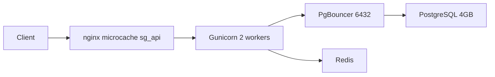

# Этап 9 — Нагрузочное тестирование и горизонталь

## Контекст и цель

Текущий стек после этапов 6–8:



**Ограничение сейчас:** [`docs/nginx/http-ddos-limits.conf`](docs/nginx/http-ddos-limits.conf) — `sg_api` **50 r/s на IP** (+ burst 60). С одного источника (localhost на VPS) это искусственный потолок, не отражающий реальную ёмкость microcache + backend.

**Ваша цель:** тестировать **на максимум**, ориентир — рост до **~100k пользователей** (база/аудитория, не 100k одновременно онлайн).

Оценка нагрузки для планирования (зафиксируем в отчёте):
- 100k MAU, пик ~2–5% онлайн → **2k–5k concurrent**
- Типичная сессия гостя: `part-types` + `catalog` ≈ **2 GET** на просмотр каталога
- При microcache HIT большая часть RPS обслуживается nginx без uvicorn

---

## Стратегия тестирования (3 трека)

| Трек | Путь | Что измеряем |
|------|------|--------------|
| **A — Catalog HIT** | `https://127.0.0.1/server/api/catalog/products?page=1&page_size=20` | Потолок RPS при тёплом microcache (целевой сценарий «100 RPS+») |
| **B — Catalog MISS** | тот же URL + `_bust=$RANDOM` | Потолок backend + PostgreSQL (cache miss) |
| **C — Mixed** | 70% HIT + 30% MISS + `part-types/public` | Реалистичный каталог |
| **D — Backend direct** | `http://127.0.0.1:8080/api/catalog/...` (минуя nginx rate limit) | Абсолютный потолок Gunicorn/PgBouncer без nginx |

Для треков A/C на время теста — **временно поднять `sg_api` до 200 r/s** (burst 300) в [`docs/nginx/http-ddos-limits.conf`](docs/nginx/http-ddos-limits.conf), `update --nginx`, после теста **вернуть 50/60** и задокументировать.

---

## Что добавить в репозиторий

### 1. k6-сценарий — [`scripts/ops/load-test-k6.js`](scripts/ops/load-test-k6.js)

- Base URL через env: `LOAD_TEST_BASE` (default `https://127.0.0.1`), `LOAD_TEST_HOST=svoygarage.ru`, `LOAD_TEST_INSECURE=true`
- Сценарии: `hit`, `miss`, `mixed`, `direct` (переключение env `LOAD_TEST_MODE`)
- Ramp: **50 → 100 → 150 → 200 VUs** за 4–5 мин, hold 2 мин на каждой ступени
- Thresholds (fail test run): `http_req_failed < 5%`, `p(95)<2000ms` — для фиксации «точки отказа» смотрим, на какой ступени пороги ломаются
- Checks: status 200, не 502/504/429

### 2. Обёртка — [`scripts/ops/run-load-test.sh`](scripts/ops/run-load-test.sh)

По аналогии с [`scripts/ops/catalog-latency-p95.sh`](scripts/ops/catalog-latency-p95.sh) и [`scripts/ops/baseline-metrics.sh`](scripts/ops/baseline-metrics.sh):

1. Pre-flight: `systemctl is-active` всех сервисов, smoke curl
2. Warmup: 20× catalog HIT + part-types (прогрев microcache)
3. Snapshot «до»: load/RAM, `grep 502/504` в nginx log, `journalctl -u kroan` restarts
4. Установка k6 (если нет): `apt install k6` или бинарник с GitHub releases
5. Прогон треков A → B → C → D с паузой 60 с между ними
6. Snapshot «после» + парсинг k6 summary (RPS, p50/p95/p99, errors)
7. Вывод markdown-таблицы в stdout для копирования в docs

### 3. Документация — [`docs/ops/load-test.md`](docs/ops/load-test.md)

- Методология, команды, интерпретация метрик
- Таблица результатов (заполняется после прогона на prod)
- Секция **«Рекомендации после теста»** (шаблон ниже)
- Ссылка на [`docs/ops/monitoring.md`](docs/ops/monitoring.md) — смотреть `/var/log/autoparts-alerts.log` во время теста

### 4. Обновить план — [`docs/ops/scale-and-speed-plan.md`](docs/ops/scale-and-speed-plan.md)

- Восстановить чеклисты этапа 9 (сейчас только заголовок)
- Секция **«Рекомендации после теста»** с дорожной картой к 100k
- Прогресс: этап 9 **выполнено** + фактические цифры RPS/p95

### 5. Кратко — [`docs/ops/performance.md`](docs/ops/performance.md)

Секция «Этап 9 — Load test» с итоговой таблицей.

**Изменений в application code не планируется** — только ops-скрипты и docs. Тюнинг по результатам (workers, rate limits) — отдельным коммитом только если тест покажет необходимость.

---

## Прогон на prod (SSH `195.24.65.251`)

**Когда:** окно низкой нагрузки (ночь MSK), один прогон.

**Последовательность:**

```bash
# 1. Поднять rate limit для честного max-теста
#    правка docs/nginx/http-ddos-limits.conf → sg_api 200r/s, burst 300
update --nginx

# 2. Нагрузочный тест
bash /home/fast/autoparts/scripts/ops/run-load-test.sh | tee /var/log/autoparts-load-test.log

# 3. Вернуть лимиты 50/60
update --nginx   # после revert в репозитории
```

**Во время теста мониторить:**
- `tail -f /var/log/autoparts-health.log`
- `htop` / load average
- `X-Cache-Status: HIT` на catalog (трек A)
- 502/504 в nginx access log

**Критерии готовности этапа 9:**
- Зафиксированы RPS и p95 на каждой ступени ramp до появления >5% ошибок или p95 >2s
- Трек A (microcache HIT): целевой ориентир **≥100 RPS без 504** (при поднятом rate limit)
- Трек B: задокументирован потолок cache-miss (ожидаемо ниже, опирается на этап 7 — p95 ~22ms при малой нагрузке)
- [`docs/ops/load-test.md`](docs/ops/load-test.md) заполнен фактическими числами
- В плане есть **следующий шаг масштабирования**

---

## Рекомендации после теста (шаблон для docs)

Заполнить по фактическим цифрам; логика для 100k пользователей:

| Фаза | Concurrent / RPS | Действия |
|------|------------------|----------|
| **Сейчас** (1 VPS, 4GB, 2 workers) | до X RPS HIT / Y RPS MISS | Зафиксировать X,Y из теста |
| **1–3k concurrent** (~200–400 RPS с microcache) | CDN для `/static`, `/uploads` | Снять трафик с VPS; Brotli уже есть |
| **3–10k concurrent** | 2-й API VPS за nginx/LB | Sticky не нужен для REST; Redis WS pub/sub уже есть (этап 6) |
| **10k+ concurrent / рост MISS** | PostgreSQL read replica | Только SELECT каталога/поиска; write на primary |
| **100k user base** | Горизонталь API + CDN + replica + мониторинг | Отказоустойчивый LB, PgBouncer на каждом API-ноде, алерты (этап 8) |

Если трек A < 100 RPS при HIT — узкое место nginx/worker count (не БД): рассмотреть `worker_connections`, 3-й Gunicorn worker при RAM, или 2-й VPS.

Если трек B падает раньше A — узкое место PostgreSQL/PgBouncer: read replica, больше `default_pool_size`, кэш Redis на catalog.

---

## Коммиты и деплой

1. Коммит: k6 script + `run-load-test.sh` + `load-test.md` + обновления plan/performance
2. `git push` → `celery_update`
3. `update` на prod (скрипты)
4. Временный bump rate limit → прогон → revert → `update --nginx`
5. Заполнить результаты в docs, второй коммит с цифрами

**Риски:** кратковременная нагрузка на prod; mitigated — тест с localhost, мониторинг этапа 8, revert rate limits сразу после.
