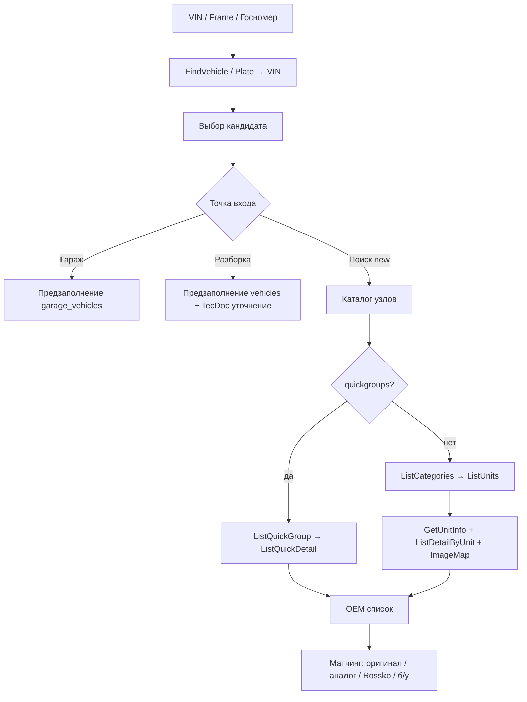

# План внедрения Laximo.CAT в «Свой Гараж»

Подробный план интеграции OEM-каталога Laximo.CAT (REST API для РФ) в сайт: гараж, автомобили разборки и поиск по VIN на странице новых запчастей.

Связанный документ: [laximo-cat-vin-capabilities.md](./laximo-cat-vin-capabilities.md) (оценка пригодности API под VIN-сценарии).

Официальная документация: [doc.laximo.ru](https://doc.laximo.ru/).

---

## 1. Краткий вердикт

| Задача | Покрытие |
|--------|----------|
| VIN → марка / модель / кузов / двигатель / год | **Да** (`FindVehicle` + нормализация `attributes`) |
| VIN → дерево узлов → OEM-детали | **Да** (categories / units / details или quick groups) |
| В строке поиска ввести VIN → каталог авто на `/autoparts/new` | **Да** (своя UX-оболочка поверх CAT) |
| Показать оригинал / аналог / Rossko / б/у | **Частично**: CAT даёт только OEM; матчинг склада — наш код (+ желательно Laximo.DOC) |
| Поиск по госномеру → VIN + карточка авто | **Да**, если в тарифе есть plate-методы |

**Оптимальная схема продукта:**

```
Laximo.CAT (VIN / узлы / OEM)
    → нормализованная карточка авто
    → OEM-номера
    → наш матчинг: склад б/у + ROSSKO + (DOC кроссы)
```

---

## 2. Текущее состояние сайта

| Область | Где в коде | Сейчас |
|---------|------------|--------|
| Клиентский гараж | `/garage`, `autoservice_garage.py` | UI декода VIN есть, `POST /autoservice/garage/decode-vin` — **заглушка** (`ok=False`) |
| Доноры разборки | `/vehicles`, `VehicleModal.jsx` | TecDoc cascade + VIN вручную |
| Поиск новых | `Search.jsx` → `/autoparts/new` | ROSSKO по артикулу/названию, **VIN не детектится** |
| Б/у каталог | `/autoparts/used`, `/catalog` | Локальный поиск + аналоги |
| Клиент Laximo | — | **Нет**, только docs |

Две отдельные сущности авто:

- `garage_vehicles` — авто клиента автосервиса (`make`, `model`, `year`, `vin`…)
- `vehicles` — доноры разборки продавца (TecDoc IDs + VIN)

---

## 3. Документация Laximo.CAT (изученные разделы)

### 3.1. Принципы работы (REST РФ)

Источник: [Принципы работы Laximo.CAT](https://doc.laximo.ru/ru/cat/principles)

| Параметр | Значение для РФ/РБ |
|----------|-------------------|
| Base URL | `https://ws.laximo.ru/restApi/v1` |
| Протокол | **Только HTTPS + POST** |
| Ответ | JSON |
| Auth | HTTP Basic: `Authorization: Basic Base64(login:password)` |
| Язык | Заголовок `accept-language: ru_RU` |
| Swagger | [ws.laximo.ru/swagger-ui](https://ws.laximo.ru/swagger-ui/index.html) |

Альтернатива: SOAP + `QueryDataLogin` (HMAC MD5 от `команда+пароль`). Для нового кода предпочтителен **REST**.

Для других стран: `https://ws.laximo.net/restApi/v1` — нам не нужен.

### 3.2. Каталоги и возможности

Источник: [Поиск каталогов](https://doc.laximo.ru/ru/cat/catalog), [ListCatalogs](https://doc.laximo.ru/ru/cat/ListCatalogs)

Методы: `ListCatalogs`, `GetCatalogInfo`.

**Features каталога** (проверять до выбора UX-ветки):

| Feature | Смысл | Методы |
|---------|--------|--------|
| `vinsearch` | Поиск по VIN | `FindVehicle` |
| `framesearch` | Поиск по кузову (JP) | `FindVehicle` / Frame-методы |
| `wizardsearch2` | Подбор по параметрам | `GetWizard2`, `FindVehicleByWizard2` |
| `quickgroups` | Быстрые группы запчастей | `ListQuickGroup`, `ListQuickDetail` |
| `fulltextsearch` | Поиск детали по названию внутри авто | `SearchVehicleDetails` |
| `detailapplicability` | Применимость детали | методы applicability |

Также: примеры VIN/Frame, архивные версии каталогов (старые ссылки продолжают работать, в списке — только актуальные).

**Практика:** при старте интеграции один раз вызвать `ListCatalogs`, сохранить карту `code → features` в кэш (TTL сутки).

### 3.3. Поиск автомобиля

Источник: [Vehicle search](https://doc.laximo.ru/ru/cat/vehicle)

| Метод | REST | Назначение |
|-------|------|------------|
| **`FindVehicle`** | Да | VIN **или** Frame; каталог можно не указывать |
| `FindVehicleByVIN` | **Только SOAP** | Не использовать в REST-стеке |
| `FindVehicleByFrame` / `FindVehicleByFrameNo` | Да | Японский рынок |
| `FindVehicleByPlateNumber` | Да* | По госномеру (см. §3.4) |
| `FindVehicleByWizard2` | Да | После wizard-параметров |
| `GetVehicleInfo` | Да | Общая карточка по `catalog` + `vehicleId` + `ssd` |
| `ExecCustomOperation` | Да | Доп. варианты поиска из `operations` каталога |

\* Фактические REST-пути для госномера в доке: `identifyByPlateNumber` / `identifyByPlateNumberFull` (§3.4).

**Важные правила из документации:**

1. VIN/Frame без выбора каталога — сервис сам подберёт; один VIN может дать **несколько** кандидатов (регионы / годы / каталоги).
2. Подбор по wizard **менее точен**, чем VIN/Frame: в детали попадут все возможные для модификаций. **В гараж авто с wizard класть не рекомендуется.**
3. `FindVehicle` по VIN/Frame часто даёт **более детальные** attributes, чем `GetVehicleInfo` (тот — «общая» информация).
4. Рекомендуется `localized=true` + locale `ru_RU` — локализованные названия атрибутов.

**Типичный ответ `FindVehicle`:**

- `brand`, `name`, `catalog`, `vehicleId`, **`ssd`**
- `attributes[]` — `key` / `value` / `name` (нестабильный набор)
- `sysProperties.filter_level` — точность идентификации (`full` / `basic` …)

Примеры атрибутов: `model`, `modification`, `frame` / `bodyStyle`, `engine` / `engine_info`, `transmission`, `manufactured` / `date`, `framecolor`, `prodrange`, `market`, `options`…

### 3.4. Поиск по госномеру (РФ)

Источник: [Vehicle search by Plate Number](https://doc.laximo.ru/ru/cat/VehicleSearchByPlateNubmer)

| Метод REST | Что даёт |
|------------|----------|
| `POST /identifyByPlateNumber?countryCode=ru&plateNumber=…` | Только VIN (`identifier`) |
| `POST /identifyByPlateNumberFull?…` | VIN + богатая карточка авто |

Поля `IdentifyByPlateNumberFull` (удобно для гаража/разборки **без VIN**):

- `vin_number`, `car_mark`, `car_model`, `car_modification`
- `car_type_string` (тип кузова), `color`, `manufacturing_year`
- `engine_model`, `engine_volume`, `engine_power`, `fuel_name`, `drive_type`
- `doors_count`, `seats_count`, `td_mark` / `td_model` / `td_modification` (TecDoc-подобные)

**Цепочка для продукта:**

```
Госномер → identifyByPlateNumberFull
         → (опционально) FindVehicle(vin) для OEM-сессии ssd
         → гараж / разборка / каталог узлов
```

Доступность зависит от тарифа Laximo — проверить в договоре.

### 3.5. Узлы автомобиля

Источник: [Searching unit](https://doc.laximo.ru/ru/cat/Searching_unit)

| Метод | Назначение |
|-------|------------|
| `ListCategories` | Дерево категорий (можно иерархия; корень `categoryId=-1`) |
| `ListUnits` | Узлы в категории |
| `GetUnitInfo` | Карточка узла + изображение |
| `GetFilterByUnit` | Уточнение применимости узла (`filter`) |

Модель данных: авто = набор **узлов**, сгруппированных по **категориям**. В категориях бывают частные узлы (например «Двигатель XYZ»). В узле — иллюстрация + список деталей.

### 3.6. Детали в узле

Источник: [Searching details in the unit](https://doc.laximo.ru/ru/cat/searching_details_in_the_unit)

| Метод | Назначение |
|-------|------------|
| **`ListDetailByUnit`** | Таблица OEM / название / характеристики |
| **`ListImageMapByUnit`** | Координаты зон на схеме ↔ `codeOnImage` |
| `GetFilterByDetail` | Уточнение, если у детали есть `filter` |

Особенности схем:

- Одна зона на картинке ↔ несколько деталей, и наоборот.
- На схеме могут быть детали, которых нет в списке (варианты комплектации) — не ошибка.
- В списке могут быть детали без зоны на картинке.

Поля детали: `oem`, `name`, `codeOnImage`, `ssd`, `filter`, `attributes` (`amount`, `note`…).

### 3.7. Быстрый поиск деталей (quick groups)

Источник: [Быстрый поиск деталей](https://doc.laximo.ru/ru/cat/quick_details_searching)

Доступно **только** если у каталога feature `quickgroups`.

| Метод | Назначение |
|-------|------------|
| `ListQuickGroup` | Дерево групп («Фильтры» → «Масляный фильтр»…) |
| `ListQuickDetail` | Узлы + детали группы; `all=true` вернёт весь узел, целевые позиции с `match=true` |

Нюансы:

- У группы `link=false` → деталей не будет (только контейнер).
- В группе могут быть **смежные** детали, нужные при установке.
- У узлов `imageUrl` / `largeImageUrl` с плейсхолдером `%size%`: `150|175|200|225|250|source`.

**Рекомендация UX:** если `quickgroups` есть — показывать quick groups как основной вход «по смысловым группам»; OEM-дерево categories — как «оригинальный каталог».

### 3.8. Применимость (OEM ↔ авто)

Источник: [Применимость](https://doc.laximo.ru/ru/cat/applicability)

| Метод | Назначение |
|-------|------------|
| `FindPartReferences` | В каких каталогах встречается OEM |
| `FindApplicableVehicles` | На каких авто в каталоге стоит OEM |
| `GetOEMPartApplicability` | Где на **конкретном** авто (по `ssd`) стоит OEM |

Статусы `applicability`:

| Значение | Смысл |
|----------|--------|
| `FULLY` | Деталь подходит, данные подтверждены |
| `PARTIAL` | Возможно подходит (часто после wizard) |
| `NONAPPLICABLE` | Не подходит / не найдено |

**Зачем нам:** обратный сценарий — «есть OEM с б/у склада → показать применимость к VIN клиента» или «в карточке товара показать узлы на выбранном авто».

---

## 4. Целевые продуктовые сценарии



### A. Гараж — VIN / госномер при добавлении авто

**Точки:** `GaragePage.jsx`, staff `AddVehicleModal`, `POST /autoservice/garage/decode-vin`.

1. Пользователь вводит VIN (17) или госномер.
2. BFF: `FindVehicle` или `identifyByPlateNumberFull` → при plate ещё `FindVehicle(vin)`.
3. Если несколько кандидатов — UI выбора.
4. Нормализация attributes → `make`, `model`, `year`, `color` (+ engine/body в notes или новые поля).
5. Сохранить `source=laximo`, refs: `catalog`, `vehicleId`, snapshot attributes (ssd — короткоживущий, не единственный PK).

### B. Разборка — VIN при добавлении донора

**Точки:** `/vehicles/add`, `VehicleModal.jsx`, `vehicles.py`.

1. Блок «Найти по VIN» поверх TecDoc cascade.
2. Предзаполнить brand/model/engine/VIN.
3. Best-effort маппинг brand → TecDoc manufacturer; generation/engine пользователь уточняет.
4. Сохранить laximo refs на `vehicles` для будущей связи б/у ↔ OEM-дерево.

### C. Поиск: VIN в строке → каталог на странице новых

**Точки:** `Search.jsx`, `MobileCompactSearch`, `FindRedirectPage`, `/autoparts/new`.

1. Детект VIN (17 символов, без I/O/Q).
2. Не слать сразу в ROSSKO — открыть VIN-каталог:
   - шаг 1: карточки авто;
   - шаг 2: quick groups **или** categories → units;
   - шаг 3: схема + OEM-детали;
   - шаг 4: у каждой OEM — наличие оригинал / аналог / б/у.
3. Параллельно можно показать счётчик б/у по бренду/модели, если уже нормализовали авто.

---

## 5. Матчинг OEM → оригинал / аналог / Rossko / б/у

CAT **не** отдаёт цены и наличие вашего склада.

```
OEM из ListDetailByUnit / ListQuickDetail
  ├─ normalize_partnumber(oem)
  ├─ Local used  → Product.article (+ brand)     = «б/у»
  ├─ ROSSKO GetSearch(oem) direct hits           = «оригинал / новый»
  └─ Laximo.DOC FindOEM(oem) → replacements
        └─ каждый кросс → ROSSKO + local used   = «аналог»
```

Без DOC на старте: только OEM → ROSSKO + б/у; аналоги — существующий used-analogs / ROSSKO analogs.

UI-строка детали:

| OEM | Название | Оригинал (новый) | Аналог | Б/у |
|-----|----------|------------------|--------|-----|
| 8W0… | Радиатор | от N ₽ ROSSKO | K офферов | M шт. |

---

## 6. Архитектура внедрения

### 6.1. Принципы

- Вызовы Laximo **только с бэкенда** (секреты, квоты).
- Всегда `accept-language: ru_RU`, для атрибутов — `localized=true`.
- Везде протаскивать актуальный **`ssd`** (+ `catalog`, `vehicleId`).
- Кэшировать: `ListCatalogs` (сутки), `FindVehicle` (часы), categories/units (часы), details — короче.
- Не хранить `ssd` как вечный ключ в БД без возможности refresh по VIN.

### 6.2. Модули бэкенда (предложение)

```
backend/app/services/laximo/
  cat_client.py          # HTTP POST + Basic Auth
  vehicle_normalize.py   # attributes → поля сайта
  session_cache.py       # vin → {catalog, vehicleId, ssd, …}
  oem_availability.py    # OEM → used + ROSSKO + DOC

backend/app/routers/laximo_cat.py
```

Конфиг: `LAXIMO_CAT_LOGIN`, `LAXIMO_CAT_PASSWORD`, `LAXIMO_CAT_BASE=https://ws.laximo.ru/restApi/v1`.

### 6.3. Черновик BFF API

```
POST /laximo/vehicles/by-vin              { vin } → candidates[]
POST /laximo/vehicles/by-plate            { plate, countryCode=ru } → card + vin
GET  /laximo/vehicles/info                ?catalog&vehicleId&ssd
GET  /laximo/catalogs                     → ListCatalogs (кэш)
GET  /laximo/categories                   ?catalog&vehicleId&ssd&categoryId=-1
GET  /laximo/units                        ?catalog&ssd&categoryId
GET  /laximo/units/{unitId}               GetUnitInfo + image map
GET  /laximo/units/{unitId}/details       ListDetailByUnit + availability
GET  /laximo/quick-groups                 ?catalog&vehicleId&ssd
GET  /laximo/quick-groups/{id}/details    ListQuickDetail + availability
POST /laximo/details/search               SearchVehicleDetails (если fulltextsearch)
POST /laximo/oem/applicability            GetOEMPartApplicability
```

Гараж: `POST /autoservice/garage/decode-vin` внутри вызывает laximo-сервис (не дублировать логику во фронте).

### 6.4. Изменения данных

**`garage_vehicles`:** добавить `laximo_catalog`, `laximo_vehicle_id`, `laximo_attributes_json` (или общий `identity_json`), расширить `source` (`manual` | `laximo` | `plate`), опционально `body`, `engine`, `transmission`.

**`vehicles` (доноры):** аналогичные laximo-поля рядом с TecDoc.

**Сессия каталога:** Redis/таблица `laximo_sessions` по `vin` / user / TTL.

---

## 7. Минимальный набор методов по фазам

### Фаза 0 — доступы

- Логин/пароль CAT (и желательно DOC).
- Smoke в Swagger: `listCatalogs`, `findVehicle` на реальных VIN.
- Проверить plate-методы в тарифе.

### Фаза 1 — VIN → карточка (максимум ROI)

Методы: `ListCatalogs`, **`FindVehicle`**, опционально `GetVehicleInfo`, опционально `identifyByPlateNumberFull`.

Внедрение:

1. `cat_client` + normalize + кэш.
2. Живой `decode-vin` в гараже.
3. VIN-кнопка на `/vehicles/add`.

### Фаза 2 — VIN в поиске → узлы

Методы: `ListCategories`, `ListUnits`, `GetUnitInfo`, `ListDetailByUnit`, `ListImageMapByUnit`; при наличии — `ListQuickGroup` / `ListQuickDetail`.

Внедрение:

1. Детект VIN в search bar + resolve.
2. UI: авто → группы/категории → узел → детали + схема.
3. Availability: OEM → ROSSKO + б/у.

### Фаза 3 — аналоги и применимость

Методы: DOC `FindOEM`; CAT `GetOEMPartApplicability`, `FindPartReferences`, `FindApplicableVehicles`.

### Фаза 4 — усиление

- `SearchVehicleDetails` (поиск «колодки» внутри VIN).
- Wizard fallback без VIN (не в гараж по умолчанию).
- Frame для японцев.
- Связка б/у донора с laximo refs.
- `GetFilterByUnit` / `GetFilterByDetail` для сложных комплектаций.

---

## 8. Карта «метод → место на сайте»

| Метод CAT | Гараж | Разборка | Поиск VIN-каталог | Карточка товара / б/у |
|-----------|-------|----------|-------------------|------------------------|
| `ListCatalogs` | фоном | фоном | выбор UX-ветки | — |
| `FindVehicle` | ✅ decode | ✅ VIN-блок | ✅ шаг 1 | — |
| Plate identify* | ✅ | ✅ | опционально | — |
| `GetVehicleInfo` | доп. поля | доп. поля | шапка авто | — |
| `ListCategories` / `ListUnits` | — | опц. для донора | ✅ основной/fallback | — |
| `ListQuickGroup` / `ListQuickDetail` | — | — | ✅ prefer | — |
| `GetUnitInfo` / `ListDetailByUnit` / ImageMap | — | — | ✅ шаг 3 | — |
| `SearchVehicleDetails` | — | — | поиск внутри авто | — |
| `GetOEMPartApplicability` | — | — | «где стоит» | ✅ fitment |
| `FindApplicableVehicles` | — | — | — | ✅ «на какие авто» |
| `GetFilterBy*` | — | — | уточнение комплектации | — |

---

## 9. Ограничения и риски

1. Attributes **не стандартизированы** по брендам — нужна своя нормализация.
2. Один VIN → несколько кандидатов — обязателен UI выбора.
3. Не все каталоги с `vinsearch` / `quickgroups` / `fulltextsearch`.
4. `ssd` протухает — refresh через повторный `FindVehicle(vin)`.
5. CAT ≠ ГИБДД/ПТС (нет владельца, ДТП, пробега); plate-full — отдельный источник, тоже не ПТС.
6. Wizard снижает точность применимости (`PARTIAL`) — не класть в гараж.
7. «Все запчасти в наличии под VIN» одним запросом **нет** — обход + матчинг.
8. Лицензия брендов зависит от договора, не от наличия метода в доке.
9. Квоты/latency Laximo + ROSSKO — батчить availability, кэшировать OEM-кроссы.

---

## 10. Рекомендуемый порядок работ

1. **Гараж `decode-vin`** — UI уже ждёт, stub в одном эндпоинте.
2. **VIN на форме разборки** — экономия времени продавцам.
3. **VIN в поисковой строке → каталог узлов на `/autoparts/new`**.
4. **Матчинг OEM → ROSSKO + б/у**, затем DOC для аналогов.
5. Госномер, applicability на карточках, fulltext внутри авто.

---

## 11. Чеклист приёмки MVP (Фазы 1–2)

- [ ] `FindVehicle` по тестовым VIN возвращает кандидатов с `ru_RU` attributes.
- [ ] Гараж: VIN → предзаполнение make/model/year; несколько кандидатов → выбор; not found → ручной ввод.
- [ ] Разборка: VIN предзаполняет форму, TecDoc cascade не сломан.
- [ ] Поиск: 17-символьный VIN открывает каталог, а не пустой ROSSKO.
- [ ] После выбора авто видны категории или quick groups.
- [ ] Узел: схема + список OEM.
- [ ] У OEM видно хотя бы одно из: оффер ROSSKO / б/у / «нет в наличии».
- [ ] Секреты Laximo не попадают на фронт; ошибки API не роняют 500 без graceful fallback.

---

## 12. Ссылки на документацию

| Раздел | URL |
|--------|-----|
| Принципы / REST РФ | https://doc.laximo.ru/ru/cat/principles |
| Каталоги | https://doc.laximo.ru/ru/cat/catalog |
| Поиск авто | https://doc.laximo.ru/ru/cat/vehicle |
| Госномер | https://doc.laximo.ru/ru/cat/VehicleSearchByPlateNubmer |
| Узлы | https://doc.laximo.ru/ru/cat/Searching_unit |
| Детали в узле | https://doc.laximo.ru/ru/cat/searching_details_in_the_unit |
| Quick groups | https://doc.laximo.ru/ru/cat/quick_details_searching |
| Применимость | https://doc.laximo.ru/ru/cat/applicability |
| FindVehicle | https://doc.laximo.ru/ru/cat/FindVehicle |
| GetVehicleInfo | https://doc.laximo.ru/ru/cat/GetVehicleInfo |
| ListCatalogs | https://doc.laximo.ru/ru/cat/ListCatalogs |
| Search inside car (usecase) | https://doc.laximo.ru/ru/UseCases/SearchInsideTheCar |
| Swagger РФ | https://ws.laximo.ru/swagger-ui/index.html |
| REST base РФ | https://ws.laximo.ru/restApi/v1 |

---

*Документ отражает состояние кодовой базы на момент составления плана: Laximo в runtime ещё не подключён; живые каталоги — TecDoc + ROSSKO.*
