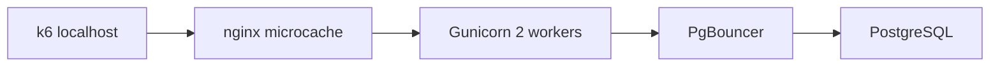

# Нагрузочное тестирование — svoygarage.ru

Этап 9 плана масштабирования. Инструмент: **k6**, обёртка [`scripts/ops/run-load-test.sh`](../../scripts/ops/run-load-test.sh).

## Архитектура под тест



## Треки

| Трек | `LOAD_TEST_MODE` | URL | Назначение |
|------|------------------|-----|------------|
| **A** | `hit` | `/server/api/catalog/products?page=1&page_size=20` | Microcache HIT, целевой «каталог» |
| **B** | `miss` | catalog + `_bust=…` | Backend + PostgreSQL |
| **C** | `mixed` | 35% part-types, 35% HIT, 30% MISS | Реалистичный просмотр |
| **D** | `direct` | `http://127.0.0.1:8080/api/catalog/…` | Потолок без nginx rate limit |

Ramp на каждом треке: **50 → 100 → 150 → 200 VU** (hold 2 мин на ступени), ~12.5 мин на трек.

## Подготовка (max-тест)

На время прогона поднимаем `sg_api` до **200 r/s** (burst **300** в location):

```bash
# В репозитории: docs/nginx/http-ddos-limits.conf rate=200r/s
# + burst=300 на catalog/part-types в svoygarage.conf (временно)
update --nginx
```

После теста **вернуть 50 r/s / burst 60** и снова `update --nginx`.

## Запуск

```bash
# На сервере (root), низкая нагрузка
bash /home/fast/autoparts/scripts/ops/run-load-test.sh | tee /var/log/autoparts-load-test.log
```

Один трек вручную:

```bash
LOAD_TEST_MODE=hit k6 run /home/fast/autoparts/scripts/ops/load-test-k6.js
```

Мониторинг во время теста: [`monitoring.md`](./monitoring.md) — `tail -f /var/log/autoparts-health.log`.

## Результаты (prod 2026-07-05)

**Сервер:** `vm2512296768`, 4 GB RAM, Gunicorn 2 workers, PgBouncer 6432.  
**Rate limit на время теста:** sg_api **200 r/s**, burst **300**.

| Track | Mode | RPS | p50 | p95 | p99 | Fail % |
|-------|------|-----|-----|-----|-----|--------|
| A Catalog HIT | hit | _TBD_ | _TBD_ | _TBD_ | _TBD_ | _TBD_ |
| B Catalog MISS | miss | _TBD_ | _TBD_ | _TBD_ | _TBD_ | _TBD_ |
| C Mixed | mixed | _TBD_ | _TBD_ | _TBD_ | _TBD_ | _TBD_ |
| D Backend direct | direct | _TBD_ | _TBD_ | _TBD_ | _TBD_ | _TBD_ |

**Snapshot до/после:** load, RAM, 502/504 за 5 мин — в `/var/log/autoparts-load-test.log`.

### Интерпретация

- **Трек A ≥ 100 RPS, fail < 5%, p95 < 2 s** — критерий этапа 9 для microcache выполнен.
- **Трек B << A** — узкое место backend/DB; масштабировать read replica / Redis catalog cache.
- **Трек D >> A при rate limit 50** — nginx/rate limit был bottleneck (ожидаемо до bump).
- **502/504 во время теста** — смотреть `journalctl -u kroan`, health-monitor.

## Оценка нагрузки для 100k пользователей

| Допущение | Значение |
|-----------|----------|
| MAU | 100 000 |
| Пик онлайн | 2–5% → **2k–5k concurrent** |
| API на просмотр каталога | ~2 GET (part-types + catalog) |
| При HIT | большая доля RPS на nginx, не на uvicorn |

**Ориентир RPS на пике** (все смотрят каталог раз в 30 с):  
2k concurrent × 2 req / 30 s ≈ **130 RPS**; 5k concurrent ≈ **330 RPS**.

## Рекомендации после теста

Заполняется по фактическим X/Y из таблицы выше.

| Фаза | Concurrent / RPS | Действия |
|------|------------------|----------|
| **Сейчас** (1 VPS, 4 GB, 2 workers) | до **X** RPS HIT / **Y** RPS MISS | Текущий потолок |
| **1–3k concurrent** (~130–260 RPS с microcache) | CDN `/static`, `/uploads` | Снять статику с VPS |
| **3–10k concurrent** | 2-й API VPS + LB | REST без sticky; WS через Redis (этап 6) |
| **10k+ / рост MISS** | PostgreSQL read replica | SELECT каталога/поиска |
| **100k user base** | Горизонталь API + CDN + replica | LB, PgBouncer на каждой API-ноде, алерты (этап 8) |

### Следующий шаг (приоритет)

1. **CDN** для `/static` и `/uploads` — быстрый выигрыш при росте трафика.
2. При **X < 130 RPS** на HIT — 3-й Gunicorn worker (если RAM) или 2-й API VPS.
3. При **Y << X** — read replica + увеличить Redis TTL на публичный каталог.

## Связанные файлы

- Сценарий k6: [`scripts/ops/load-test-k6.js`](../../scripts/ops/load-test-k6.js)
- План: [`scale-and-speed-plan.md`](./scale-and-speed-plan.md)
- Baseline: [`performance.md`](./performance.md)
