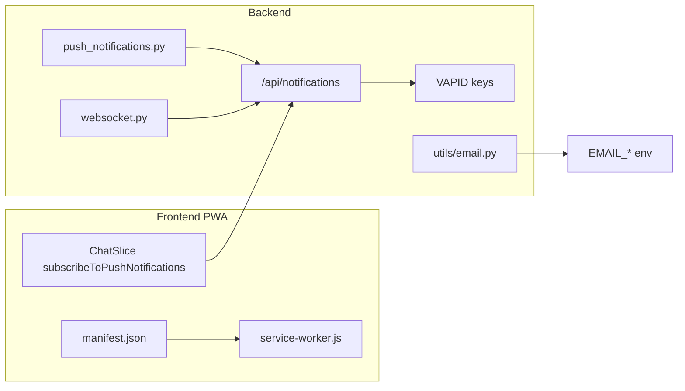

# Product Baseline — Этап 0

Дата: 2026-07-06  
Проект: **Свой Гараж** (`svoygarage.ru`)  
Назначение: зафиксировать текущее состояние перед roadmap-этапами 1–20 ([product-roadmap-plan.md](./product-roadmap-plan.md)).

---

## 1. Workflow-решения (согласовано)

| Вопрос | Решение |
|--------|---------|
| Продакшен | Синхронизирован с веткой `celery_update`, последний коммит `8f24256` |
| Git-ветка | Остаёмся на `celery_update` |
| Коммиты | После каждого завершённого этапа roadmap |
| Деплой | Только по явному запросу (не автоматически после этапов) |
| Роли | Не экспериментируем: admin / seller / employee / buyer есть; сотрудникам выдаются granular permissions |
| Уведомления (roadmap) | Только **PWA push** и **email** — без SMS, Telegram, WhatsApp |

---

## 2. Git snapshot

```
Ветка:     celery_update → origin/celery_update (синхронизирована)
HEAD:      8f24256 паврпролло
Статус:    рабочее дерево чистое (нет unstaged/staged изменений в коде)
Untracked: docs/product-roadmap-plan.md
```

### Последние коммиты

| Hash | Сообщение |
|------|-----------|
| `8f24256` | паврпролло — MyParts UI, ячейки, модалка печати |
| `3fbfab5` | фыв |
| `185dffd` | Move my-parts search above filters on full width row |
| `ebfffc6` | asdasdas |
| `a7a61a6` | лоро |

### Другие ветки

| Ветка | Последний коммит |
|-------|------------------|
| `master` | `42274d4` ip update 2 |
| `kalyaka_malyaka` | `8e39d1c` git pull |
| `search` | `64d8799` arguments_celery_2 |

---

## 3. Продакшен

- URL: `https://svoygarage.ru`
- API: `https://svoygarage.ru/server/api` (из `frontend/my-autoparts/.env`)
- Деплой: `update` / `update --frontend-only` на сервере
- По заявке владельца: прод синхронизирован с `celery_update` / `8f24256`

---

## 4. Маршруты (инвентаризация)

Источник: [`frontend/my-autoparts/src/App.js`](../frontend/my-autoparts/src/App.js)

### 4.1 Публичные (покупатель)

| Группа | Маршруты |
|--------|----------|
| Главная и каталог | `/`, `/catalog`, `/find`, `/autoparts` |
| Новые запчасти | `/autoparts/new`, `/autoparts/new/filters`, `/autoparts/new/brand/:slug`, `/autoparts/new/category/:slug`, `/autoparts/new/open`, `/autoparts/new/part/:cardId` |
| Б/у запчасти | `/autoparts/used`, `/autoparts/used/filters`, `/autoparts/used/brand/:slug`, `/autoparts/used/category/:slug`, `/autoparts/used/geo/:slug` |
| Карточка и корзина | `/part/:productId`, `/cart`, `/order-reg`, `/cart/new/checkout`, `/cart/new/pay/:sessionId` |
| Организации | `/organizations`, `/organizations/:orgId`, `/users/:publicCode` |
| Инфо | `/about`, `/privacy`, `/personal-data-consent`, `/offer`, `/cookie-policy`, `/delivery`, `/payment`, `/reviews` |
| Auth | `/auth`, `/auth/password-reset` |

### 4.2 Кабинет (продавец / сотрудник / админ)

| Группа | Маршруты |
|--------|----------|
| Главная | `/dashboard` |
| Склад | `/my-parts`, `/my-parts/add`, `/my-parts/edit/:id`, `/my-parts/drafts/:draftId/edit`, `/my-parts/resubmit/:id`, `/my-parts/edit-pending/:id` |
| Автомобили | `/vehicles`, `/vehicles/add`, `/vehicles/edit/:id` |
| Покупки | `/purchases/orders`, `/purchases/returns` |
| Продажи | `/sales/orders`, `/sales/returns`, `/warehouse-sales` |
| Складские операции | `/stock-in`, `/stock-out` |
| Финансы | `/finance` |
| Чаты | `/chats`, `/chats/:chatId` |
| Настройки | `/profile`, `/settings/organization`, `/settings/storage-addresses`, `/settings/printers`, `/settings/employees`, `/settings/integration`, `/settings/integration/avito`, `/settings/integration/avito/nomenclature`, `/settings/integration/drom`, `/settings/integration/drom/nomenclature` |
| Модерация (админ) | `/moderation/pending-sellers`, `/moderation/products`, `/moderation/products/:organizationId` |
| Админка | `/admin-settings`, `/admin/analytics`, `/admin/analytics/seo/queue`, `/admin/analytics/seo/queue/:source`, `/admin/audit-log`, `/admin/users`, `/admin/rossko` |
| Прочее | `/clients`, `/sellers`, `/sellers/:sellerId/workspace`, `/seller/part-card/:id` |

### 4.3 Меню ↔ маршруты (расхождения)

Источник меню: [`profileMenuConfig.js`](../frontend/my-autoparts/src/pages/Profile/menu/profileMenuConfig.js)

| Пункт меню | Путь в TAB_PATH_MAP | Route в App.js | Статус |
|------------|---------------------|----------------|--------|
| `settings-label` | `/settings/label` | **нет** | Мёртвый путь |
| `settings-printers` | `/settings/printers` | `/settings/printers` | OK |
| Все остальные пункты TAB_PATH_MAP | — | есть | OK |

Дополнительно: [`useMobileMenuShell.js`](../frontend/my-autoparts/src/hooks/useMobileMenuShell.js) содержит заголовок для `/settings/label` («Этикетки»), но маршрута нет.

**Рекомендация:** этап 18 — выровнять `/settings/label` и `/settings/printers`.

### 4.4 Legacy-страницы (не в App.js routes)

| Файл | Проблема |
|------|----------|
| [`SalesPage.jsx`](../frontend/my-autoparts/src/pages/Sales/SalesPage.jsx) | Старая обёртка с `OrdersTab` |
| [`PurchasesPage.jsx`](../frontend/my-autoparts/src/pages/Sales/PurchasesPage.jsx) | Старая обёртка |
| [`OrdersTab.jsx`](../frontend/my-autoparts/src/pages/Sales/OrdersTab.jsx) | Вызывает `GET /api/orders/` (не существует) |
| [`RosskoOrdersPage.jsx`](../frontend/my-autoparts/src/pages/Sales/RosskoOrdersPage.jsx) | Не подключена к routes |
| [`SalesRosskoPage.jsx`](../frontend/my-autoparts/src/pages/Sales/SalesRosskoPage.jsx) | Не подключена к routes |

Актуальные страницы заказов: `SalesOrdersPage`, `PurchasesOrdersPage`.

---

## 5. Роли и доступ

Источник: [`profileMenuConfig.js`](../frontend/my-autoparts/src/pages/Profile/menu/profileMenuConfig.js)

| Роль | Что видит в меню |
|------|------------------|
| **admin** | Dashboard, продавцы, клиенты, чаты, покупки, продажи, финансы, склад, админка |
| **seller** | Dashboard, клиенты, чаты, покупки, продажи, финансы, склад, настройки |
| **employee** | Dashboard, покупки, продажи/склад по permissions, настройки по permissions |
| **buyer** | Покупки, чаты, профиль |

### Granular permissions (примеры)

- `sales.orders`, `sales.returns`, `warehouse-sales`
- `my-parts`, `vehicles`, `stock-in`, `stock-out`
- `finance.reports`, `storage-addresses`
- `settings.printers`, `settings.integration.avito`
- `admin.audit`

**На этапах 0–3 permissions не менять.**

---

## 6. Заглушки и недоделанные разделы

### 6.1 User-facing «в разработке»

| Раздел | Маршрут | Файл | Видимость |
|--------|---------|------|-----------|
| Возвраты покупателя | `/purchases/returns` | `PurchasesReturnsPage.jsx` | Меню: admin, seller, buyer, employee |
| Возвраты продавца | `/sales/returns` | `SalesReturnsPage.jsx` | Меню: admin, seller, employee (permission) |
| Rossko-заказы (tab) | не в routes | `RosskoOrdersTab.jsx` | Только через legacy `RosskoOrdersPage` / `SalesRosskoPage` |

Вложенные компоненты с тем же текстом: `ReturnsTab.jsx`, `PurchasesReturnsTab.jsx`.

**Рекомендация этап 1:** скрыть из меню или сделать MVP.

### 6.2 Backend 501

| Endpoint | Файл | Кто видит |
|----------|------|-----------|
| `POST /api/checkout/from-cart` | `checkout.py` | Не используется фронтом (checkout через `orders_legacy`) |
| `POST .../drom/.../publish` | `drom_integration.py` | Продавец при попытке API-публикации Drom |
| `POST /api/admin/migrations/orders-v2/up|down` | `admin.py` | Только админ (намеренно отключено) |

### 6.3 Backend TODO (Drom API)

| Файл | Статус |
|------|--------|
| `backend/app/services/drom_api.py` | Stubs: validate token, upload file, get status |

### 6.4 Настройка без UI

| Настройка | Backend | Redux | UI | Карточка товара |
|-----------|---------|-------|-----|-----------------|
| `used_parts_purchase_mode` | `admin.py` PATCH, `auth.py` public config | `PublicInfoSlice.js` | **нет** в AdminPanel | **не используется** в `PartDetail.jsx` |

Допустимые значения: `both`, `cart_only`, `cta_only`.

**Рекомендация этап 2:** админка + карточка товара.

---

## 7. Env checklist (имена переменных, без секретов)

### 7.1 Backend — обязательные

| Переменная | Назначение |
|------------|------------|
| `DATABASE_URL` | PostgreSQL |
| `SECRET_KEY` | JWT, шифрование |
| `ALGORITHM` | JWT algorithm |
| `ACCESS_TOKEN_EXPIRE_MINUTES` | TTL токена |
| `EMAIL_HOST`, `EMAIL_PORT`, `EMAIL_HOST_USER`, `EMAIL_HOST_PASSWORD`, `EMAIL_FROM` | SMTP |
| `VERIFICATION_CODE_EXPIRE_SECONDS` | Код подтверждения email |
| `ROSSKO_KEY1`, `ROSSKO_KEY2` | Rossko API |
| `GET_SEARCH`, `GET_CHECK_OUT_DETAILS`, `GET_CHECK_OUT`, `GET_ORDERS`, `GET_DELIVERY_DETAILS`, `GET_SETTLEMETNS`, `GET_BROKEN_WAVE` | Rossko endpoints |
| `BASE_URL`, `PUBLIC_BASE_URL` | Внутренние и публичные URL |

### 7.2 Backend — инфраструктура

| Переменная | Назначение |
|------------|------------|
| `REDIS_URL`, `CELERY_BROKER_URL`, `CELERY_RESULT_BACKEND` | Celery / кэш |
| `CORS_ALLOW_ORIGINS` | CORS |
| `DB_POOL_SIZE`, `DB_MAX_OVERFLOW` | SQLAlchemy pool |
| `RATE_LIMIT_ENABLED` | Rate limiting |
| `PRERENDER_INTERNAL_TOKEN` | Prerender для SEO |
| `BACKUP_DIR`, `PG_DUMP_PATH`, `BACKUP_RETENTION_COUNT` | Бэкапы |

### 7.3 Backend — уведомления (этап 4)

| Переменная | Назначение | Статус |
|------------|------------|--------|
| `EMAIL_*` | Email-уведомления | Работает (auth, welcome) |
| `VAPID_PUBLIC_KEY` | PWA push — клиент | Может быть пустым |
| `VAPID_PRIVATE_KEY` | PWA push — сервер | Может быть пустым |

Если VAPID пустые — push молча не отправляется (`notifications.py`, `push_notifications.py`).

### 7.4 Backend — интеграции

| Переменная | Назначение |
|------------|------------|
| `AVITO_CREDENTIALS_SECRET`, `AVITO_WEBHOOK_SECRET` | Avito |
| `YOOKASSA_SHOP_ID`, `YOOKASSA_SECRET_KEY` | ЮKassa (новые запчасти) |
| `YANDEX_CREDENTIALS_SECRET`, `YANDEX_OAUTH_REDIRECT_URI` | Yandex Webmaster |
| `GOOGLE_CREDENTIALS_SECRET`, `GOOGLE_OAUTH_REDIRECT_URI` | Google Search Console |
| `OPENROUTER_CREDENTIALS_SECRET` | AI-описания |
| `DADATA_API_KEY` | Подсказки адреса |

### 7.5 Frontend

| Переменная | Назначение |
|------------|------------|
| `REACT_APP_API_BASE_URL` | API base (`https://svoygarage.ru/server/api`) |
| `REACT_APP_BACKEND_BASE_URL` | Backend base (`https://svoygarage.ru/server`) |

Секреты в frontend `.env` **не хранить**.

---

## 8. Инфраструктура уведомлений

### 8.1 Ограничение roadmap

Новые уведомления — только:
- **PWA push** (Web Push API + service worker)
- **email** (SMTP)

Не планировать: SMS, Telegram, WhatsApp, сторонние mobile SDK.

### 8.2 Что уже есть



| Компонент | Файл | Что делает |
|-----------|------|------------|
| PWA manifest | `public/manifest.json` | standalone app, icons |
| Service Worker | `public/service-worker.js` | push events, click → `/chats` или `/sales/orders` |
| Подписка на push | `ChatSlice.js` → `subscribeToPushNotifications` | VAPID key, register SW, POST `/notifications/subscribe` |
| API подписок | `routers/notifications.py` | subscribe, unsubscribe, vapid-public-key |
| Отправка push | `send_push_notification()` | pywebpush, модель `PushSubscription` |
| Push при заказе | `services/push_notifications.py` | `notify_sellers_new_order` |
| Push при чате | `routers/websocket.py` | при offline получателя |
| Email | `utils/email.py` | verification, welcome, seller confirmation |

### 8.3 Чего нет (для этапа 4)

- Центр уведомлений в UI
- Настройки «какие события включить»
- Email при смене статуса заказа (кроме auth-flow)
- История уведомлений в БД
- Универсальный notification event bus

---

## 9. Основные API (кратко)

Источник: [`backend/app/routers/__init__.py`](../backend/app/routers/__init__.py)

| Область | Роутеры |
|---------|---------|
| Каталог | `catalog`, `search_products`, `tecdoc_parts`, `public_new_parts_cards` |
| Товары | `products`, `pending_products`, `product_drafts`, `moderation_products` |
| Заказы | `orders_legacy` (POST б/у), `orders_new_parts`, `payments_new_parts`, `sales`, `checkout` (501) |
| Склад | `stock_ins`, `stock_outs`, `storage_cells`, `storage_locations`, `vehicles` |
| Интеграции | `avito_integration`, `avito_messenger`, `drom_integration`, `rossko_api` |
| SEO | `public_feeds`, `seo_landing_pages`, `public_product_seo`, `yandex_feeds` |
| Уведомления | `notifications`, `websocket` |
| Админ | `admin`, `admin_analytics`, `audit`, `backup_admin` |

### Актуальные flow заказов

| Тип | Checkout | API | Страница |
|-----|----------|-----|----------|
| Б/у | `/order-reg` | `POST /api/orders/` (`orders_legacy`) | `/purchases/orders`, `/sales/orders` |
| Новые | `/cart/new/checkout` | `POST /api/orders/new-parts` + YooKassa | `/purchases/orders`, `/cart/new/pay/:sessionId` |

---

## 10. Реестр рисков

| # | Риск | Влияние | Митигация | Этап |
|---|------|---------|-----------|------|
| 1 | Заглушки «в разработке» в меню | Потеря доверия | Скрыть или MVP | 1 |
| 2 | `/settings/label` без route | Битая ссылка в mobile shell | Выровнять пути | 18 |
| 3 | `used_parts_purchase_mode` не на UI | Путаница cart vs chat | Подключить | 2 |
| 4 | Legacy `OrdersTab` / `GET /orders/` | Случайный рефактор ломает flow | Не трогать / удалить | 17 |
| 5 | Drom publish 501 | Ложное ожидание у продавца | API или честный XLSX | 8 |
| 6 | VAPID пустые на проде | Push не работает | Проверить env | 4 |
| 7 | Деплой вручную | Забытые коммиты | Коммит после этапа | workflow |
| 8 | SEO microdata конфликты | Хуже сниппеты | Довести JSON-LD | 10 |
| 9 | Permissions сотрудников | Сломать доступ | Не менять до этапа 16 | — |
| 10 | `backend/.env` в Git | Утечка секретов | Никогда не коммитить | — |

---

## 11. Файлы «не трогать без согласования»

- `backend/.env` — секреты продакшена
- `docs/nginx/svoygarage.conf` — только с отдельным SEO/deploy-этапом
- Модель permissions сотрудников — до этапа 16
- Production DB migrations — только с бэкапом
- `SECRET_KEY`, `VAPID_*`, `EMAIL_*`, ключи интеграций

---

## 12. Команды проверки

| Проверка | Команда |
|----------|---------|
| Git status | `git status -sb` |
| Frontend build | `cd frontend/my-autoparts && npm run build` |
| Backend tests | `cd backend && pytest tests/ -q` |
| Lint (после этапов) | IDE diagnostics / `read_lints` |
| Deploy (ручной) | `update` или `update --frontend-only` на сервере |

---

## 13. Рекомендуемый порядок следующих этапов

1. **Этап 1** — убрать/скрыть заглушки (возвраты, Rossko tab)
2. **Этап 18** — навигация (`/settings/label` vs `/settings/printers`)
3. **Этап 2** — `used_parts_purchase_mode` на карточке + админка
4. **Этап 3** — единый путь заказа б/у
5. **Этап 4** — PWA/email-уведомления (расширить существующую инфраструктуру)
6. **Этап 10** — SEO и микроразметка

Полный roadmap: [product-roadmap-plan.md](./product-roadmap-plan.md)

---

## 14. Критерии готовности этапа 0

- [x] Baseline-документ создан
- [x] Git, prod, routes, stubs, env, notifications зафиксированы
- [x] Workflow-решения записаны
- [x] Риски и порядок этапов определены
- [x] Код приложения не изменён

**Следующий рекомендуемый этап: 1** (убрать заглушки и недоделанные пользовательские разделы).
