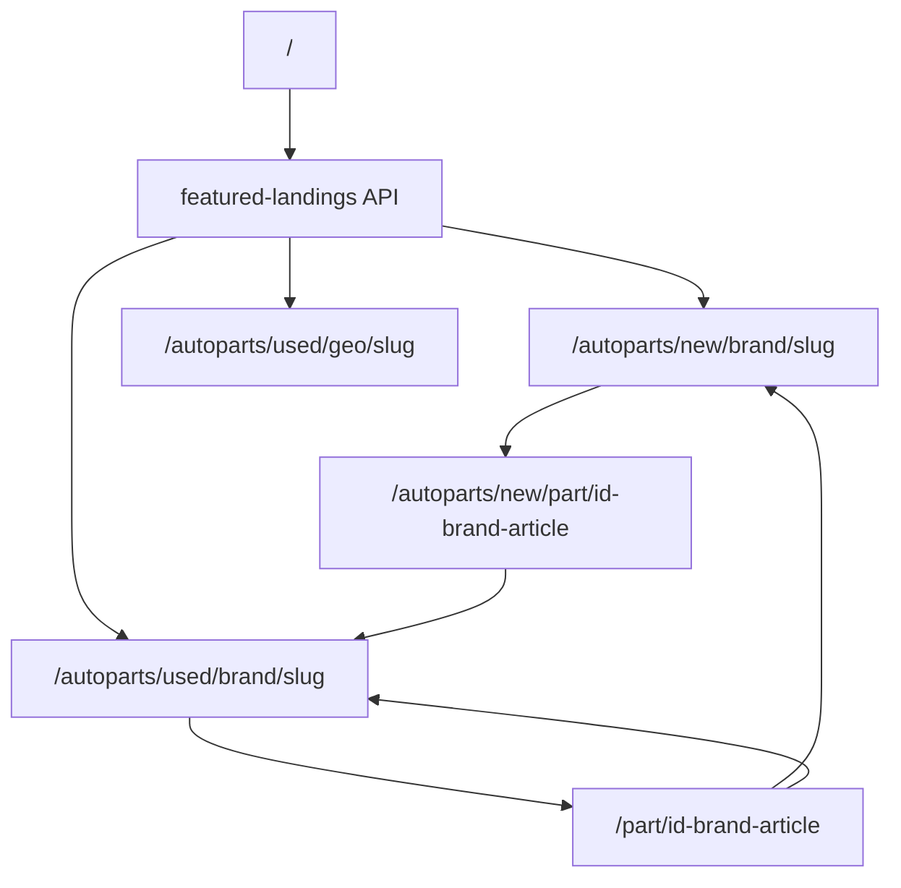

# Итоги реализации SEO (этапы 6–7)

Документ фиксирует, что было сделано по [SEO Master Plan](../.cursor/plans/seo_master_plan_1a249a04.plan.md) в рамках **этапов 6 и 7**, а также смежные изменения.

> **Важно:** в мастер-плане описаны только **этапы 1–7**. Отдельного «Этапа 8» в плане нет.

---

## Статус этапов мастер-плана

| Этап | Название | Статус в этом отчёте |
|------|----------|----------------------|
| 1 | Карточка `/autoparts/new/part/` | Вне scope (см. план) |
| 2 | Slug и транслит | Вне scope (см. план) |
| 3 | Посадочные брендов (new) | Вне scope (см. план) |
| 4 | Посадочные категорий (new) | Вне scope (см. план) |
| 5 | Рост SEO-карточек | Вне scope (см. план) |
| **6** | **Посадочные б/у** | **Реализовано** |
| **7** | **Семантика и KPI** | **Реализовано** |

---

## Этап 6. Посадочные б/у (п.12)

**Цель:** brand / category / geo landing для б/у каталога, sitemap, prerender, cross-links с карточек.

### Backend

| Компонент | Файл / endpoint | Что сделано |
|-----------|-----------------|-------------|
| Каталог б/у по бренду/городу | `backend/app/services/used_catalog_service.py` | slug бренда, counts, итераторы для prerender |
| Фильтр geo | `backend/app/routers/catalog.py` | параметр `city` → JOIN `organization`, `address ILIKE` |
| Посадочные в реестре | `backend/app/services/seo_landing_page_service.py` | kinds: `brand_used`, `category_used`, `geo`; seed (10 brand + 10 category + 1 geo) |
| Public API | `backend/app/routers/seo_landing_pages.py` | `GET /public/seo/landings/{kind}/{slug}` для used kinds |
| Prerender SEO | `backend/app/services/static_page_seo_service.py` | builders для used brand / category / geo |
| SPA route check | `backend/app/services/spa_page_check_service.py` | валидаторы маршрутов used/geo |
| Sitemap | `backend/app/services/sitemap_service.py`, `public_feeds.py` | `sitemap-used-brands.xml`, `sitemap-used-categories.xml`, `sitemap-used-geo.xml` + записи в index |
| Nginx | `docs/nginx/svoygarage.conf` | prerender для `/autoparts/used/brand|category|geo/` |

**Geo URL (фактический):** `/autoparts/used/geo/{slug}` (например `/autoparts/used/geo/ekaterinburg`), не `/city/`.

### Frontend

| Компонент | Путь |
|-----------|------|
| Brand landing | `frontend/.../UsedPartsBrandLandingPage.jsx` |
| Category landing | `frontend/.../UsedPartsCategoryLandingPage.jsx` |
| Geo landing | `frontend/.../UsedPartsGeoLandingPage.jsx` |
| SEO helpers | `usedPartsBrandSeo.js`, `usedPartsCategorySeo.js`, `usedPartsGeoSeo.js` |
| API клиент | `usedCatalogApi.js` |
| Маршруты | `App.js`: `/autoparts/used/brand|category|geo/:slug` |
| Cross-links на б/у карточке | `PartDetailSeoCrossLinks.jsx` + `PartDetail.jsx` |
| Breadcrumbs / pageSeo | `breadcrumbs.js`, `pageSeo.js` — исключения для landing paths |
| Каталог б/у | `autopartsPublic.js` — явный `is_new: false` |

### Критерии приёмки этапа 6

- [x] Посадочные brand / category / geo для б/у
- [x] Sitemap + index
- [x] Prerender (nginx + static_page_seo)
- [x] Cross-links с б/у карточки (brand, new analog)
- [ ] После деплоя: seed в админке, применить nginx, пересобрать sitemap cache

---

## Этап 7. Семантика, индексация, перелинковка, KPI (п.13)

**Цель:** семантическая карта, правила index/noindex, матрица перелинковки, KPI из GSC и Яндекс Вебмастера.

### 7.1 Документация

| Файл | Содержание |
|------|------------|
| [`semantic-map.md`](semantic-map.md) | ≥60 запросов, кластеры A–D, таблица URL, матрица перелинковки |
| [`indexation-rules.md`](indexation-rules.md) | robots/canonical по URL-паттернам, согласовано с кодом |
| [`webmaster-setup.md`](webmaster-setup.md) | Чеклист GSC + Яндекс Вебмастер, sitemap, OAuth |

### 7.3 Правила индексации (в коде)

**Правило:** листинг с одним `?brand=` без текстового `q` → **noindex**, canonical на brand landing.

| Слой | Файл | Детали |
|------|------|--------|
| Frontend (Helmet) | `frontend/.../pageSeo.js` | `resolveBrandLandingCanonical()`, `buildNewPartsSeo`, `buildUsedPartsSeo` |
| Backend (prerender) | `backend/.../static_page_seo_service.py` | `_build_new_parts_seo`, `_build_used_parts_seo` + brands из query |
| Общая логика | `backend/.../seo_semantics_service.py` | `resolve_single_brand_landing_path()`, `classify_query_cluster()` |

### 7.4 Перелинковочная матрица

| From | To | Реализация |
|------|-----|------------|
| Главная | brand landings (new + used) | `FeaturedLandingsSection.jsx` на `Main.jsx` |
| Brand landing | counterpart + categories + top cards | `SeoCrossLinksSection.jsx` + API crosslinks |
| Category landing | brands + counterpart | то же |
| Geo landing | used brands + categories | то же |
| New card | used matches + analogs + brand | `NewPartUsedMatchesBlock`, `NewPartDetailPage` → brand link |
| Used card | new analog + brand + seller org | `PartDetailSeoCrossLinks.jsx` |

**API:**

- `GET /public/seo/featured-landings` — блок на главной
- `GET /public/seo/landings/{kind}/{slug}/crosslinks` — секции на landing pages

**Сервис:** `backend/app/services/seo_crosslinks_service.py`

### 7.5 KPI-дашборд

| Компонент | Описание |
|-----------|----------|
| `backend/app/services/seo_kpi_service.py` | Агрегация метрик, группировка по кластерам A–D |
| `backend/app/services/google_search_console_service.py` | OAuth + Search Analytics API |
| `backend/app/routers/google_search_console.py` | `/admin/google/*` (credentials, OAuth) |
| `backend/app/services/yandex_webmaster_service.py` | `get_popular_search_queries`, history |
| `GET /admin/seo/kpi/dashboard` | Admin endpoint (days=14 по умолчанию) |
| `SeoKpiDashboard.jsx` | UI в **Админ → Аналитика → SEO** |
| `get_site_sitemap_files()` | Список всех 8 дочерних sitemap в админке |

**Не автоматизировано в KPI:**

- Сравнение «URL в sitemap vs проиндексировано» (только счётчики sitemap)
- Конверсии: корзина (new), чат (used)
- Первый осмысленный отчёт — через ~2 недели после индексации посадочных

### Критерии приёмки этапа 7

- [x] `semantic-map.md` с ≥50 запросами
- [x] `indexation-rules.md` согласован с `pageSeo.js` и `static_page_seo_service.py`
- [x] Перелинковка по матрице 7.4
- [x] KPI API (GSC + Яндекс) + дашборд в админке
- [ ] Первый отчёт GSC/Вебмастер через 2 недели после деплоя этапов 1–6

---

## Тесты (backend)

| Файл | Покрытие |
|------|----------|
| `tests/test_seo_landing_pages.py` | resolve/seed landing pages |
| `tests/test_used_catalog_service.py` | used catalog counts |
| `tests/test_static_page_seo_service.py` | prerender meta, brand canonical |
| `tests/test_seo_semantics_service.py` | cluster classification, brand path |
| `tests/test_seo_crosslinks_service.py` | featured landings, crosslinks |
| `tests/test_seo_kpi_service.py` | нормализация GSC/Yandex, dashboard без токенов |

---

## Смежные изменения (не этап мастер-плана)

### Упрощение `/admin-settings`

Файл: `frontend/.../AdminPanelPage.jsx`

**Оставлено:**

1. Отображать новые запчасти
2. Отображать отзывы на сайте
3. Наценка на новые запчасти (глобальная)
4. Быстрые ссылки (для сниппета Яндекса)
5. Локализация фото с Avito

**Убрано с UI:**

- Яндекс Товары / Вебмастер (OAuth, фид, sync)
- Матрица доставки для Яндекс Товаров

Интеграция Яндекса по-прежнему доступна через API `/admin/yandex/*`; подключение GSC — в **Аналитика → SEO → KPI**.

---

## Post-deploy чеклист

1. **Seed посадочных:** Админ → SEO → «Seed из каталога» или `POST /admin/seo/landing-pages/seed-from-catalog`
2. **Nginx:** применить `docs/nginx/svoygarage.conf` (prerender used landings)
3. **Sitemap:** пересборка cache в админке SEO
4. **Google Search Console:** OAuth в SEO KPI, отправить `https://svoygarage.ru/sitemap.xml`
5. **Яндекс Вебмастер:** OAuth через `/admin/yandex/*`, host/ensure, sitemap (см. [`webmaster-setup.md`](webmaster-setup.md))
6. **Через 2 недели:** открыть KPI-дашборд, сверить кластеры A–D с [`semantic-map.md`](semantic-map.md)

---

## Карта URL (после этапов 6–7)

---

## Связанные документы

- [SEO Master Plan](../.cursor/plans/seo_master_plan_1a249a04.plan.md)
- [semantic-map.md](semantic-map.md)
- [indexation-rules.md](indexation-rules.md)
- [webmaster-setup.md](webmaster-setup.md)
- [verification-checklist.md](verification-checklist.md)
