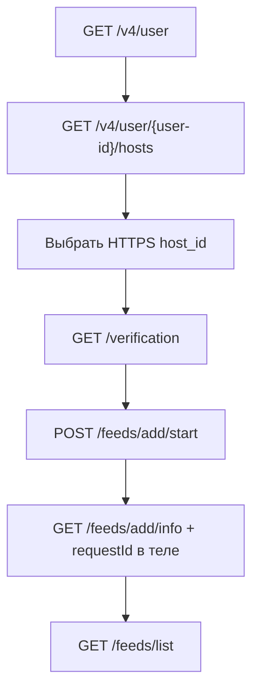

# Проверка API Яндекс Вебмастера (svoygarage.ru)

Дата проверки: **2026-05-23**

Документ фиксирует фактическое состояние OAuth-интеграции и корректный сценарий вызовов API для Яндекс Товаров.

## Подтвержденное состояние

| Параметр | Значение |
|---|---|
| `user_id` | `902503128` |
| Основной `host_id` | `https:svoygarage.ru:443` |
| Дополнительный `host_id` | `http:svoygarage.ru:80` (зеркало → HTTPS) |
| Права на сайт | `VERIFIED` |
| Способ подтверждения | `META_TAG` |
| Код метатега | `ce766610ecf7435a` |
| Последнее подтверждение | `2026-02-26T15:26:07.227+03:00` |

### Фиды в Вебмастере (до обновления)

```json
{
  "feeds": [
    {
      "url": "https://svoygarage.ru/",
      "regionIds": [],
      "type": "GOODS"
    }
  ]
}
```

### Фиды после корректной async-загрузки

```json
{
  "feeds": [
    {
      "url": "https://svoygarage.ru/",
      "regionIds": [],
      "type": "GOODS"
    },
    {
      "url": "https://svoygarage.ru/api/feeds/yandex/used.yml",
      "regionIds": [3, 40, 17, 59, 26, 73, 52, 102444],
      "type": "GOODS"
    }
  ]
}
```

Рабочий URL фида для платформы: `https://svoygarage.ru/api/feeds/yandex/used.yml`

## Корректная последовательность API



### Шаг 1. Получить `user-id`

```http
GET https://api.webmaster.yandex.net/v4/user
Authorization: OAuth <access_token>
Accept: application/json
```

Ответ:

```json
{"user_id": 902503128}
```

### Шаг 2. Проверить, добавлен ли сайт

```http
GET https://api.webmaster.yandex.net/v4/user/902503128/hosts
Authorization: OAuth <access_token>
Accept: application/json
```

Если сайта нет — добавить:

```http
POST https://api.webmaster.yandex.net/v4/user/902503128/hosts
Authorization: OAuth <access_token>
Content-Type: application/json;charset=UTF-8

{"host_url": "https://svoygarage.ru"}
```

### Шаг 3. Проверить подтверждение прав

```http
GET https://api.webmaster.yandex.net/v4/user/902503128/hosts/https:svoygarage.ru:443/verification
Authorization: OAuth <access_token>
Accept: application/json
```

Ожидаемый статус: `"verification_state": "VERIFIED"`.

Если не подтвержден — добавить метатег на главную:

```html
<meta name="yandex-verification" content="ce766610ecf7435a" />
```

Затем запустить проверку:

```http
POST https://api.webmaster.yandex.net/v4/user/902503128/hosts/https:svoygarage.ru:443/verification?verification_type=META_TAG
Authorization: OAuth <access_token>
```

### Шаг 4. Асинхронная загрузка фида

```http
POST https://api.webmaster.yandex.net/v4/user/902503128/hosts/https:svoygarage.ru:443/feeds/add/start
Authorization: OAuth <access_token>
Content-Type: application/json;charset=UTF-8

{
  "feed": {
    "url": "https://svoygarage.ru/api/feeds/yandex/used.yml",
    "type": "GOODS",
    "regionIds": [225]
  }
}
```

Ответ:

```json
{"requestId": "8b6b52e0-56d7-11f1-aaff-419c7404fe5e"}
```

### Шаг 5. Проверить статус загрузки

**Важно:** это `GET`, но тело запроса обязательно.

```http
GET https://api.webmaster.yandex.net/v4/user/902503128/hosts/https:svoygarage.ru:443/feeds/add/info
Authorization: OAuth <access_token>
Content-Type: application/json;charset=UTF-8

{"requestId": "8b6b52e0-56d7-11f1-aaff-419c7404fe5e"}
```

Ответ:

```json
{"processStatus": "OK"}
```

Возможные значения: `IN_PROGRESS`, `OK`.

### Шаг 6. Проверить список фидов

```http
GET https://api.webmaster.yandex.net/v4/user/902503128/hosts/https:svoygarage.ru:443/feeds/list
Authorization: OAuth <access_token>
Accept: application/json
```

## Типовые ошибки

| Ошибка | Причина | Решение |
|---|---|---|
| `415 CONTENT_TYPE_UNSUPPORTED` на `/feeds/add/info` | Запрос без `Content-Type: application/json` и/или без тела `requestId` | Передавать JSON-тело с `requestId` |
| `400 ENTITY_VALIDATION_ERROR` | Некорректное JSON-тело (часто из-за экранирования в shell) | Использовать `scripts/yandex-webmaster-check.py` |
| `404 HOST_NOT_VERIFIED` | Права на сайт не подтверждены | Подтвердить через META_TAG/HTML_FILE/DNS |
| `404 BAD_HTTP_CODE` | Feed URL недоступен | Проверить `GET /api/feeds/yandex/used.yml` |
| `404 BAD_MIME_TYPE` | Неверный Content-Type фида | Отдавать `application/xml` или `text/xml` |

## Скрипты для ручной проверки

- Python (рекомендуется на Windows): [`scripts/yandex-webmaster-check.py`](../scripts/yandex-webmaster-check.py)
- PowerShell: [`scripts/yandex-webmaster-check.ps1`](../scripts/yandex-webmaster-check.ps1)

Примеры:

```bash
# Только проверка состояния
python scripts/yandex-webmaster-check.py --token "<oauth_token>" check

# Полный цикл: add/start -> poll -> list
python scripts/yandex-webmaster-check.py --token "<oauth_token>" sync
```

## Связь с кодом проекта

Backend уже реализует этот сценарий:

- [`backend/app/services/yandex_webmaster_service.py`](../backend/app/services/yandex_webmaster_service.py) — HTTP-обертки API
- [`backend/app/tasks/yandex_feed_tasks.py`](../backend/app/tasks/yandex_feed_tasks.py) — Celery sync с polling `processStatus`
- [`docs/yandex-feed-runbook.md`](yandex-feed-runbook.md) — админский runbook для `/admin-settings`
