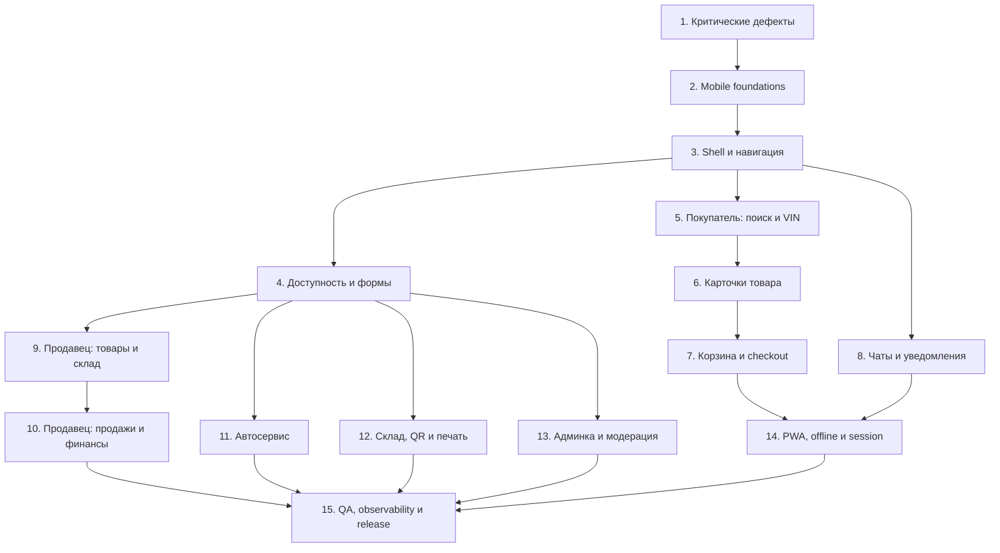

# Мастер-план улучшения мобильной версии «Свой Гараж»

Документ программы модернизации mobile UX для **всех ролей**: покупатель, продавец, автосервис, склад, администрирование и PWA.

**Связанные документы:**
- [MOBILE_UI.md](./MOBILE_UI.md) — правила вёрстки и паттерны
- [MOBILE_QA_CHECKLIST.md](./MOBILE_QA_CHECKLIST.md) — ручная регрессия
- [design-system.md](./design-system.md) — дизайн-система

---

## Цель программы

Единый **app-like UX** на ширине **360–1023 px** для всех ролей без регрессии desktop (≥1024 px).

## Правила работы

1. **Один этап = один цикл:** Plan mode → реализация → тесты → обновление статуса в этом файле.
2. **Не смешивать этапы:** попутный редизайн соседних областей запрещён.
3. **Desktop не ломать:** изменения только под `max-lg:` / `md:hidden`, если этап явно не требует иного.
4. **Обязательные viewport'ы:** 360×800, 390×844, 768×1024, desktop ≥1024.
5. **Статусы этапов:** `не начат` | `планируется` | `выполняется` | `завершён` | `отложен`.

## Сводная таблица этапов

| № | Этап | Зависит от | Статус | План / PR |
|---|------|------------|--------|-----------|
| 1 | Критические функциональные дефекты | — | завершён | этап 1, 2026-08-25 |
| 2 | Mobile foundations и единые токены | 1 | завершён | этап 2, 2026-08-25 |
| 3 | Shell, навигация и состояние страницы | 2 | завершён | этап 3, 2026-08-25 |
| 4 | Доступность, формы и modal primitives | 3 | завершён | этап 4, 2026-08-25 |
| 5 | Покупатель: главная, каталог, фильтры и VIN | 3 | завершён | этап 5, 2026-08-25 |
| 6 | Карточки и страницы товара | 5 | завершён | этап 6, 2026-08-25 |
| 7 | Корзина, оформление и оплата | 6 | завершён | этап 7, 2026-08-25 |
| 8 | Чаты, push и центр уведомлений | 3 | завершён | этап 8, 2026-08-25 |
| 9 | Продавец: товары, добавление, редактирование и склад | 4 | завершён | этап 9 plan, 2026-08-25 |
| 10 | Продавец: продажи, возвраты, финансы и интеграции | 9 | завершён | этап 10 plan, 2026-08-25 |
| 11 | Автосервис | 4 | завершён | этап 11 plan, 2026-08-25 |
| 12 | Склад, QR, выдача и печать | 4 | завершён | этап 12, 2026-08-25 |
| 13 | Админка и модерация | 4 | завершён | этап 13, 2026-08-25 |
| 14 | PWA, offline, session и производительность | 7, 8 | завершён | этап 14, 2026-08-25 |
| 15 | Mobile QA, observability и release gate | 10–14 | завершён | этап 15, 2026-08-25 |

## Граф зависимостей



---

## Шаблон запуска этапа в Plan mode

Скопируйте блок ниже, замените `X` на номер этапа (1–15):

```text
Прочитай @frontend/my-autoparts/docs/MOBILE_IMPROVEMENT_MASTER_PLAN.md.
Создай в Plan mode детальный план только для этапа X.
Перед планом проверь текущее состояние указанных файлов и уже завершённые зависимости.
Не реализуй соседние этапы. Сохрани desktop-поведение, если этап явно не требует его менять.
Включи: точные файлы, миграции/контракты, состояния UI, accessibility, тесты, риски,
критерии приёмки и команды проверки. После моего подтверждения реализуй план полностью.
```

После завершения этапа обновите в этом файле: **Статус** → `завершён`, добавьте ссылку на Plan/PR в колонку «План / PR».

---

# Этапы (детально)

---

## Этап 1. Критические функциональные дефекты

**Статус:** `завершён`  
**План / PR:** этап 1, 2026-08-25

### Цель и пользовательский результат
Устранить блокирующие баги, из‑за которых пользователь не может завершить ключевое действие на телефоне (оформить заказ, войти из VIN-каталога) или не получает обновления PWA.

### Причины и подтверждённые проблемы
- Кнопка «Оформить» на `/order-reg` закреплена `bottom-0 z-30`, нижняя навигация — `z-50` → CTA перекрыта.
- Ссылка «Войти» в VIN-каталоге ведёт на `/login`, маршрута нет (есть только `/auth`).
- Класс `pb-safe-bottom` в OrderRegistration не определён в CSS.
- Nginx кеширует `service-worker.js` на 1 год (`immutable`) вместе с остальными `.js`.

### Зависимости и границы
- **Зависит от:** нет.
- **Не входит:** полный редизайн корзины, PWA offline, manifest 512 — это этапы 7 и 14.

### Основные области / файлы
| Файл | Что сделать |
|------|-------------|
| `src/pages/Cart/OrderRegistration.jsx` (~918) | Поднять sticky footer над nav через `MOBILE_STICKY_BOTTOM_OFFSET` / `MobileStickyFooter` |
| `src/pages/AutoParts/VinCatalog/VinCatalogBrowse.jsx` (~296) | `/login` → `/auth` |
| `src/pages/SellerPartCard/SellerPartCardPage.jsx` (~347) | Проверить fixed footer vs bottom nav |
| `src/pages/Cart/NewPartsOrderRegistration.jsx` (~542) | Проверить `pb-16` vs высота nav + safe-area |
| `src/constants/mobileTokens.js` | Использовать единые константы offset/z-index |
| `docs/nginx/svoygarage.conf` (~428) | Отдельный `location = /service-worker.js` с `no-cache` **до** regex static |

### Функциональные требования
- Mobile CTA «Оформить» полностью видна и нажимаема на 360 px с gesture bar / home indicator.
- «Войти» из VIN открывает страницу авторизации без 404.
- SW отдаётся с заголовками, позволяющими браузеру проверять обновления.

### UX и accessibility
- Touch target кнопки «Оформить» ≥ 44 px.
- Конtrast и readable label на sticky bar.

### Тестовая матрица
| Viewport | Сценарий |
|----------|----------|
| 360×800 | Б/у checkout: scroll формы → нажать «Оформить» |
| 360×800 | VIN-каталог без auth → «Войти» → `/auth` |
| 390×844 | PWA standalone: CTA не под nav |
| Desktop ≥1024 | OrderRegistration без регрессии sidebar |

### Критерии готовности
- [x] CTA не перекрыта bottom nav на iPhone/Android эмуляторе
- [x] Нет 404 на `/login`
- [x] `curl -I` SW возвращает `Cache-Control` без `immutable` на 1y (nginx config; deploy on server)
- [x] `npm run build` проходит

### Риски и rollback
- **Риск:** слишком высокий bottom offset оставит лишний зазор — использовать те же токены, что `PartDetail.jsx:1344`.
- **Rollback:** revert отдельных коммитов; nginx — backup конфига перед деплоем.

### Команды проверки
```bash
cd frontend/my-autoparts && npm run build && CI=true npm test -- --watchAll=false
grep -n "login\|bottom-0\|pb-safe" src/pages/Cart/OrderRegistration.jsx src/pages/AutoParts/VinCatalog/VinCatalogBrowse.jsx
```

---

## Этап 2. Mobile foundations и единые токены

**Статус:** `завершён`  
**План / PR:** этап 2, 2026-08-25

### Цель и пользовательский результат
Единая система breakpoints, отступов, z-index и safe-area — без magic numbers в каждом компоненте.

### Причины и подтверждённые проблемы
- Документация: mobile `<768px`, shell: `lg:hidden` до `<1024px`.
- Разные offset'ы: `4.5rem`, `3.5rem`, `calc(3.5rem + safe-area)` в разных файлах.
- Нет единой таблицы z-index для nav / sticky / cookie / PWA / modal.

### Зависимости и границы
- **Зависит от:** этап 1.
- **Не входит:** рефакторинг всех страниц — только фундамент и документация.

### Основные области / файлы
| Файл | Что сделать |
|------|-------------|
| `src/constants/mobileTokens.js` | Расширить: breakpoints, nav height, header height, z-index scale |
| `src/constants/breakpoints.js` | Согласовать с shell |
| `src/index.css` | CSS variables `--sg-mobile-*`, `--sg-z-*` |
| `docs/MOBILE_UI.md` | Зафиксировать phone (<768), tablet shell (768–1023), desktop (≥1024) |

### Функциональные требования
- Экспорт констант для JS (pull-to-refresh, PWA prompt, narrow mobile).
- Документированная матрица overlay-слоёв (минимум 8 уровней).

### UX и accessibility
- Safe-area на всех fixed UI через tokens, не inline `calc` в каждом файле.

### Тестовая матрица
| Viewport | Проверка |
|----------|----------|
| 375px | Header + nav + sticky footer без overlap |
| 768–1023px | Shell как mobile, без PTR если так задокументировано |
| ≥1024px | Desktop без изменений |

### Критерии готовности
- [x] `MOBILE_UI.md` описывает три режима width
- [x] `mobileTokens.js` — единственный источник z-index sticky footer
- [x] Нет новых hardcoded `bottom: 0` для mobile CTA в эталонных компонентах (grep audit baseline зафиксирован)

### Риски и rollback
- **Риск:** массовая замена сломает один экран — менять постепенно в следующих этапах, на этапе 2 только tokens + docs + 2–3 эталонных компонента.

### Команды проверки
```bash
rg "bottom-0|z-\[|3\.5rem|4\.5rem" frontend/my-autoparts/src --glob "*.{jsx,js,css}"
```

---

## Этап 3. Shell, навигация и состояние страницы

**Статус:** `завершён`  
**План / PR:** этап 3, 2026-08-25

### Цель и пользовательский результат
Одинаковое поведение mobile shell на публичных и авторизованных маршрутах: header, bottom nav, drawer, back, scroll, pull-to-refresh.

### Причины и подтверждённые проблемы
- Дублирование layout-логики в `MainLayout` и `ProfileWithMenuLayout`.
- Pull-to-refresh делает full `window.location.reload()` — сброс SPA state.
- Много fixed-слоёв (nav, cookie, PWA, sticky CTA) — риск наложений.
- Bottom nav без текстовых подписей (только иконки).

### Зависимости и границы
- **Зависит от:** этап 2.
- **Не входит:** контент страниц каталога/корзины (этапы 5–7).

### Основные области / файлы
| Файл | Что сделать |
|------|-------------|
| `src/layouts/MainLayout.jsx` | Общие shell primitives |
| `src/layouts/ProfileWithMenuLayout.jsx` | Унификация с MainLayout |
| `src/components/MobileHeader/MobileHeader.jsx` | Back, title, city chip |
| `src/components/MobileBottomNav/MobileBottomNav.jsx` | Labels optional, `aria-current` на links |
| `src/components/MobileSideMenu/MobileSideMenu.jsx` | Focus, scroll lock |
| `src/components/PullToRefresh/PullToRefresh.jsx` | Route-level refresh вместо reload |
| `src/hooks/useMobileMenuShell.js` | Cabinet mode switch |
| `src/components/Legal/CookieBanner.jsx` | z-index vs nav |
| `src/components/InstallPwaPrompt/InstallPwaPrompt.jsx` | Position above nav |

### Функциональные требования
- Back в PWA ведёт на `PWA_START_PATH`, не на desktop home.
- Scroll to top при навигации (кроме document editor routes — уже есть исключение).
- PTR обновляет данные текущего route (redux refetch / react-query pattern).

### UX и accessibility
- `aria-current="page"` на активном пункте bottom nav (links и buttons).
- Keyboard: Escape закрывает drawer.

### Тестовая матрица
| Роль | Маршруты |
|------|----------|
| Гость | `/`, `/autoparts/new`, `/part/:id` |
| Покупатель | `/profile`, `/cart`, `/chats` |
| Продавец | `/my-parts`, `/dashboard` |

### Критерии готовности
- [x] Нет full page reload на PTR (кроме явного fallback)
- [x] Cookie + PWA + nav не перекрывают друг друга на 375px
- [x] Profile и public layout ведут себя согласованно

### Риски и rollback
- **Риск:** PTR без reload сложнее на формах с несохранёнными данными — отключить PTR на form routes (как для AddPart partial refresh).

---

## Этап 4. Доступность, формы и modal primitives

**Статус:** `завершён`  
**План / PR:** этап 4, 2026-08-25

### Цель и пользовательский результат
Базовый a11y-слой: zoom, touch targets, focus trap в модалках, единые mobile-поля ввода.

### Причины и подтверждённые проблемы
- `maximum-scale=1` в `public/index.html`.
- Touch targets 28–32 px в поиске, stepper корзины.
- `Modal.jsx` — нет focus trap; `MobileSideMenu` — нет focus trap.
- `SearchablePillSelect` — eslint a11y warning (combobox без `aria-controls`).
- Login без `autocomplete="username"`.

### Зависимости и границы
- **Зависит от:** этап 3.
- **Не входит:** полный WCAG audit всего приложения (этап 15).

### Основные области / файлы
| Файл | Что сделать |
|------|-------------|
| `public/index.html` | Убрать или ослабить `maximum-scale=1` |
| `src/components/UI/Modal.jsx` | Focus trap, restore focus, `aria-labelledby` |
| `src/components/MobileSideMenu/MobileSideMenu.jsx` | Focus trap |
| `src/components/MobileCompactSearch/MobileCompactSearch.jsx` | Hit area 44px |
| `src/pages/Cart/CartPage.jsx` | QuantityStepper hit area |
| `src/pages/Autorization/Login/Login.jsx` | `autocomplete`, inputMode |
| `src/components/SearchablePillSelect/SearchablePillSelect.jsx` | ARIA combobox |
| `src/components/MobileFormField/MobileFormField.jsx` | Единый паттерн label/error |
| `src/hooks/useAllowViewportZoom.js` | Подключить где нужен zoom на print preview |

### Функциональные требования
- Hook или utility `useFocusTrap` для dialog/drawer.
- Input font-size ≥16px на mobile auth/checkout (iOS zoom).

### UX и accessibility
- Zoom 200% не ломает layout checkout.
- Tab order логичен в modal.

### Тестовая матрица
| Tool | Scope |
|------|-------|
| axe | `/auth`, `/cart`, Modal open |
| Keyboard | Open modal → Tab → Escape |
| iOS Safari | Login field не вызывает unwanted zoom |

### Критерии готовности
- [x] axe: 0 critical/serious на auth + cart + modal
- [x] Все icon buttons в MobileCompactSearch ≥44px hit area
- [x] Focus возвращается на trigger после закрытия modal

### Риски и rollback
- **Риск:** focus trap ломает сторонние embed — тестировать чаты и media lightbox.

---

## Этап 5. Покупатель: главная, каталог, фильтры и VIN

**Статус:** `завершён`  
**План / PR:** этап 5, 2026-08-25

### Цель и пользовательский результат
Быстрый путь «нашёл запчасть по тексту / артикулу / VIN» без горизонтального scroll и с понятными состояниями камеры.

### Причины и подтверждённые проблемы
- VIN scan только в каталоге, не на главной (`Main.jsx`).
- VIN offers — horizontal scroll table (`VinCatalogOffersTable.jsx`).
- Нет pre-permission explainer перед камерой.
- Sticky search + sort dropdown + tabs — плотный верх экрана.

### Зависимости и границы
- **Зависит от:** этап 3.
- **Не входит:** карточка товара (этап 6), корзина (этап 7).

### Основные области / файлы
| Файл | Что сделать |
|------|-------------|
| `src/pages/Main/Main.jsx` | VIN trigger в поиске |
| `src/pages/AutoParts/AutoParts.jsx` | Sticky search, tabs, sort |
| `src/pages/AutoParts/UsedParts/UsedPartsList.jsx` | Grid/list, virtualization |
| `src/pages/AutoParts/NewParts/NewPartsResults.jsx` | Results mobile |
| `src/pages/AutoParts/VinCatalog/VinCatalogPage.jsx` | Entry, wizard |
| `src/pages/AutoParts/VinCatalog/VinCatalogBrowse.jsx` | Mobile tree |
| `src/pages/AutoParts/VinCatalog/VinCatalogOffersTable.jsx` | Cards на mobile |
| `src/components/VinScanner/VinScanModal.jsx` | Camera explainer, errors |
| `src/utils/vinOcr.js`, `vinScanMobile.js` | Performance hints |

### Функциональные требования
- VIN из любого search field → `/autoparts/vin?vin=`.
- Filters сохраняются в URL; back восстанавливает состояние.
- Empty / loading / error / retry на каталоге.

### UX и accessibility
- Camera permission denied → upload fallback + инструкция.
- Live scan status label для screen readers.

### Тестовая матрица
| Сценарий | 375px |
|----------|-------|
| Поиск б/у live | Debounce, clear |
| VIN scan confirm | Navigate to catalog |
| VIN offers | No horizontal scroll |

### Критерии готовности
- [x] Главная и каталог: одинаковый VIN entry point
- [x] VIN offers — card layout на `<md`
- [x] Sort/filter usable one-handed

---

## Этап 6. Карточки и страницы товара

**Статус:** `завершён`  
**План / PR:** этап 6, 2026-08-25

### Цель и пользовательский результат
Единый mobile-паттерн карточки new/used: галерея, CTA, продавец, совместимость — без CLS и с sticky actions.

### Причины и подтверждённые проблемы
- Used `PartDetail` — эталон sticky CTA; new `NewPartDetailPage` — inline cart block без sticky.
- Full-bleed gallery только на used; new — другой layout.

### Зависимости и границы
- **Зависит от:** этап 5.
- **Не входит:** checkout (этап 7).

### Основные области / файлы
| Файл | Что сделать |
|------|-------------|
| `src/pages/PartDetail/PartDetail.jsx` | Эталон; polish |
| `src/pages/AutoParts/NewParts/NewPartDetailPage.jsx` | Sticky CTA |
| `src/pages/AutoParts/NewParts/NewPartProductCard.jsx` | Cart block mobile |
| `src/components/FavoriteButton/`, `ShareButton/` | Overlay actions |
| `src/pages/PartDetail/PartDetail*.jsx` | Blocks: specs, fitment, trust |

### Функциональные требования
- «Купить сейчас» / «В корзину» / «Написать» — sticky над nav.
- Share через `navigator.share` fallback.
- Lazy images с aspect ratio placeholders.

### UX и accessibility
- Gallery swipe + counter «1/N».
- CTA disabled/loading states visible.

### Тестовая матрица
| Route | Actions |
|-------|---------|
| `/part/:id` | Buy, chat, favorite, share |
| `/autoparts/new/part/:id` | Add to cart sticky |

### Критерии готовности
- [x] New part detail parity with used sticky CTA
- [x] No CLS on image load (Lighthouse)
- [x] CTA clears bottom nav + safe-area

---

## Этап 7. Корзина, оформление и оплата

**Статус:** `завершён`  
**План / PR:** этап 7, 2026-08-25

### Цель и пользовательский результат
Полный buyer funnel на 360 px: корзина → checkout → СБП/карта без horizontal scroll и потери данных.

### Причины и подтверждённые проблемы
- `CartPage` — table `min-w-[640px]`.
- New checkout без sticky pay CTA.
- Used checkout CTA overlap (этап 1 частично).
- Multiple baskets / move / repair-order import — сложный UI на mobile.

### Зависимости и границы
- **Зависит от:** этап 6; этап 1 для used CTA.
- **Не входit:** PWA offline (этап 14).

### Основные области / файлы
| Файл | Что сделать |
|------|-------------|
| `src/pages/Cart/CartPage.jsx` | Mobile card layout |
| `src/pages/Cart/NewPartsOrderRegistration.jsx` | Sticky footer, sections |
| `src/pages/Cart/NewPartsPaymentPage.jsx` | QR + card stack, sticky status |
| `src/pages/Cart/OrderRegistration.jsx` | Used checkout (post stage 1) |
| `src/components/MobileStickyFooter/MobileStickyFooter.jsx` | Reuse everywhere |
| `src/components/ResponsiveDataView/ResponsiveDataView.jsx` | Pattern for cart rows |
| `src/components/CartAuthModal/CartAuthModal.jsx` | Auth interrupt |

### Функциональные требования
- Select items, qty stepper, remove, move basket — на карточках.
- Checkout сохраняет recipient/delivery при back.
- Payment: poll status, expired session, paid-but-order-failed UX.

### UX и accessibility
- Итог и primary action always visible on long checkout.
- QR scannable size ≥200px on 360px width.

### Тестовая матрица
| Flow | Viewport |
|------|----------|
| Add → cart → checkout → pay | 360×800 |
| Partial checkout selected items | 390×844 |
| Guest → auth modal → resume | 375px |

### Критерии готовности
- [x] Zero horizontal scroll on cart
- [x] Sticky pay/order on new + used checkout
- [x] Payment error states documented and tested

---

## Этап 8. Чаты, push и центр уведомлений

**Статус:** `завершён`  
**План / PR:** этап 8, 2026-08-25

### Цель и пользовательский результат
Надёжные чаты на mobile, push deep links, безопасная media, понятный центр уведомлений.

### Причины и подтверждённые проблемы
- Token в media URL query string.
- Full-height chat vs keyboard — layout в `MainLayout` / `ChatsHubPage`.
- Push есть, in-app notification history — нет.
- iOS push только после Add to Home Screen — не объяснено в UI.

### Зависимости и границы
- **Зависит от:** этап 3.
- **Не входит:** backend push provider swap.

### Основные области / файлы
| Файл | Что сделать |
|------|-------------|
| `src/pages/Chat/ChatsHubPage.jsx` | List + active chat mobile |
| `src/pages/Chat/MediaMessage.jsx`, `MediaLightbox.jsx` | Secure media |
| `src/redux/slices/ChatSlice.js` | Push subscribe |
| `public/service-worker.js` | Notification click routing |
| `src/App.js` | ServiceWorkerNavigationHandler |
| `src/pages/Profile/NotificationSettingsPage.jsx` | iOS hints |
| `src/components/NotificationsBanner/NotificationsBanner.jsx` | Permission prompt |
| **NEW:** `src/pages/Profile/NotificationCenterPage.jsx` (optional) | In-app history |

### Функциональные требования
- Push click → correct chat/order route when app closed/open.
- Unread badges sync bottom nav + chat list.
- Media без token в URL (cookie/header/session).

### UX и accessibility
- Composer не скрывается клавиатурой.
- Voice messages playable on mobile.

### Тестовая матрица
| Case | Device |
|------|--------|
| Open chat from push | Android Chrome PWA |
| Send photo | 375px |
| Unread badge | After WS message |

### Критерии готовности
- [x] No JWT in media URL
- [x] Deep link e2e test (manual or automated)
- [x] iOS install hint near notification settings
- [x] Composer не скрывается клавиатурой (visualViewport inset)
- [x] Unread badges sync bottom nav + chat list
- [x] Voice messages playable on mobile (VoicePlayer)
- [x] Notification center MVP (`/profile/notification-center`)

---

## Этап 9. Продавец: товары, добавление, редактирование и склад

**Статус:** `завершён`  
**План / PR:** этап 9 plan, 2026-08-25 (`этап_9_seller_products_warehouse.plan.md`)

### Цель и пользовательский результат
Продавец создаёт и редактирует товар с телефона без потери данных (фото, ячейки, черновики).

### Причины и подтверждённые проблемы
- `AddPart` / `EditPart` — длинные формы; частичный autosave на draft routes.
- MyParts — таблицы + mobile cards mix.
- Stock-in/out lists — desktop-first tables.

### Зависимости и границы
- **Зависит от:** этап 4 (forms, sticky save).
- **Не входит:** sales orders (этап 10).

### Основные области / файлы
| Файл | Что сделать |
|------|-------------|
| `src/pages/MyParts/MyParts.jsx` | Filters, cards, actions |
| `src/pages/MyParts/AddPart/AddPart.jsx` | Sections, sticky save |
| `src/pages/MyParts/EditPart/EditPart.jsx` | Photo/video mobile |
| `src/pages/StockIn/StockInList.jsx` | Mobile cards |
| `src/pages/StockOut/StockOutList.jsx` | Mobile cards |
| `src/pages/Profile/StorageAddressesPage.jsx` | Cells cards |
| `src/components/StorageCellsTable/` | Mobile display |

### Функциональные требования
- Draft recovery после camera / background / connection loss.
- Cell picker — cards not wide table.
- Print receipt modal usable on phone.

### UX и accessibility
- Section collapse on long forms.
- Primary save always reachable (`MobileStickyFooter`).

### Тестовая матрица
| Task | 390px |
|------|-------|
| Create part with 3 photos | |
| Edit pending part | |
| Stock-in scan entry | |

### Критерии готовности
- [x] No data loss on AddPart interrupt test
- [x] MyParts primary actions without horizontal scroll

---

## Этап 10. Продавец: продажи, возвраты, финансы и интеграции

**Статус:** `завершён`  
**План / PR:** этап 10 plan, 2026-08-25 (`этап_10_seller_sales_finance_integrations.plan.md`)

### Цель и пользовательский результат
Ежедневные операции продавца (заказы, возвраты, финансы, Avito/Drom) на 390 px.

### Зависимости и границы
- **Зависит от:** этап 9.
- **Не входит:** autoservice (этап 11).

### Основные области / файлы
| Файл | Что сделать |
|------|-------------|
| `src/pages/Sales/SalesOrdersPage.jsx` | Mobile order cards |
| `src/pages/Sales/PurchasesOrdersPage.jsx` | Buyer orders seller view |
| `src/pages/Sales/SalesReturnsPage.jsx`, `PurchasesReturnsPage.jsx` | Returns |
| `src/pages/Finance/FinancePage.jsx` | Collapsible filters, cards |
| `src/pages/Dashboard/DashboardPage.jsx` | Summary widgets |
| `src/pages/Settings/AvitoIntegrationPage.jsx` | Mobile hints |
| `src/pages/Settings/DromIntegrationPage.jsx` | Mobile hints |
| `src/components/PurchaseOrderCard/` | Reuse patterns |

### Функциональные требования
- Status change with confirm on destructive actions.
- Partial failure + retry on bulk ops.
- QR pickup verify flows mobile-ready.

### Критерии готовности
- [x] Top 5 seller daily tasks completable on phone
- [x] Finance filters collapsible, no table-only dead ends
- [x] PTR on sales orders, returns, finance, dashboard, purchases lists
- [x] Destructive seller return reject uses ConfirmDialog
- [x] Sales CNC / confirm flows on shared Modal
- [x] Order card primary actions ≥44px (`min-h-11`)
- [x] QR pickup / item confirm modals — sticky CTA, double-submit guard
- [x] Drom integration mobile hint (mirror Avito)

---

## Этап 11. Автосервис

**Статус:** `завершён`  
**План / PR:** этап 11 plan, 2026-08-25 (`этап_11_autoservice.plan.md`)

### Цель и пользовательский результат
Мастер создаёт и ведёт заказ-наряд с телефона; planner и отчёты имеют mobile-альтернативу.

### Основные области / файлы
| Файл | Что сделать |
|------|-------------|
| `src/pages/Autoservice/AutoserviceClientsPage.jsx` | Client cards |
| `src/pages/Autoservice/AutoservicePlannerPage.jsx` | Agenda/list mobile |
| `src/pages/Autoservice/AutoserviceOrdersPage.jsx` | Order list |
| `src/pages/Autoservice/AutoserviceOrderFormPage.jsx` | Sticky totals, draft |
| `src/pages/Autoservice/AutoserviceInspectionsPage.jsx` | Inspection mobile |
| `src/pages/Autoservice/AutoserviceFinancePage.jsx` | Summary cards |
| `src/pages/Garage/GaragePage.jsx` | Client garage mobile |
| `src/pages/Autoservice/RepairOrderPrintPage.jsx` | Print mode unchanged |

### Зависимости
- **Зависит от:** этап 4.

### Критерии готовности
- [x] Create + close repair order on 390px
- [x] Print routes still A4-accurate (verify only — layout unchanged)
- [x] Clients list — mobile cards, no table-only dead end
- [x] PTR on orders, clients, planner, inspections, finance, reports, garage
- [x] Order form draft recovery on create interrupt
- [x] Order form modals on shared Modal; destructive deletes confirmed
- [x] Planner touch add-in-zone on mobile day view

---

## Этап 12. Склад, QR, выдача и печать

**Статус:** `завершён`  
**План / PR:** этап 12, 2026-08-25

### Цель и пользовательский результат
Scan workflows (склад, выдача, QR-метки) стабильны на mobile: камера, torch, feedback, без double-submit.

### Основные области / файлы
| Файл | Что сделано |
|------|-------------|
| `src/components/QrScanner/useQrScannerCamera.js` | Shared hook: lifecycle, torch, haptics, safe stop |
| `src/pages/Warehouse/WarehouseScanPage.jsx` | Hook + torch + bottom-nav pad + PTR disabled route |
| `src/pages/Warehouse/LabelQrResolvePage.jsx` | Error UX: «Открыть сканер» |
| `src/components/SalesOrders/ItemConfirmScanModal.jsx` | Shared Modal + hook + torch + haptics |
| `src/components/SalesOrders/PickupVerifyModal.jsx` | Shared Modal + hook + torch + haptics |
| `src/pages/StockIn/StockInList.jsx`, `StockOutList.jsx` | Scan entry CTA → `/warehouse/scan` |
| `src/pages/MyParts/PrintReceiptModal/PrintReceiptModal.jsx` | Preview parity note + height fix |
| `src/components/Warehouse/InventoryWizard.jsx` | Shared Modal; count step touch ≥44px |
| `src/pages/Autoservice/AutoserviceWarehouse*.jsx` | PTR listeners |
| `src/utils/pullToRefreshPolicy.js` | `/warehouse/scan` disabled |

### Зависимости
- **Зависит от:** этап 4.

### Критерии готовности
- [x] Camera releases on modal close
- [x] Scan success/error haptic or visual feedback
- [x] Print preview ≠ print output (no geometry change)

---

## Этап 13. Админка и модерация

**Статус:** `завершён`  
**План / PR:** этап 13, 2026-08-25

### Цель и пользовательский результат
Срочные admin/moderation actions с телефона; тяжёлая analytics остаётся desktop-first с явной пометкой.

### Основные области / файлы
| Файл | Что сделать |
|------|-------------|
| `src/pages/Moderation/ProductModeration/ProductModeration.jsx` | Cards (exists) polish |
| `src/pages/Moderation/PendingSellersPage.jsx` | Mobile queue |
| `src/pages/Admin/AdminPanelPage.jsx` | Summary mobile |
| `src/pages/Admin/AdminUsersPage.jsx` | User actions |
| `src/pages/Admin/AuditLogPage.jsx` | Filter + cards |
| `src/pages/Admin/analytics/*.jsx` | Mobile summary only |
| `src/components/ProductModerationCard/` | Touch actions |

### Зависимости
- **Зависит от:** этап 4.

### Критерии готовности
- [x] Approve/reject moderation item on phone
- [x] Analytics deep dives marked «desktop recommended»

---

## Этап 14. PWA, offline, session и производительность

**Статус:** `завершён`  
**План / PR:** этап 14, 2026-08-25

### Цель и пользовательский результат
Installable, updatable PWA с offline shell, безопасной сессией и контролируемой производительностью.

### Причины и подтверждённые проблемы
- Manifest без 512/maskable; SW без fetch handler; JWT 30 min без refresh в localStorage.
- Initial JS ~250KB gzip main; OCR/Tesseract heavy on first VIN scan.

### Зависимости
- **Зависит от:** этапы 7, 8 (buyer flows stable before offline promises).

### Основные области / файлы
| Файл | Что сделать |
|------|-------------|
| `public/manifest.json` | 512, maskable, id, lang, shortcuts |
| `public/service-worker.js` | Precache shell, offline fallback, fetch strategy |
| `public/index.html` | Metrika consent gate (optional sub-task) |
| `docs/nginx/svoygarage.conf` | SW + manifest cache headers |
| `src/redux/slices/AuthSlice.js`, `src/utils/apiClient.js` | Refresh token / cookie |
| `backend/app/routers/auth.py` | Refresh endpoint |
| **NEW:** `src/components/OfflineBanner/OfflineBanner.jsx` | Network status |
| **NEW:** `src/components/ErrorBoundary/ErrorBoundary.jsx` | Global error UI |

### Функциональные требования
- Install prompt criteria pass (Lighthouse PWA).
- Offline: shell + «нет сети» page; no stale cart mutations offline.
- Session: silent renew before expiry.

### Критерии готовности
- [x] Lighthouse PWA installable
- [x] Airplane mode → offline page loads
- [x] SW update UX («Обновить приложение»)
- [x] Session survives 2+ hours active use (after refresh token)

### Риски
- Refresh token migration requires coordinated backend deploy.

---

## Этап 15. Mobile QA, observability и release gate

**Статус:** `завершён`  
**План / PR:** этап 15, 2026-08-25

### Цель и пользовательский результат
CI блокирует регрессии mobile: E2E smoke, a11y, performance, crash reporting.

### Основные области / файлы
| Файл | Что сделано |
|------|-------------|
| `frontend/my-autoparts/playwright.config.js` | Projects mobile-360 / mobile-390 |
| `frontend/my-autoparts/e2e/mobile/*.spec.js` | 5 smoke flows + API mocks |
| `.github/workflows/ci.yml` | `mobile-quality` job (Playwright + LHCI) |
| `frontend/my-autoparts/lighthouserc.js` | Mobile perf/PWA budgets |
| `docs/MOBILE_E2E.md` | Runbook для E2E и CI |
| `docs/MOBILE_QA_CHECKLIST.md` | Automation map |
| `src/utils/sentry.js` | Optional crash reporting (`REACT_APP_SENTRY_DSN`) |
| `ErrorBoundary.test.jsx` | Retry UI unit test |

### E2E smoke flows (минимум)
1. Guest: catalog search → part detail
2. Buyer: cart → new checkout (mock pay)
3. Seller: my-parts list → open add form
4. Push deep link mock (SW message)
5. Auth login logout

### Критерии готовности
- [x] Playwright green on CI for 360 + 390 viewports
- [x] Lighthouse CI budget agreed (LCP, CLS, installable, SW)
- [x] ErrorBoundary shows retry UI on thrown error
- [x] MOBILE_QA_CHECKLIST updated with automation map

---

## Приложение A. Карта файлов по ролям

| Роль | Ключевые директории |
|------|---------------------|
| Покупатель | `pages/Main`, `AutoParts`, `PartDetail`, `Cart`, `Chat` |
| Продавец | `pages/MyParts`, `Sales`, `Finance`, `Dashboard`, `Settings` |
| Автосервис | `pages/Autoservice`, `Garage` |
| Склад | `pages/Warehouse`, `StockIn`, `StockOut` |
| Админ | `pages/Admin`, `Moderation` |
| Shell/PWA | `layouts/`, `components/Mobile*`, `public/`, `index.js` |

## Приложение B. Команды проверки (общие)

```bash
# Сборка и unit-тесты
cd frontend/my-autoparts
npm run build
CI=true npm test -- --watchAll=false

# Поиск anti-patterns
rg "bottom-0 z-30|min-w-\[640|/login" src --glob "*.{jsx,js}"

# Lighthouse (локально, после deploy или static serve)
npx lighthouse https://localhost:3000 --preset=mobile --view
```

## Приложение C. История изменений документа

| Дата | Версия | Изменение |
|------|--------|-----------|
| 2026-08-25 | 1.0 | Первая версия: 15 этапов, зависимости, шаблон Plan mode |
| 2026-08-25 | 1.1 | Этап 1 завершён: sticky CTA, /auth link, SW nginx cache |
| 2026-08-25 | 1.2 | Этап 2 завершён: mobile tokens, CSS vars, breakpoints, MOBILE_UI.md |
| 2026-08-25 | 1.3 | Этап 3 завершён: shared shell frame, PTR без reload, nav labels, overlay tokens, drawer focus trap |
| 2026-08-25 | 1.4 | Этап 4 завершён: useFocusTrap, Modal a11y, viewport zoom, touch targets, Login labels, combobox ARIA |
| 2026-08-25 | 1.5 | Этап 5 завершён: VIN entry parity, offers mobile cards, VinScan intro, catalog chrome, retry states |
| 2026-08-25 | 1.6 | Этап 6 завершён: ProductDetailStickyBar, new detail gallery/sticky/share, PartDetail swipe polish |
| 2026-08-25 | 1.7 | Этап 7 завершён: cart mobile cards, checkout draft persistence, sticky pay/order, payment polish, CartAuthModal Modal |
| 2026-08-25 | 1.8 | Этап 8 завершён: secure chat media, unified chat routes/deep links, keyboard-safe composer, unread sync, notification center, iOS push hints |
| 2026-08-25 | 1.15 | Этап 15 завершён: Playwright mobile smoke @360/390, CI mobile-quality job, Lighthouse budgets, Sentry optional, QA checklist automation map |
| 2026-08-25 | 1.14 | Этап 14 завершён: manifest 512/maskable/shortcuts, SW precache+offline shell, AppUpdateBanner, OfflineBanner, auth refresh endpoint, ErrorBoundary, Metrika consent gate |
| 2026-08-25 | 1.13 | Этап 13 завершён: moderation mobile CTAs (approve/reject/view), shared Modal/ConfirmDialog on admin flows, PTR on moderation/admin routes, analytics desktop-recommended banner + mobile KPI summary, AdminPanel mobile quick links |
| 2026-08-25 | 1.12 | Этап 12 завершён: useQrScannerCamera hook, torch/haptics on QR surfaces, PTR disabled on /warehouse/scan, StockIn/Out scan entry, scan modals on shared Modal, print preview disclaimer, inventory/autoservice warehouse polish |
| 2026-08-25 | 1.11 | Этап 11 завершён: autoservice clients cards, order form sticky/draft/modals, PTR on service lists, planner touch add, Garage ConfirmDialog |
| 2026-08-25 | 1.10 | Этап 10 завершён: seller orders/returns/finance PTR, shared Modal on CNC/returns, order card touch targets, QR pickup polish, Drom mobile hint |
| 2026-08-25 | 1.9 | Этап 9 завершён: part-form session cache, storage cells mobile cards, seller modals on shared Modal, MyParts/warehouse PTR, mobile warehouse stats |

---

*После завершения каждого этапа обновляйте таблицу «Сводная таблица этапов» и секцию «Статус» внутри этапа.*
